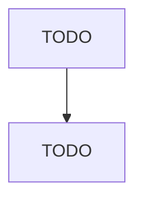

# Voluntary Health Organizations

> TODO: Business-as-Code definition

## Overview

This U.S. industry comprises establishments primarily engaged in raising funds for health related research, such as disease (e.g., heart, cancer, diabetes) prevention, health education, and patient services. Illustrative Examples: Disease awareness fundraising organizations Health research fundraising organizations Voluntary health organizations Disease research (e.g., heart, cancer) fundraising organizations Cross-References.

## Actors

| Actor | Description |
|-------|-------------|
| TODO | TODO |

## Entities

| Entity | Description |
|--------|-------------|
| TODO | TODO |

## Actions

| Action | Description |
|--------|-------------|
| TODO | TODO |

## Events

| Event | Description |
|-------|-------------|
| TODO | TODO |

## Searches

| Search | Description |
|--------|-------------|
| TODO | TODO |

## Workflow

## Actor Relationships

