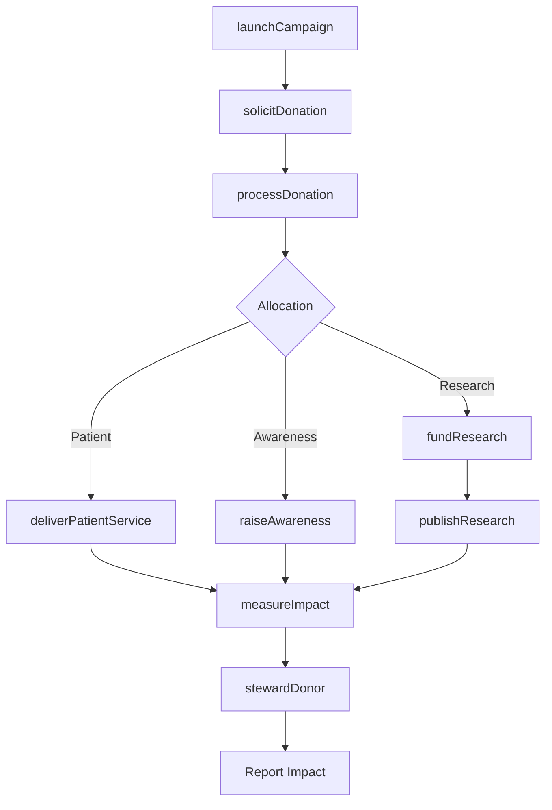
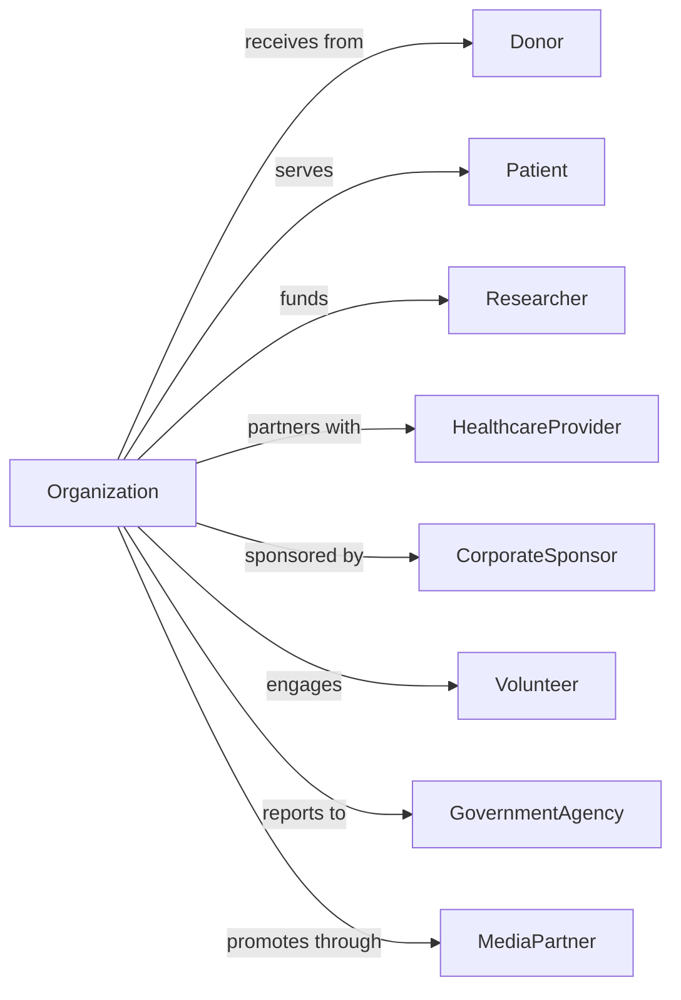

# Voluntary Health Organizations

> Business-as-Code definition for voluntary health organization operations. Models disease-focused nonprofits raising funds for medical research, patient services, and health education.

## Overview

Voluntary health organizations raise funds and awareness for health-related causes including disease prevention, medical research, patient support, and health education. These organizations include disease-specific charities (heart, cancer, diabetes), research funding bodies, and patient advocacy groups. This definition exposes actions for fundraising campaigns, events for donor engagement, and searches for program and research impact tracking.

## Actors

| Actor | Description |
|-------|-------------|
| Donor | Individual or organization contributing funds |
| Patient | Individual affected by the health condition |
| Researcher | Scientist receiving research funding |
| HealthcareProvider | Medical professional partnering on care |
| CorporateSponsor | Business providing major support |
| Volunteer | Community member providing service |
| GovernmentAgency | NIH, CDC, or health regulators |
| MediaPartner | Organization amplifying awareness |

## Roles

| Role | Description |
|------|-------------|
| ExecutiveDirector | Leads organization operations |
| DevelopmentDirector | Oversees fundraising programs |
| ResearchDirector | Manages grant portfolios |
| PatientServicesManager | Coordinates support programs |
| MarketingDirector | Leads awareness campaigns |
| EventsManager | Coordinates fundraising events |
| VolunteerManager | Organizes community helpers |
| AdvocacyDirector | Leads policy and legislative efforts |

## Entities

| Entity | Description |
|--------|-------------|
| Donor | Contributor record |
| Donation | Gift of funds |
| Campaign | Fundraising initiative |
| ResearchGrant | Funding for scientific study |
| PatientProgram | Support service offering |
| Event | Fundraising or awareness gathering |
| Volunteer | Helper participation record |
| Sponsor | Corporate supporter record |
| Awareness | Educational outreach initiative |
| Advocacy | Policy change effort |
| Publication | Research or educational material |
| Chapter | Regional affiliate organization |

## Actions

| Action | Description |
|--------|-------------|
| launchCampaign | Start fundraising initiative |
| solicitDonation | Request financial contribution |
| processDonation | Accept and record gift |
| fundResearch | Award scientific study grants |
| deliverPatientService | Provide support program |
| organizeEvent | Plan fundraising gathering |
| recruitVolunteer | Enlist community helper |
| raiseAwareness | Educate public about condition |
| advocatePolicy | Promote legislative change |
| engageSponsor | Partner with corporate supporter |
| publishResearch | Share scientific findings |
| supportChapter | Assist regional affiliate |
| stewardDonor | Maintain contributor relationship |
| measureImpact | Assess program outcomes |

## Events

| Event | Description |
|-------|-------------|
| campaignLaunched | Fundraising started |
| donationReceived | Gift accepted |
| researchFunded | Grant awarded |
| patientServed | Support provided |
| eventCompleted | Gathering finished |
| volunteerRecruited | Helper enlisted |
| awarenessRaised | Education delivered |
| policyAdvocated | Legislative effort made |
| sponsorEngaged | Corporate partnership formed |
| researchPublished | Findings shared |
| chapterSupported | Affiliate assisted |
| donorStewardedF | Relationship maintained |
| impactMeasured | Outcomes assessed |
| milestoneReached | Fundraising goal achieved |

## Searches

| Search | Description |
|--------|-------------|
| findDonors | List contributors |
| getCampaigns | View fundraising initiatives |
| findResearchGrants | List funded studies |
| getPatientPrograms | View support services |
| findEvents | List scheduled gatherings |
| getVolunteers | View community helpers |
| getSponsors | List corporate supporters |
| getImpactMetrics | Retrieve outcome data |

## Workflow



## Actor Relationships



## Usage

### Calling Actions

```typescript
import { grantCharities } from '@headlessly/grant-charities'

const healthOrg = grantCharities()

// Launch annual campaign
const campaign = await healthOrg.launchCampaign({
  name: 'Heart Month 2024',
  goal: 5000000,
  startDate: '2024-02-01',
  endDate: '2024-02-29',
  channels: ['direct mail', 'digital', 'events'],
  matchingSponsor: 'corp-456'
})

// Fund research grant
const grant = await healthOrg.fundResearch({
  researcherId: 'dr-789',
  institution: 'Johns Hopkins Medical',
  study: 'Novel cardiac biomarkers for early detection',
  amount: 250000,
  duration: '3-years',
  milestones: ['yearOne', 'yearTwo', 'final']
})

// Deliver patient service
await healthOrg.deliverPatientService({
  programType: 'transportationAssistance',
  patientId: 'patient-123',
  service: 'treatmentTransport',
  appointments: 12,
  facility: 'Memorial Hospital'
})
```

### Event-Driven Automation

```typescript
// Welcome and steward new donors
healthOrg.donationReceived(async ({ donorId, amount, campaign, isFirstGift }) => {
  if (isFirstGift) {
    await healthOrg.stewardDonor({
      donorId,
      action: 'welcomePackage',
      materials: ['thankYouLetter', 'impactReport', 'newsletter']
    })
  }

  if (amount >= 1000) {
    await healthOrg.stewardDonor({
      donorId,
      action: 'majorGiftRecognition',
      level: getDonorLevel(amount)
    })
  }
})

// Publish research when complete
healthOrg.researchMilestoneReached(async ({ grantId, milestone, findings }) => {
  if (milestone === 'final') {
    await healthOrg.publishResearch({
      grantId,
      title: findings.title,
      summary: findings.laySummary,
      channels: ['website', 'newsletter', 'pressRelease']
    })

    await healthOrg.notifyDonors({
      segment: 'researchFunders',
      message: `Your support enabled breakthrough: ${findings.title}`
    })
  }
})
```

## Related

- [Grantmaking Foundations](./813211-GrantmakingFoundations.mdx)
- [Other Grantmaking and Giving Services](./813219-OtherGrantmakingAndGivingServices.mdx)
