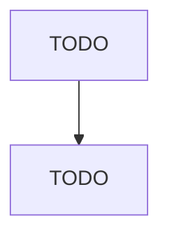

# Other Grantmaking and Giving Services

> TODO: Business-as-Code definition

## Overview

This U.S. industry comprises establishments (except voluntary health organizations) primarily engaged in raising funds for a wide range of social welfare activities, such as educational, scientific, cultural, and health. Illustrative Examples: Community chest fundraising organizations United fund councils Federated charities United funds for colleges Cross-References.

## Actors

| Actor | Description |
|-------|-------------|
| TODO | TODO |

## Entities

| Entity | Description |
|--------|-------------|
| TODO | TODO |

## Actions

| Action | Description |
|--------|-------------|
| TODO | TODO |

## Events

| Event | Description |
|-------|-------------|
| TODO | TODO |

## Searches

| Search | Description |
|--------|-------------|
| TODO | TODO |

## Workflow

## Actor Relationships

