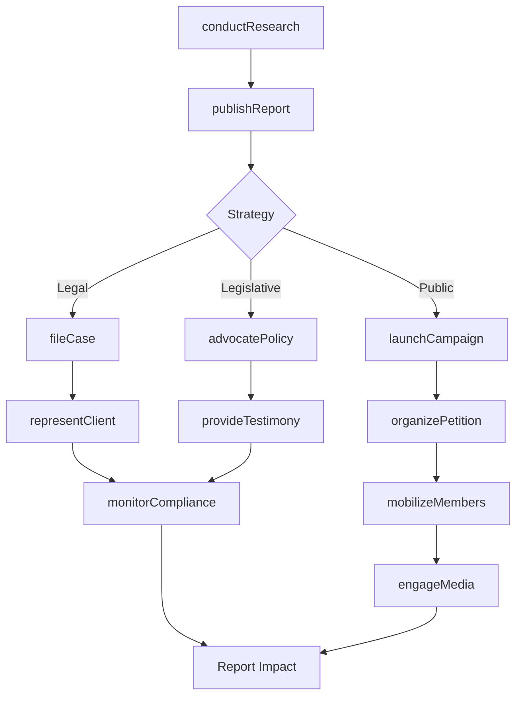
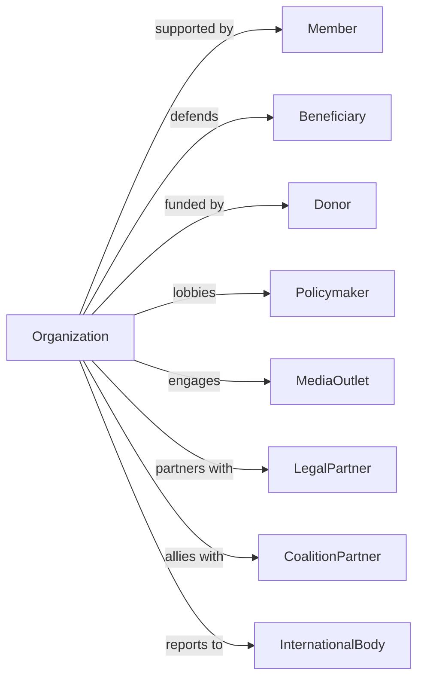

# Human Rights Organizations

> Business-as-Code definition for human rights advocacy operations. Models organizations protecting civil liberties, promoting equality, and defending the rights of vulnerable populations.

## Overview

Human rights organizations advocate for constitutional rights, civil liberties, and the protection of vulnerable populations including children, women, minorities, and persons with disabilities. Activities include legal advocacy, public education, policy research, and community organizing. This definition exposes actions for advocacy campaigns, events for case and policy tracking, and searches for membership and impact management.

## Actors

| Actor | Description |
|-------|-------------|
| Member | Supporting individual or organization |
| Beneficiary | Person whose rights are defended |
| Donor | Financial contributor |
| Policymaker | Legislator or government official |
| MediaOutlet | Organization amplifying advocacy |
| LegalPartner | Pro bono attorney or firm |
| CoalitionPartner | Allied advocacy organization |
| InternationalBody | UN or human rights commission |

## Roles

| Role | Description |
|------|-------------|
| ExecutiveDirector | Leads organization operations |
| LegalDirector | Oversees litigation and legal advocacy |
| PolicyDirector | Manages legislative and regulatory work |
| CommunicationsDirector | Leads media and public education |
| OrganizingDirector | Coordinates grassroots campaigns |
| ResearchDirector | Conducts investigations and reports |
| DevelopmentDirector | Manages fundraising |
| ProgramManager | Coordinates specific rights initiatives |

## Entities

| Entity | Description |
|--------|-------------|
| Member | Supporter record |
| Case | Legal matter or advocacy intervention |
| Campaign | Advocacy initiative |
| Policy | Legislation or regulation target |
| Report | Research documentation |
| Petition | Public action request |
| Coalition | Partner alliance |
| Donation | Financial contribution |
| Event | Rally, hearing, or gathering |
| Volunteer | Activist participant |
| Publication | Educational material |
| Testimony | Legislative or legal statement |

## Actions

| Action | Description |
|--------|-------------|
| fileCase | Initiate legal action |
| advocatePolicy | Promote legislative change |
| conductResearch | Investigate rights violations |
| publishReport | Release research findings |
| launchCampaign | Start advocacy initiative |
| organizePetition | Gather public signatures |
| mobilizeMembers | Activate supporters |
| provideTestimony | Present at hearings |
| educatePublic | Inform about rights issues |
| buildCoalition | Form partner alliances |
| representClient | Provide legal defense |
| monitorCompliance | Track rights implementation |
| trainAdvocates | Develop activist skills |
| engageMedia | Promote coverage of issues |

## Events

| Event | Description |
|-------|-------------|
| caseFiled | Legal action initiated |
| policyAdvocated | Legislative effort made |
| researchCompleted | Investigation finished |
| reportPublished | Findings released |
| campaignLaunched | Initiative started |
| petitionSubmitted | Signatures delivered |
| membersMobilized | Supporters activated |
| testimonyProvided | Hearing statement given |
| publicEducated | Information shared |
| coalitionFormed | Alliance established |
| clientRepresented | Legal defense provided |
| complianceMonitored | Implementation tracked |
| advocatesTrained | Skills developed |
| mediaCoverageObtained | Issue publicized |

## Searches

| Search | Description |
|--------|-------------|
| findMembers | List supporters |
| getCases | View legal matters |
| findCampaigns | List advocacy initiatives |
| getPolicies | View legislative targets |
| findReports | List research documents |
| getCoalitions | View partner alliances |
| getEvents | Retrieve scheduled activities |
| getImpactMetrics | Track advocacy outcomes |

## Workflow



## Actor Relationships



## Usage

### Calling Actions

```typescript
import { advocateRights } from '@headlessly/advocate-rights'

const rightsOrg = advocateRights()

// File civil rights case
const legalCase = await rightsOrg.fileCase({
  type: 'civilRights',
  plaintiff: 'community-group-123',
  defendant: 'state-agency',
  claims: ['discriminatoryPolicy', 'constitutionalViolation'],
  court: 'federalDistrict',
  counsel: ['legal-director', 'pro-bono-firm']
})

// Launch advocacy campaign
const campaign = await rightsOrg.launchCampaign({
  name: 'Equal Access Initiative',
  issue: 'votingRights',
  goal: 'passStateLegislation',
  tactics: ['grassroots', 'media', 'lobbying'],
  duration: '18-months',
  targetStates: ['TX', 'GA', 'FL']
})

// Publish research report
await rightsOrg.publishReport({
  title: 'State of Civil Liberties 2024',
  topic: 'policingPractices',
  methodology: 'mixedMethods',
  findings: ['finding1', 'finding2'],
  recommendations: ['recommendation1', 'recommendation2'],
  distribution: ['media', 'policymakers', 'members']
})
```

### Event-Driven Automation

```typescript
// Mobilize on policy developments
rightsOrg.legislationIntroduced(async ({ billId, jurisdiction, topic }) => {
  if (isRelevantToMission(topic)) {
    await rightsOrg.analyzePolicy({
      billId,
      assessment: 'full'
    })

    await rightsOrg.mobilizeMembers({
      jurisdiction,
      action: 'contactLegislators',
      bill: billId,
      urgency: 'high'
    })
  }
})

// Celebrate legal victories
rightsOrg.caseDecided(async ({ caseId, outcome, precedent }) => {
  if (outcome === 'victory') {
    await rightsOrg.engageMedia({
      caseId,
      type: 'pressRelease',
      message: generateVictoryStatement(caseId, precedent)
    })

    await rightsOrg.educatePublic({
      topic: 'caseImpact',
      caseId,
      channels: ['website', 'email', 'socialMedia']
    })
  }
})
```

## Related

- [Environment, Conservation and Wildlife Organizations](./813312-EnvironmentConservationAndWildlifeOrganizations.mdx)
- [Other Social Advocacy Organizations](./813319-OtherSocialAdvocacyOrganizations.mdx)
