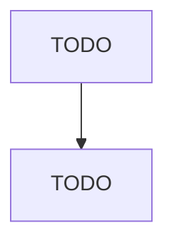

# Other Social Advocacy Organizations

> TODO: Business-as-Code definition

## Overview

This U.S. industry comprises establishments primarily engaged in social advocacy (except human rights and environmental protection, conservation, and wildlife preservation). Establishments in this industry address issues, such as peace and international understanding; community action (excluding civic organizations); or advancing social causes, such as firearms safety, drunk driving prevention, or drug abuse awareness. These organizations may solicit contributions and offer memberships to suppor

## Actors

| Actor | Description |
|-------|-------------|
| TODO | TODO |

## Entities

| Entity | Description |
|--------|-------------|
| TODO | TODO |

## Actions

| Action | Description |
|--------|-------------|
| TODO | TODO |

## Events

| Event | Description |
|-------|-------------|
| TODO | TODO |

## Searches

| Search | Description |
|--------|-------------|
| TODO | TODO |

## Workflow

## Actor Relationships

