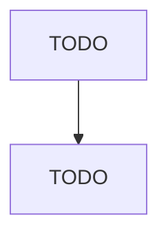

# Business Associations

> TODO: Business-as-Code definition

## Overview

This industry comprises establishments primarily engaged in promoting the business interests of their members. These establishments may conduct research on new products and services; develop market statistics; sponsor quality and certification standards; lobby public officials; or publish newsletters, books, or periodicals for distribution to their members. Illustrative Examples: Agricultural organizations (except youth farming organizations, farm granges) Real estate boards Chambers of commerce

## Actors

| Actor | Description |
|-------|-------------|
| TODO | TODO |

## Entities

| Entity | Description |
|--------|-------------|
| TODO | TODO |

## Actions

| Action | Description |
|--------|-------------|
| TODO | TODO |

## Events

| Event | Description |
|-------|-------------|
| TODO | TODO |

## Searches

| Search | Description |
|--------|-------------|
| TODO | TODO |

## Workflow

## Actor Relationships

