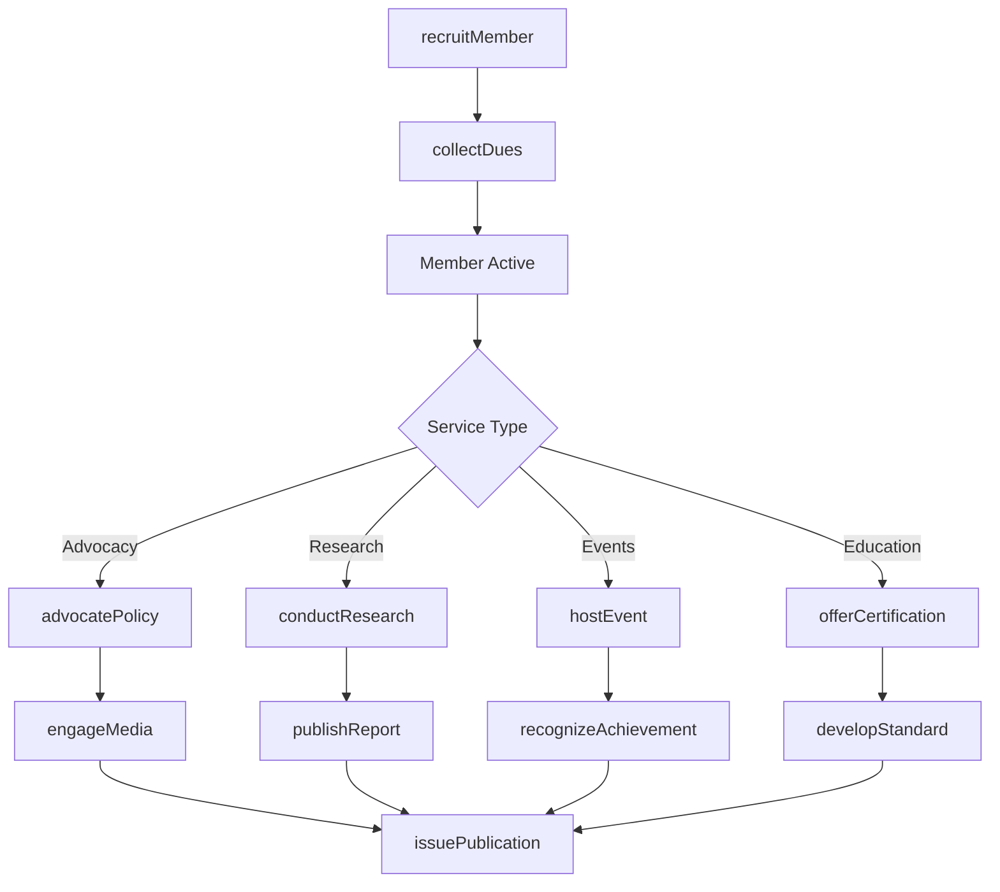
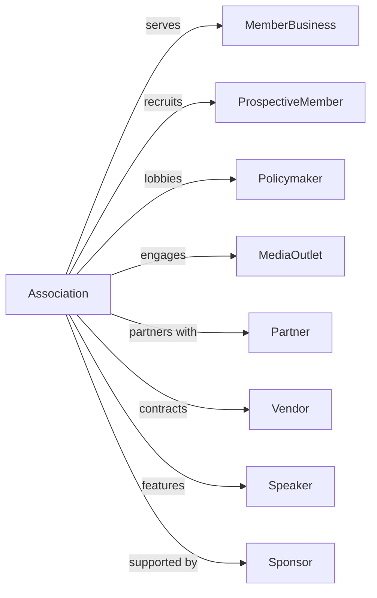

# Business Associations

> Business-as-Code definition for business association operations. Models chambers of commerce, trade associations, and industry groups promoting business interests through advocacy, networking, and member services.

## Overview

Business associations promote the interests of member businesses through advocacy, research, networking, and education. This includes chambers of commerce, trade associations, real estate boards, and agricultural organizations. Activities encompass lobbying, market research, quality standards development, and member networking events. This definition exposes actions for advocacy and member services, events for engagement tracking, and searches for membership and industry data.

## Actors

| Actor | Description |
|-------|-------------|
| MemberBusiness | Company belonging to association |
| ProspectiveMember | Business considering membership |
| Policymaker | Legislator or regulator |
| MediaOutlet | Organization covering industry news |
| Partner | Allied organization |
| Vendor | Supplier to association |
| Speaker | Presenter at events |
| Sponsor | Business providing event support |

## Roles

| Role | Description |
|------|-------------|
| ExecutiveDirector | Leads association operations |
| MembershipDirector | Manages recruitment and retention |
| GovernmentAffairsDirector | Oversees advocacy and lobbying |
| CommunicationsDirector | Handles media and publications |
| EventsManager | Coordinates conferences and networking |
| ResearchDirector | Conducts industry studies |
| EducationCoordinator | Develops training programs |
| FinanceDirector | Manages budget and dues |

## Entities

| Entity | Description |
|--------|-------------|
| Member | Business participant record |
| Event | Conference, meeting, or networking |
| Publication | Newsletter, report, or guide |
| Policy | Legislative or regulatory position |
| Research | Industry study or survey |
| Committee | Working group for specific topic |
| Certification | Quality or training credential |
| Dues | Membership fee payment |
| Sponsorship | Event or program support |
| Award | Industry recognition |
| Chapter | Regional affiliate |
| Standard | Industry quality guideline |

## Actions

| Action | Description |
|--------|-------------|
| recruitMember | Attract new business participants |
| renewMember | Process membership continuation |
| collectDues | Receive membership payments |
| advocatePolicy | Lobby for industry positions |
| conductResearch | Study industry trends |
| publishReport | Release research findings |
| hostEvent | Organize conference or networking |
| offerCertification | Provide industry credential |
| developStandard | Create quality guideline |
| recognizeAchievement | Honor industry excellence |
| issuePublication | Distribute member communication |
| coordinateCommittee | Manage working group |
| engageMedia | Promote industry news |
| supportChapter | Assist regional affiliate |

## Events

| Event | Description |
|-------|-------------|
| memberRecruited | New business joined |
| memberRenewed | Continuation processed |
| duesCollected | Payment received |
| policyAdvocated | Lobbying effort made |
| researchConducted | Study completed |
| reportPublished | Findings released |
| eventHosted | Conference completed |
| certificationAwarded | Credential granted |
| standardDeveloped | Guideline created |
| achievementRecognized | Excellence honored |
| publicationIssued | Communication distributed |
| committeeCoordinated | Working group met |
| mediaCoverageObtained | Industry news publicized |
| chapterSupported | Affiliate assisted |

## Searches

| Search | Description |
|--------|-------------|
| findMembers | List business participants |
| getEvents | View scheduled activities |
| findPolicies | List legislative positions |
| getResearch | Retrieve industry studies |
| findCertifications | List credential holders |
| getCommittees | View working groups |
| getDuesStatus | Check payment records |
| getChapters | List regional affiliates |

## Workflow



## Actor Relationships



## Usage

### Calling Actions

```typescript
import { representIndustries } from '@headlessly/represent-industries'

const chamber = representIndustries()

// Recruit new member business
const member = await chamber.recruitMember({
  businessName: 'Acme Manufacturing',
  industry: 'manufacturing',
  employees: 250,
  annualRevenue: 50000000,
  membershipLevel: 'corporate',
  primaryContact: 'jane.smith@acme.com'
})

// Advocate policy position
await chamber.advocatePolicy({
  issue: 'workforceDevelopment',
  position: 'supportApprenticeshipFunding',
  tactics: ['lobbying', 'testimony', 'coalitionBuilding'],
  targetLegislation: 'HB-1234',
  committeeFocus: ['workforce', 'education']
})

// Host annual conference
await chamber.hostEvent({
  name: 'Industry Summit 2024',
  type: 'annualConference',
  date: '2024-10-15',
  location: 'Convention Center',
  expectedAttendance: 500,
  sessions: ['keynote', 'breakouts', 'networking'],
  sponsors: ['platinum', 'gold', 'silver']
})
```

### Event-Driven Automation

```typescript
// Welcome new members
chamber.memberRecruited(async ({ memberId, businessName, membershipLevel }) => {
  await chamber.issuePublication({
    type: 'welcomePackage',
    recipient: memberId,
    materials: ['memberDirectory', 'benefitsGuide', 'eventCalendar']
  })

  await chamber.assignBenefits({
    memberId,
    level: membershipLevel,
    benefits: getMembershipBenefits(membershipLevel)
  })
})

// Share research with members
chamber.researchConducted(async ({ studyId, topic, findings }) => {
  await chamber.publishReport({
    studyId,
    title: `Industry Report: ${topic}`,
    distribution: ['members', 'media', 'policymakers']
  })

  await chamber.issuePublication({
    type: 'researchAlert',
    content: {
      study: studyId,
      keyFindings: findings.highlights
    }
  })
})
```

## Related

- [Professional Organizations](./813920-ProfessionalOrganizations.mdx)
- [Civic and Social Organizations](../8134-CivicAndSocialOrganizations/813410-CivicAndSocialOrganizations.mdx)
