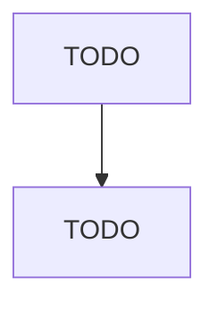

# Professional Organizations

> TODO: Business-as-Code definition

## Overview

This industry comprises establishments primarily engaged in promoting the professional interests of their members and the profession as a whole. These establishments may conduct research; develop statistics; sponsor quality and certification standards; lobby public officials; or publish newsletters, books, or periodicals for distribution to their members. Illustrative Examples: Bar associations Learned societies Dentists' associations Peer review boards Engineers' associations Professional stand

## Actors

| Actor | Description |
|-------|-------------|
| TODO | TODO |

## Entities

| Entity | Description |
|--------|-------------|
| TODO | TODO |

## Actions

| Action | Description |
|--------|-------------|
| TODO | TODO |

## Events

| Event | Description |
|-------|-------------|
| TODO | TODO |

## Searches

| Search | Description |
|--------|-------------|
| TODO | TODO |

## Workflow

## Actor Relationships

