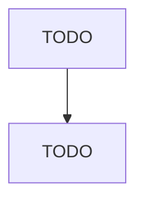

# Political Organizations

> TODO: Business-as-Code definition

## Overview

This industry comprises establishments primarily engaged in promoting the interests of national, state, or local political parties or candidates. Included are political groups organized to raise funds for a political party or individual candidates. Illustrative Examples: Campaign organizations, political Political organizations or clubs Political action committees (PACs) Political parties Political campaign organizations Cross-References. Establishments primarily engaged in--

## Actors

| Actor | Description |
|-------|-------------|
| TODO | TODO |

## Entities

| Entity | Description |
|--------|-------------|
| TODO | TODO |

## Actions

| Action | Description |
|--------|-------------|
| TODO | TODO |

## Events

| Event | Description |
|-------|-------------|
| TODO | TODO |

## Searches

| Search | Description |
|--------|-------------|
| TODO | TODO |

## Workflow

## Actor Relationships

