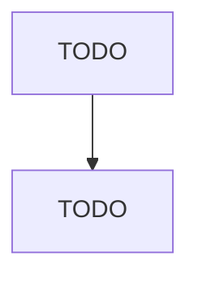

# Other Similar Organizations (except Business, Professional, Labor, and Political Organizations)

> TODO: Business-as-Code definition

## Overview

This industry comprises establishments (except religious organizations, social advocacy organizations, civic and social organizations, business associations, professional organizations, labor unions, and political organizations) primarily engaged in promoting the interests of their members. Illustrative Examples: Athletic associations and leagues, regulatory Property owners' associations Condominium and homeowners' associations Tenants' associations (except advocacy) Cooperative owners' associat

## Actors

| Actor | Description |
|-------|-------------|
| TODO | TODO |

## Entities

| Entity | Description |
|--------|-------------|
| TODO | TODO |

## Actions

| Action | Description |
|--------|-------------|
| TODO | TODO |

## Events

| Event | Description |
|-------|-------------|
| TODO | TODO |

## Searches

| Search | Description |
|--------|-------------|
| TODO | TODO |

## Workflow

## Actor Relationships

