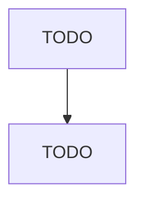

# Private Households

> TODO: Business-as-Code definition

## Overview

This industry comprises private households primarily engaged in employing workers on or about the premises in activities primarily concerned with the operation of the household. These private households may employ individuals, such as cooks, maids, nannies, butlers, non-medical personal care aides, and outside workers, such as gardeners, caretakers, and other maintenance workers. Cross-References. Establishments primarily engaged in--

## Actors

| Actor | Description |
|-------|-------------|
| TODO | TODO |

## Entities

| Entity | Description |
|--------|-------------|
| TODO | TODO |

## Actions

| Action | Description |
|--------|-------------|
| TODO | TODO |

## Events

| Event | Description |
|-------|-------------|
| TODO | TODO |

## Searches

| Search | Description |
|--------|-------------|
| TODO | TODO |

## Workflow

## Actor Relationships

