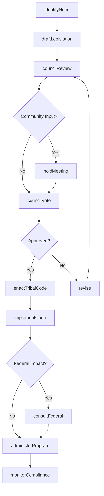
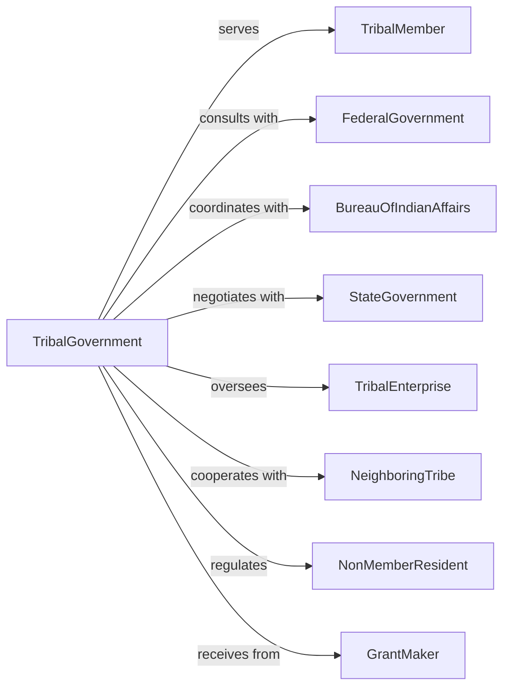

# American Indian and Alaska Native Tribal Governments

> Business-as-Code definition for tribal government operations. Models sovereign governance functions including legislative, judicial, and administrative activities for tribal nations.

## Overview

American Indian and Alaska Native tribal governments exercise sovereign authority over tribal lands and members, performing comprehensive governmental functions. This definition exposes actions for tribal council proceedings, treaty rights administration, cultural preservation, and member services, events for workflow automation, and searches for tribal governance data retrieval.

## Actors

| Actor | Description |
|-------|-------------|
| TribalMember | Enrolled citizen of the tribal nation |
| FederalGovernment | United States government with trust responsibilities |
| BureauOfIndianAffairs | Federal agency administering Indian affairs |
| StateGovernment | State entity with limited jurisdiction on tribal lands |
| TribalEnterprise | Business owned and operated by the tribe |
| NeighboringTribe | Adjacent tribal nation with shared interests |
| NonMemberResident | Individual living on tribal lands without enrollment |
| GrantMaker | Foundation or agency providing tribal funding |

## Roles

| Role | Description |
|------|-------------|
| TribalChairperson | Elected leader of tribal government |
| CouncilMember | Elected representative on tribal council |
| TribalJudge | Judicial officer presiding over tribal court |
| TribalAdministrator | Professional manager of tribal operations |
| EnrollmentOfficer | Official maintaining tribal membership rolls |
| CulturalDirector | Leader preserving tribal heritage and traditions |

## Entities

| Entity | Description |
|--------|-------------|
| TribalCode | Laws enacted by tribal council |
| TribalResolution | Formal action by tribal council |
| EnrollmentRecord | Documentation of tribal membership |
| Treaty | Agreement between tribe and federal government |
| TrustLand | Real property held in trust for tribe |
| TribalCourt | Judicial body exercising tribal jurisdiction |
| SovereignImmunity | Legal protection from suit without consent |
| CompactAgreement | Government-to-government arrangement |
| CulturalResource | Heritage site, artifact, or tradition |
| PerCapitaPayment | Distribution of tribal revenues to members |
| TribalEnterpriseLicense | Authorization for business on tribal lands |

## Actions

| Action | Description |
|--------|-------------|
| enactTribalCode | Pass legislation through tribal council |
| adoptResolution | Approve formal tribal council action |
| adjudicateCase | Decide matter in tribal court |
| enrollMember | Add individual to tribal membership rolls |
| negotiateCompact | Develop agreement with federal or state government |
| administerProgram | Deliver federally funded services to members |
| preserveCulture | Protect and promote tribal heritage |
| distributeRevenue | Issue per capita payments to enrolled members |
| exerciseSovereignty | Assert tribal governmental authority |
| manageTrustLand | Oversee use and development of trust property |
| licenseEnterprise | Authorize business activity on tribal lands |
| conductElection | Administer tribal government elections |
| consultFederal | Engage in government-to-government dialogue |
| protectTreatyRights | Enforce rights guaranteed by treaties |

## Events

| Event | Description |
|-------|-------------|
| tribalCodeEnacted | Legislation passed and effective |
| resolutionAdopted | Council action approved |
| caseAdjudicated | Tribal court decision issued |
| memberEnrolled | Individual added to tribal rolls |
| compactNegotiated | Government agreement finalized |
| programAdministered | Services delivered to members |
| culturePreserved | Heritage protection action completed |
| revenueDistributed | Per capita payments issued |
| sovereigntyExercised | Governmental authority asserted |
| trustLandManaged | Property decision implemented |
| enterpriseLicensed | Business authorized to operate |
| electionConducted | Voting completed and certified |
| federalConsulted | Government dialogue concluded |
| treatyRightProtected | Rights enforcement action taken |

## Searches

| Search | Description |
|--------|-------------|
| findTribalCodes | Search enacted legislation by subject or date |
| getEnrollmentRecords | Retrieve membership data by status or lineage |
| listCourtCases | Get tribal court matters by type or status |
| findCompacts | Search government agreements by party or subject |
| getTreatyRights | Retrieve treaty provisions affecting tribe |
| listEnterprises | Get authorized businesses on tribal lands |
| findCulturalResources | Search heritage sites and artifacts |

## Workflow



## Actor Relationships



## Usage

### Calling Actions

```typescript
import { governBudgets } from '@headlessly/govern-budgets'

const tribal = governBudgets()

// Enact tribal code
const code = await tribal.enactTribalCode({
  title: 'Environmental Protection Code',
  chapter: 'NaturalResources',
  sections: [
    { number: '101', title: 'Purpose', text: '...' },
    { number: '102', title: 'Water Quality Standards', text: '...' },
    { number: '103', title: 'Enforcement', text: '...' }
  ],
  effectiveDate: '2024-06-01',
  councilVote: { for: 7, against: 0, abstain: 1 }
})

// Process enrollment
const enrollment = await tribal.enrollMember({
  applicant: {
    name: 'John Eagle Feather',
    dateOfBirth: '1995-03-15',
    bloodQuantum: 0.25,
    lineage: ['grandfather-enrolled-1952', 'mother-enrolled-1978']
  },
  documentation: ['birthCertificate', 'lineageChart', 'dnaTest'],
  reviewCommittee: 'enrollment-committee'
})

// Negotiate gaming compact
await tribal.negotiateCompact({
  type: 'gaming',
  counterparty: 'state-of-arizona',
  terms: {
    duration: 20,
    revenueShare: 0.08,
    exclusivity: ['slotMachines', 'blackjack'],
    regulatoryAuthority: 'tribal'
  }
})
```

### Event-Driven Automation

```typescript
// Process enrollment approval
tribal.memberEnrolled(async ({ memberId, benefits }) => {
  await issueTribalId({
    memberId,
    validUntil: addYears(new Date(), 5)
  })

  if (benefits.includes('perCapita')) {
    await addToDistribution({
      memberId,
      effectiveDate: nextQuarter()
    })
  }

  await notifyPrograms({
    newMember: memberId,
    eligibleServices: benefits
  })
})

// Track revenue distribution
tribal.revenueDistributed(async ({ quarter, totalAmount, recipients }) => {
  await recordDistribution({
    quarter,
    totalAmount,
    recipientCount: recipients.length
  })

  await generateTaxDocuments({
    quarter,
    recipients
  })
})
```
