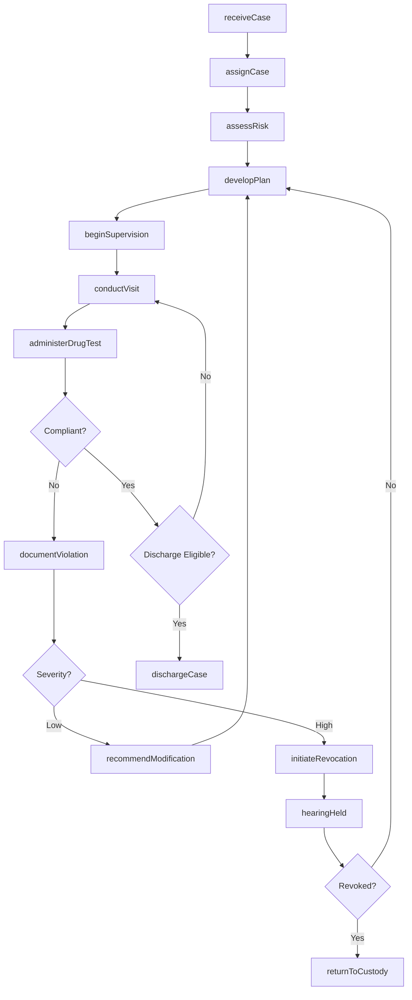
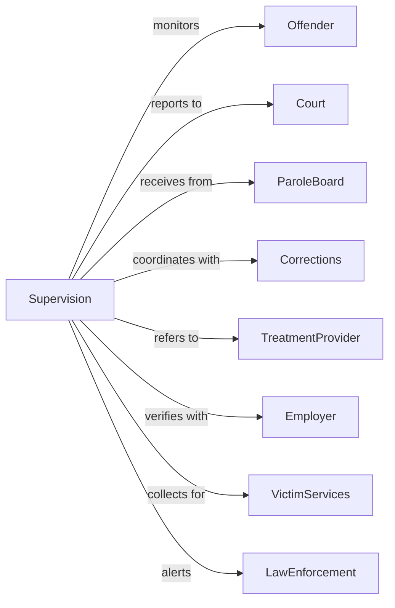

# Parole Offices and Probation Offices

> Business-as-Code definition for community supervision operations. Models offender supervision from case assignment through discharge or revocation.

## Overview

Parole and probation offices administer judicially mandated community supervision of offenders, providing monitoring, support services, and compliance enforcement. This definition exposes actions for supervision planning, offender monitoring, violation response, and case closure, events for workflow automation, and searches for supervision data retrieval.

## Actors

| Actor | Description |
|-------|-------------|
| Offender | Individual under community supervision |
| Court | Judicial body imposing or modifying supervision |
| ParoleBoard | Authority granting or revoking parole |
| Corrections | Prison system releasing parolees |
| TreatmentProvider | Agency delivering mandated services |
| Employer | Business employing supervised individual |
| VictimServices | Organization supporting crime victims |
| LawEnforcement | Police coordinating on offender matters |

## Roles

| Role | Description |
|------|-------------|
| ChiefProbationOfficer | Executive managing supervision agency |
| ProbationOfficer | Professional supervising offender caseload |
| ParoleOfficer | Specialist monitoring released prisoners |
| SupervisionSpecialist | Staff handling specialized populations |
| PreSentenceWriter | Investigator preparing court reports |
| ComplianceOfficer | Staff monitoring electronic supervision |

## Entities

| Entity | Description |
|--------|-------------|
| SupervisionCase | Complete record of offender under supervision |
| ConditionOfSupervision | Requirement imposed by court or board |
| SupervisionPlan | Strategy for managing offender compliance |
| ContactRecord | Documentation of offender interaction |
| DrugTest | Substance screening result |
| ViolationReport | Documentation of condition breach |
| PreSentenceReport | Investigation informing sentencing decision |
| RiskAssessment | Evaluation of offender recidivism likelihood |
| ElectronicMonitoring | GPS or home detention equipment assignment |
| RestitutionPayment | Victim compensation collection |
| DischargeReport | Documentation of supervision termination |

## Actions

| Action | Description |
|--------|-------------|
| assignCase | Designate officer for new supervision |
| developPlan | Create supervision strategy with conditions |
| conductVisit | Meet with offender at home or office |
| administerDrugTest | Collect and analyze substance sample |
| monitorLocation | Track offender via electronic means |
| verifyEmployment | Confirm offender work status |
| collectRestitution | Process victim compensation payment |
| documentViolation | Record breach of supervision condition |
| initiateRevocation | Begin process to terminate supervision |
| recommendModification | Propose change to supervision terms |
| prepareReport | Write pre-sentence investigation |
| assessRisk | Evaluate offender recidivism factors |
| referToServices | Connect offender with treatment provider |
| dischargeCase | Close supervision upon completion |

## Events

| Event | Description |
|-------|-------------|
| caseAssigned | Officer designated for supervision |
| planDeveloped | Supervision strategy created |
| visitConducted | Offender contact completed |
| drugTestAdministered | Substance sample collected |
| locationMonitored | Electronic tracking verified |
| employmentVerified | Work status confirmed |
| restitutionCollected | Victim payment processed |
| violationDocumented | Condition breach recorded |
| revocationInitiated | Termination process begun |
| modificationRecommended | Term change proposed |
| reportPrepared | Pre-sentence investigation completed |
| riskAssessed | Recidivism evaluation completed |
| serviceReferred | Treatment connection made |
| caseDischarged | Supervision successfully closed |

## Searches

| Search | Description |
|--------|-------------|
| findCases | Search supervisions by offender, officer, or status |
| getContacts | Retrieve visit records by date or type |
| listViolations | Get breaches by severity or outcome |
| findDrugTests | Search screenings by result or date |
| getRestitution | Retrieve payment records by status or amount |
| listDischarges | Get completed supervisions by date or type |
| findHighRisk | Search cases by risk level or needs |

## Workflow



## Actor Relationships



## Usage

### Calling Actions

```typescript
import { enforceParole } from '@headlessly/enforce-parole'

const supervision = enforceParole()

// Assign and develop supervision plan
const assignment = await supervision.assignCase({
  offender: {
    name: 'Robert Johnson',
    caseNumber: 'PROB-2024-5678',
    offenseType: 'drugPossession'
  },
  sourceType: 'courtSentence',
  supervisionTerm: { months: 36 }
})

const plan = await supervision.developPlan({
  caseId: assignment.caseId,
  riskLevel: 'moderate',
  conditions: [
    { type: 'standardReporting', frequency: 'monthly' },
    { type: 'substanceTesting', frequency: 'random' },
    { type: 'treatmentParticipation', program: 'outpatientDrug' },
    { type: 'employment', requirement: 'maintain' }
  ]
})

// Conduct supervision activities
await supervision.conductVisit({
  caseId: assignment.caseId,
  visitType: 'homeVisit',
  observations: ['residenceVerified', 'noContrabandObserved'],
  nextVisit: addDays(new Date(), 30)
})

await supervision.administerDrugTest({
  caseId: assignment.caseId,
  substances: ['cannabis', 'opioids', 'amphetamines'],
  collectionMethod: 'observed'
})
```

### Event-Driven Automation

```typescript
// Process new assignment
supervision.caseAssigned(async ({ caseId, offender, riskLevel }) => {
  await supervision.assessRisk({
    caseId,
    instrument: 'oras',
    factors: await gatherRiskFactors(offender.id)
  })

  if (riskLevel === 'high') {
    await supervision.referToServices({
      caseId,
      services: ['cognitiveBehavioral', 'substanceAbuse']
    })
  }
})

// Handle positive drug test
supervision.drugTestAdministered(async ({ caseId, result }) => {
  if (result.positive) {
    await supervision.documentViolation({
      caseId,
      type: 'substanceUse',
      substances: result.positiveSubstances,
      severity: 'moderate'
    })

    await supervision.referToServices({
      caseId,
      services: ['intensiveOutpatient'],
      priority: 'urgent'
    })
  }
})
```
