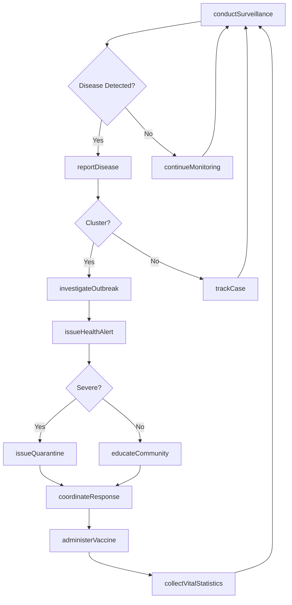
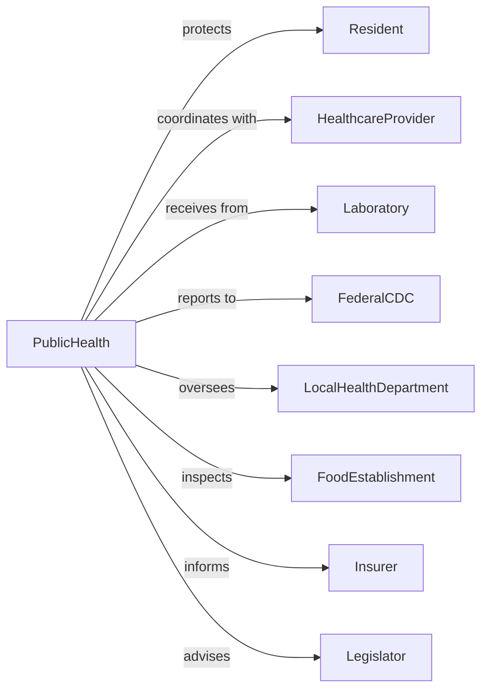

# Administration of Public Health Programs

> Business-as-Code definition for public health program administration. Models health policy coordination, disease surveillance, and population health management.

## Overview

Public health program administration encompasses government planning and coordination of health services including disease prevention, health inspections, immunization programs, and health statistics collection. This definition exposes actions for outbreak response, health inspection, vaccination campaigns, and epidemiological surveillance, events for workflow automation, and searches for public health data retrieval.

## Actors

| Actor | Description |
|-------|-------------|
| Resident | Individual receiving public health services |
| HealthcareProvider | Facility delivering medical services |
| Laboratory | Entity conducting disease testing |
| FederalCDC | Centers for Disease Control providing guidance |
| LocalHealthDepartment | County or city health agency |
| FoodEstablishment | Restaurant or processor subject to inspection |
| Insurer | Carrier involved in health coverage |
| Legislator | Elected official shaping health policy |

## Roles

| Role | Description |
|------|-------------|
| HealthOfficer | Executive leading public health department |
| Epidemiologist | Specialist tracking disease patterns |
| HealthInspector | Official conducting facility reviews |
| ImmunizationCoordinator | Manager overseeing vaccination programs |
| EnvironmentalHealthSpecialist | Professional monitoring environmental hazards |
| HealthEducator | Communicator delivering wellness information |

## Entities

| Entity | Description |
|--------|-------------|
| DiseaseCase | Reported instance of communicable illness |
| OutbreakInvestigation | Response to disease cluster |
| HealthInspection | Review of facility compliance |
| ImmunizationRecord | Documentation of vaccination status |
| HealthStatistic | Aggregated population health data |
| QuarantineOrder | Directive restricting movement |
| HealthAlert | Public notification of health threat |
| LicensePermit | Authorization for health-related business |
| SurveillanceReport | Summary of disease monitoring |
| HealthGrant | Funding for public health program |
| VitalRecord | Birth, death, or marriage documentation |

## Actions

| Action | Description |
|--------|-------------|
| investigateOutbreak | Respond to disease cluster |
| conductInspection | Review facility for health compliance |
| administerVaccine | Provide immunization to individual |
| issueQuarantine | Order isolation of infected individual |
| conductSurveillance | Monitor disease patterns in population |
| issueHealthAlert | Disseminate public health warning |
| licenseEstablishment | Authorize health-related business |
| collectVitalStatistics | Gather birth, death, and marriage data |
| enforceRegulation | Take action for health code violation |
| coordinateResponse | Manage multi-agency health emergency |
| educateCommunity | Deliver health promotion programs |
| reportDisease | Document communicable illness case |
| testEnvironment | Sample water, air, or food for hazards |
| administerGrant | Process public health funding |

## Events

| Event | Description |
|-------|-------------|
| outbreakInvestigated | Disease cluster response completed |
| inspectionConducted | Facility review completed |
| vaccineAdministered | Immunization provided |
| quarantineIssued | Isolation order enacted |
| surveillanceConducted | Disease monitoring completed |
| healthAlertIssued | Public warning disseminated |
| establishmentLicensed | Business authorization granted |
| vitalStatisticsCollected | Population data gathered |
| regulationEnforced | Compliance action taken |
| responseCoordinated | Emergency operations managed |
| communityEducated | Health program delivered |
| diseaseReported | Illness case documented |
| environmentTested | Hazard sampling completed |
| grantAdministered | Funding processed |

## Searches

| Search | Description |
|--------|-------------|
| findCases | Search disease reports by type or location |
| getInspections | Retrieve facility reviews by result or date |
| listOutbreaks | Get disease clusters by status or pathogen |
| findImmunizations | Search vaccination records by vaccine or area |
| getVitalStats | Retrieve birth and death data by period |
| listAlerts | Get health warnings by type or date |
| findLicenses | Search business authorizations by type or status |

## Workflow



## Actor Relationships



## Usage

### Calling Actions

```typescript
import { administerHealth } from '@headlessly/administer-health'

const health = administerHealth()

// Investigate disease outbreak
const investigation = await health.investigateOutbreak({
  disease: 'salmonella',
  caseCount: 25,
  location: 'county-springfield',
  suspectedSource: 'restaurant',
  responseLevel: 'urgent'
})

// Conduct food establishment inspection
const inspection = await health.conductInspection({
  establishmentType: 'restaurant',
  location: '123 Main Street',
  inspectionType: 'routine',
  areas: [
    'foodStorage',
    'temperatureControl',
    'employeeHygiene',
    'pestControl',
    'sanitation'
  ]
})

// Issue quarantine order
await health.issueQuarantine({
  individual: 'patient-12345',
  disease: 'tuberculosis',
  duration: 21,
  restrictions: ['homeIsolation', 'noPublicSpaces'],
  monitoring: 'daily'
})
```

### Event-Driven Automation

```typescript
// Process disease report
health.diseaseReported(async ({ caseId, disease, location }) => {
  await health.conductSurveillance({
    disease,
    area: location,
    contacts: await identifyContacts(caseId)
  })

  if (isNotifiable(disease)) {
    await reportToFederal({
      caseId,
      disease,
      reportType: 'mandatory'
    })
  }
})

// Handle outbreak investigation
health.outbreakInvestigated(async ({ outbreakId, source, cases }) => {
  if (source.type === 'foodEstablishment') {
    await health.conductInspection({
      establishmentId: source.id,
      inspectionType: 'emergency',
      focus: 'outbreak'
    })

    await health.issueHealthAlert({
      outbreakId,
      affectedProduct: source.product,
      action: 'avoidConsumption'
    })
  }
})
```
