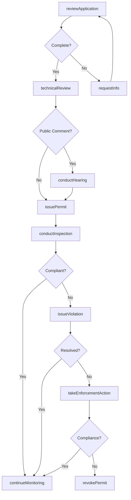
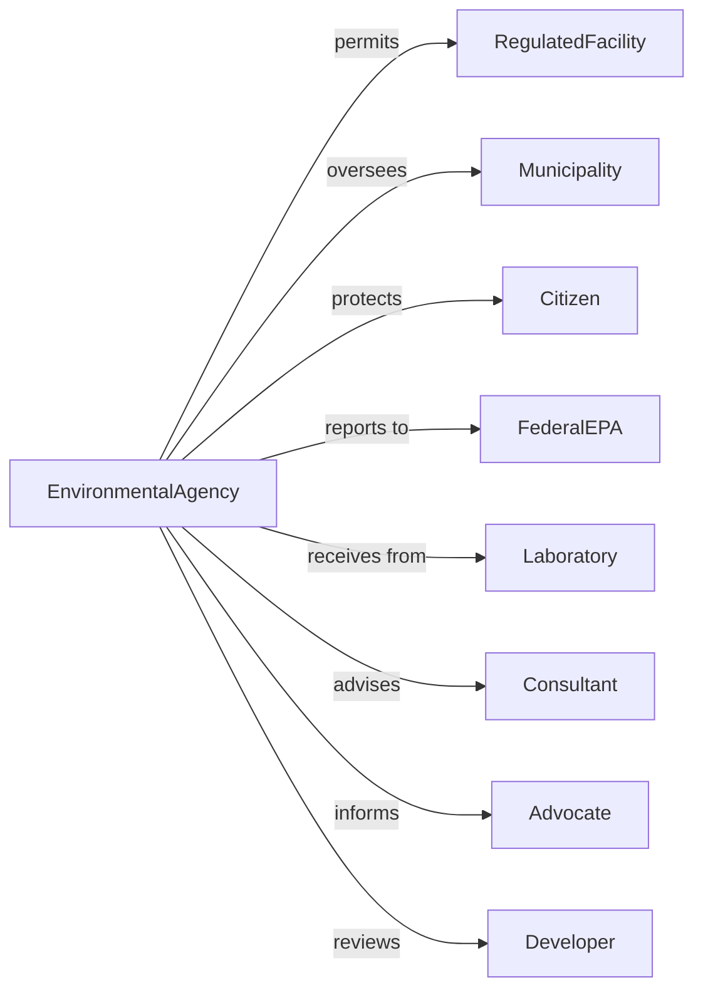

# Administration of Air and Water Resource and Solid Waste Management Programs

> Business-as-Code definition for environmental quality program administration. Models pollution control, resource management, and waste regulation from permit issuance through enforcement.

## Overview

Environmental quality program administration encompasses government regulation of air quality, water resources, and solid waste management including pollution control, permit issuance, and environmental monitoring. This definition exposes actions for permit processing, compliance inspection, pollution monitoring, and enforcement, events for workflow automation, and searches for environmental data retrieval.

## Actors

| Actor | Description |
|-------|-------------|
| RegulatedFacility | Industrial or commercial entity subject to permits |
| Municipality | Local government operating water or waste systems |
| Citizen | Individual affected by environmental quality |
| FederalEPA | Environmental Protection Agency providing oversight |
| Laboratory | Entity conducting environmental testing |
| Consultant | Environmental specialist advising permit applicants |
| Advocate | Environmental organization monitoring compliance |
| Developer | Entity planning projects with environmental impact |

## Roles

| Role | Description |
|------|-------------|
| EnvironmentalDirector | Executive leading environmental agency |
| PermitWriter | Specialist drafting environmental authorizations |
| ComplianceInspector | Official conducting facility reviews |
| WaterQualitySpecialist | Professional monitoring water resources |
| AirQualityEngineer | Expert analyzing atmospheric emissions |
| WasteManagementOfficer | Administrator overseeing solid waste programs |

## Entities

| Entity | Description |
|--------|-------------|
| EnvironmentalPermit | Authorization for regulated activity |
| EmissionLimit | Maximum allowable pollutant discharge |
| WaterQualityStandard | Required condition for water body |
| ComplianceInspection | Review of facility environmental practices |
| ViolationNotice | Documentation of permit non-compliance |
| MonitoringData | Environmental measurement results |
| WasteManifest | Tracking document for hazardous waste |
| TotalMaximumDailyLoad | Pollution budget for impaired water body |
| DischargeReport | Facility submission of emission data |
| EnforcementAction | Penalty or corrective requirement |
| AirQualityIndex | Daily atmospheric condition measurement |

## Actions

| Action | Description |
|--------|-------------|
| issuePermit | Grant authorization for regulated activity |
| setEmissionLimit | Establish maximum pollutant discharge |
| conductInspection | Review facility environmental compliance |
| monitorAirQuality | Measure atmospheric pollutant levels |
| monitorWaterQuality | Assess water body condition |
| processDischargeReport | Handle facility emission submission |
| issueViolation | Document permit non-compliance |
| takeEnforcementAction | Impose penalty or require correction |
| developTMDL | Create pollution budget for water body |
| trackWaste | Monitor hazardous material movement |
| reviewApplication | Evaluate permit request |
| issueAdvisory | Warn public of environmental condition |
| conductHearing | Hold public proceeding on permit or enforcement |
| modifyPermit | Revise existing authorization |

## Events

| Event | Description |
|-------|-------------|
| permitIssued | Regulated activity authorized |
| emissionLimitSet | Pollutant discharge maximum established |
| inspectionConducted | Facility review completed |
| airQualityMonitored | Atmospheric measurement recorded |
| waterQualityMonitored | Water body assessment completed |
| dischargeReportProcessed | Facility submission handled |
| violationIssued | Non-compliance documented |
| enforcementTaken | Penalty or correction imposed |
| tmdlDeveloped | Water body pollution budget created |
| wasteTracked | Hazardous material movement logged |
| applicationReviewed | Permit request evaluated |
| advisoryIssued | Public warning disseminated |
| hearingConducted | Public proceeding completed |
| permitModified | Authorization revised |

## Searches

| Search | Description |
|--------|-------------|
| findPermits | Search authorizations by facility or type |
| getMonitoringData | Retrieve environmental measurements by location |
| listViolations | Get non-compliance records by facility or severity |
| findInspections | Search facility reviews by date or result |
| getAirQuality | Retrieve atmospheric data by area or date |
| listEnforcementActions | Get penalties by facility or status |
| findWasteManifests | Search hazardous material tracking documents |

## Workflow



## Actor Relationships



## Usage

### Calling Actions

```typescript
import { administerAir } from '@headlessly/administer-air'

const environmental = administerAir()

// Issue discharge permit
const permit = await environmental.issuePermit({
  permitType: 'npdes',
  facility: {
    name: 'Acme Manufacturing',
    location: '123 Industrial Way',
    sicCode: '3312'
  },
  discharges: [
    { outfall: '001', receiving: 'Spring River', parameters: ['bod', 'tss', 'ph'] }
  ],
  limits: [
    { parameter: 'bod', limit: 30, unit: 'mg/L', average: 'monthly' },
    { parameter: 'tss', limit: 30, unit: 'mg/L', average: 'monthly' }
  ],
  term: { start: '2024-01-01', end: '2028-12-31' }
})

// Conduct compliance inspection
const inspection = await environmental.conductInspection({
  permitId: permit.id,
  inspectionType: 'comprehensive',
  areas: ['dischargePoints', 'monitoring', 'recordkeeping', 'stormwater'],
  inspector: 'johnson-smith'
})

// Monitor air quality
await environmental.monitorAirQuality({
  station: 'downtown-monitor-1',
  parameters: ['ozone', 'pm25', 'co', 'no2'],
  frequency: 'hourly',
  alertThresholds: { pm25: 35, ozone: 0.070 }
})
```

### Event-Driven Automation

```typescript
// Process permit application
environmental.applicationReceived(async ({ applicationId, facility, permitType }) => {
  await environmental.reviewApplication({
    applicationId,
    checklistItems: [
      'completeness',
      'technicalAdequacy',
      'publicNotice'
    ]
  })

  if (requiresHearing(permitType, facility)) {
    await schedulePublicHearing({
      applicationId,
      noticePeriod: 30
    })
  }
})

// Handle violation detection
environmental.violationIssued(async ({ violationId, facility, severity }) => {
  if (severity === 'significant') {
    await environmental.takeEnforcementAction({
      violationId,
      actionType: 'complianceOrder',
      deadline: addDays(new Date(), 30)
    })

    await notifyFederalEPA({
      violationId,
      reportType: 'significantNoncompliance'
    })
  }
})
```
