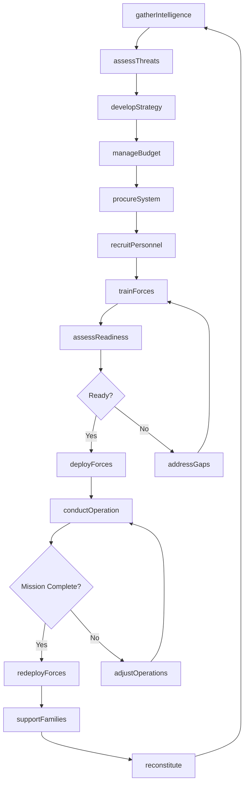
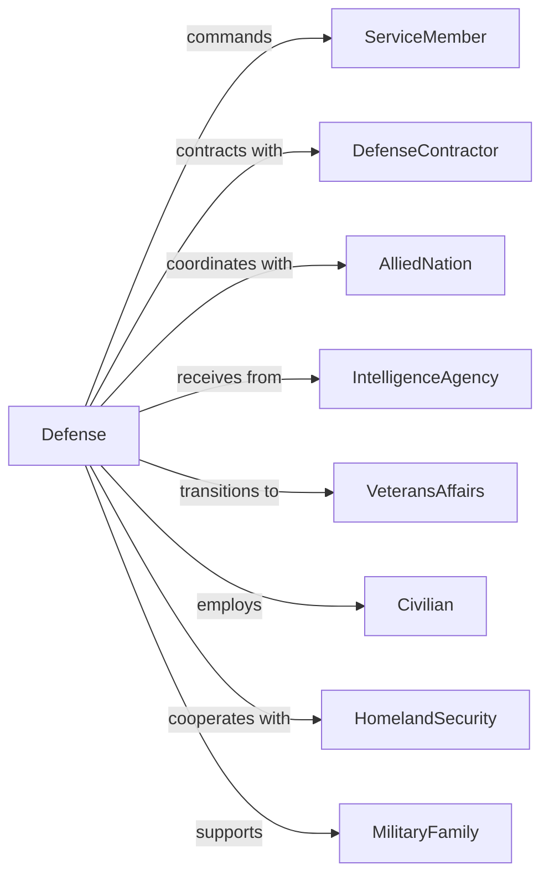

# National Security

> Business-as-Code definition for national defense administration. Models military operations, force readiness, and defense coordination from strategy through mission execution.

## Overview

National security encompasses government establishments of the Armed Forces including Army, Navy, Air Force, Marine Corps, and National Guard engaged in national defense and related activities. This definition exposes actions for force deployment, military training, defense procurement, and homeland security coordination, events for workflow automation, and searches for defense operations data retrieval.

## Actors

| Actor | Description |
|-------|-------------|
| ServiceMember | Active duty or reserve military personnel |
| DefenseContractor | Company providing military systems |
| AlliedNation | Foreign country in security partnership |
| IntelligenceAgency | Organization gathering national security information |
| VeteransAffairs | Agency serving former military members |
| Civilian | Non-military government employee |
| HomelandSecurity | Agency coordinating domestic security |
| MilitaryFamily | Dependents of service members |

## Roles

| Role | Description |
|------|-------------|
| SecretaryOfDefense | Executive leading defense department |
| JointChiefChairman | Senior military advisor |
| CombatantCommander | General officer leading geographic command |
| BaseCommander | Officer managing military installation |
| IntelligenceOfficer | Specialist gathering security information |
| LogisticsOfficer | Manager coordinating supply chains |

## Entities

| Entity | Description |
|--------|-------------|
| MilitaryUnit | Organized formation of service members |
| WeaponSystem | Combat equipment platform |
| MilitaryOperation | Planned or executed combat action |
| DefenseContract | Agreement for military procurement |
| MilitaryInstallation | Base or facility supporting operations |
| Deployment | Assignment of forces to operational area |
| SecurityClearance | Authorization for classified access |
| MilitaryTraining | Preparation of forces for operations |
| IntelligenceReport | Assessment of security threats |
| DefenseBudget | Allocation of military funding |
| ForceReadiness | Measure of unit preparedness |

## Actions

| Action | Description |
|--------|-------------|
| deployForces | Assign units to operational area |
| conductOperation | Execute military action |
| trainForces | Prepare units for combat |
| procureSystem | Acquire military equipment |
| gatherIntelligence | Collect security information |
| assessReadiness | Evaluate unit preparedness |
| defendHomeland | Protect domestic territory |
| coordinateAllies | Manage international partnerships |
| maintainInstallation | Operate military facility |
| processClearance | Authorize classified access |
| manageBudget | Allocate defense funding |
| recruitPersonnel | Enlist service members |
| supportFamilies | Assist military dependents |
| conductExercise | Practice combat operations |

## Events

| Event | Description |
|-------|-------------|
| forcesDeployed | Units assigned to area |
| operationConducted | Military action executed |
| forcesTrained | Units prepared for combat |
| systemProcured | Equipment acquired |
| intelligenceGathered | Security information collected |
| readinessAssessed | Preparedness evaluated |
| homelandDefended | Territory protected |
| alliesCoordinated | Partnerships managed |
| installationMaintained | Facility operated |
| clearanceProcessed | Access authorized |
| budgetManaged | Funding allocated |
| personnelRecruited | Service members enlisted |
| familiesSupported | Dependents assisted |
| exerciseConducted | Combat practice completed |

## Searches

| Search | Description |
|--------|-------------|
| findUnits | Search formations by type, location, or status |
| getOperations | Retrieve actions by region or timeframe |
| listContracts | Get procurement agreements by system or contractor |
| findDeployments | Search assignments by unit or area |
| getReadiness | Retrieve preparedness by unit or category |
| listInstallations | Get facilities by branch or location |
| findClearances | Search authorizations by level or status |

## Workflow



## Actor Relationships



## Usage

### Calling Actions

```typescript
import { defendDefense } from '@headlessly/defend-defense'

const defense = defendDefense()

// Deploy forces
const deployment = await defense.deployForces({
  unit: {
    name: '1st Infantry Division',
    type: 'mechanizedInfantry',
    strength: 15000
  },
  destination: {
    region: 'indoPacific',
    location: 'classified'
  },
  mission: 'deterrence',
  duration: 9,
  supportRequirements: [
    'logistics',
    'airSupport',
    'intelligence'
  ]
})

// Procure weapon system
const contract = await defense.procureSystem({
  system: {
    name: 'NextGenFighter',
    type: 'aircraft',
    quantity: 100
  },
  contractor: 'defense-aerospace-corp',
  value: 15000000000,
  schedule: {
    design: '2024-2026',
    production: '2027-2032',
    delivery: '2028-2035'
  },
  requirements: [
    'stealth',
    'supercruise',
    'advancedSensors'
  ]
})

// Assess readiness
await defense.assessReadiness({
  unit: '1st-infantry-division',
  categories: [
    'personnel',
    'equipment',
    'training',
    'logistics'
  ],
  standard: 'deployable',
  timeline: 30
})
```

### Event-Driven Automation

```typescript
// Process deployment
defense.forcesDeployed(async ({ deploymentId, unit, mission }) => {
  await defense.maintainInstallation({
    installation: getForwardBase(deploymentId),
    support: ['housing', 'medical', 'dining', 'communications']
  })

  await defense.supportFamilies({
    unit: unit.id,
    services: [
      'deploymentBriefing',
      'familyReadinessGroup',
      'emergencyContact'
    ]
  })

  await updateReadinessReporting({
    unit: unit.id,
    status: 'deployed',
    mission
  })
})

// Monitor readiness
defense.readinessAssessed(async ({ unitId, results, gaps }) => {
  if (gaps.length > 0) {
    await defense.trainForces({
      unit: unitId,
      focus: gaps.map(g => g.category),
      timeline: 'expedited'
    })

    await notifyCommand({
      unit: unitId,
      readiness: results.overall,
      remediation: gaps
    })
  }
})
```
