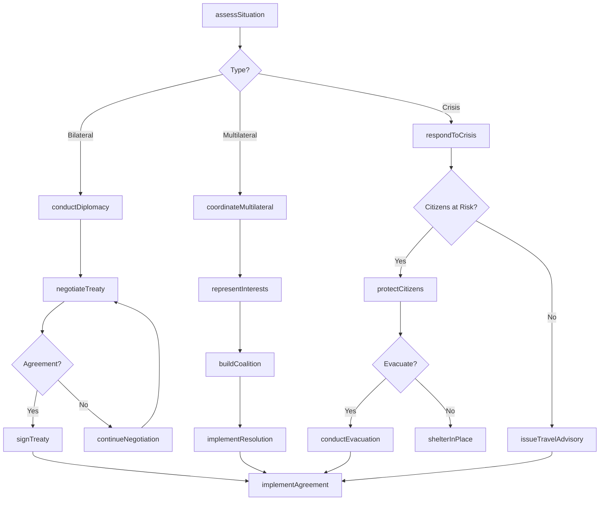
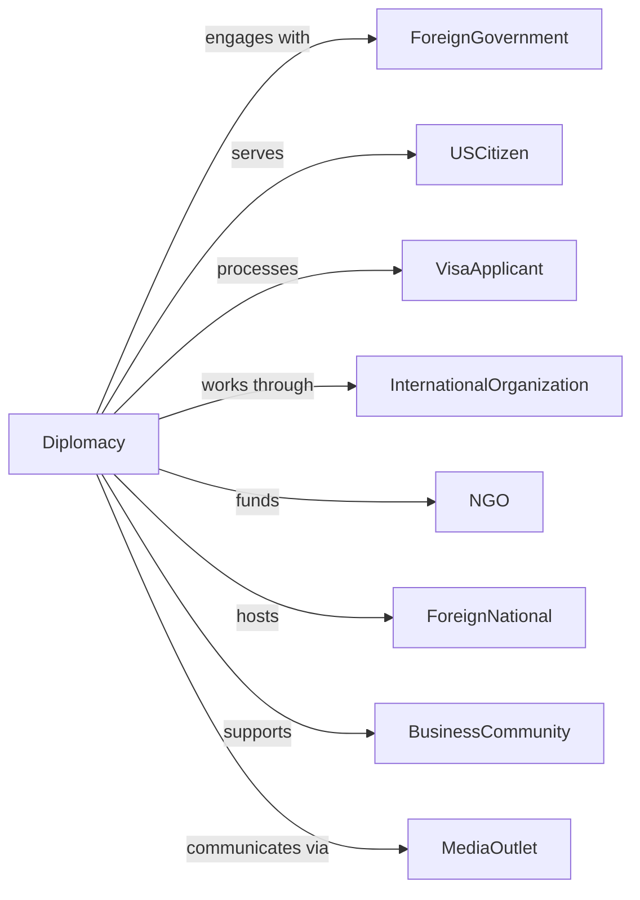

# International Affairs

> Business-as-Code definition for diplomatic and international affairs administration. Models foreign relations, treaty negotiation, and international assistance from policy through implementation.

## Overview

International affairs encompasses government establishments engaged in foreign relations, diplomatic services, and international programs including embassies, consulates, and foreign assistance agencies. This definition exposes actions for diplomatic engagement, treaty negotiation, visa processing, and foreign assistance delivery, events for workflow automation, and searches for international affairs data retrieval.

## Actors

| Actor | Description |
|-------|-------------|
| ForeignGovernment | Sovereign nation engaged in diplomatic relations |
| USCitizen | American national abroad requiring services |
| VisaApplicant | Individual seeking entry authorization |
| InternationalOrganization | Multilateral body facilitating cooperation |
| NGO | Nonprofit implementing assistance programs |
| ForeignNational | Citizen of another country |
| BusinessCommunity | Commercial entities in international trade |
| MediaOutlet | News organization covering foreign affairs |

## Roles

| Role | Description |
|------|-------------|
| SecretaryOfState | Executive leading foreign affairs |
| Ambassador | Chief diplomatic representative to country |
| ConsularOfficer | Official processing visas and citizen services |
| ForeignServiceOfficer | Diplomat conducting international relations |
| AIDAdministrator | Manager overseeing development assistance |
| PolicyAdvisor | Specialist analyzing international issues |

## Entities

| Entity | Description |
|--------|-------------|
| DiplomaticMission | Embassy or consulate representing country |
| Treaty | Formal agreement between nations |
| VisaApplication | Request for entry authorization |
| ForeignAssistanceGrant | Development aid to recipient country |
| DiplomaticNote | Official communication between governments |
| ConsularCase | Citizen service matter |
| TravelAdvisory | Warning about foreign destination |
| TradeAgreement | Commercial arrangement between nations |
| Sanctions | Economic restrictions on foreign entity |
| CulturalExchange | Program promoting international understanding |
| EmergencyEvacuation | Extraction of citizens from crisis |

## Actions

| Action | Description |
|--------|-------------|
| conductDiplomacy | Engage with foreign government |
| negotiateTreaty | Develop formal agreement |
| processVisa | Handle entry authorization request |
| deliverAssistance | Provide foreign aid |
| issueNote | Send official communication |
| handleConsularCase | Manage citizen service matter |
| issueTravelAdvisory | Warn about foreign destination |
| negotiateTrade | Develop commercial agreement |
| imposeSanctions | Implement economic restrictions |
| promotExchange | Facilitate international understanding |
| conductEvacuation | Extract citizens from crisis |
| representInterests | Advocate for national position |
| protectCitizens | Assist nationals abroad |
| coordinateMultilateral | Work with international organizations |

## Events

| Event | Description |
|-------|-------------|
| diplomacyConducted | Foreign engagement completed |
| treatyNegotiated | Formal agreement developed |
| visaProcessed | Entry authorization handled |
| assistanceDelivered | Foreign aid provided |
| noteIssued | Official communication sent |
| consularCaseHandled | Citizen matter managed |
| advisoryIssued | Destination warning published |
| tradeNegotiated | Commercial agreement developed |
| sanctionsImposed | Economic restrictions implemented |
| exchangePromoted | International understanding facilitated |
| evacuationConducted | Crisis extraction completed |
| interestsRepresented | Position advocated |
| citizensProtected | Nationals assisted |
| multilateralCoordinated | Organization work completed |

## Searches

| Search | Description |
|--------|-------------|
| findMissions | Search diplomatic posts by country or type |
| getTreaties | Retrieve agreements by nation or subject |
| listVisas | Get entry authorizations by type or status |
| findAssistance | Search aid by recipient or program |
| getAdvisories | Retrieve warnings by destination or level |
| listSanctions | Get restrictions by target or type |
| findConsularCases | Search citizen matters by type or status |

## Workflow



## Actor Relationships



## Usage

### Calling Actions

```typescript
import { defendDiplomacy } from '@headlessly/defend-diplomacy'

const diplomacy = defendDiplomacy()

// Negotiate treaty
const treaty = await diplomacy.negotiateTreaty({
  counterparty: 'republic-of-example',
  subject: 'climateCooperation',
  provisions: [
    { article: 1, topic: 'emissionReductions', commitment: 'binding' },
    { article: 2, topic: 'technologyTransfer', commitment: 'voluntary' },
    { article: 3, topic: 'financing', commitment: 'contributory' }
  ],
  negotiators: ['special-envoy-climate', 'undersecretary-economic'],
  timeline: { start: '2024-01', target: '2024-12' }
})

// Deliver foreign assistance
const assistance = await diplomacy.deliverAssistance({
  recipient: 'developing-nation',
  program: 'healthInfrastructure',
  amount: 50000000,
  implementer: 'usaid-health',
  objectives: [
    'buildClinics',
    'trainHealthWorkers',
    'supplyMedications'
  ],
  duration: 5
})

// Process visa application
await diplomacy.processVisa({
  applicant: {
    name: 'Maria Garcia',
    nationality: 'mexican',
    passportNumber: 'G12345678'
  },
  visaType: 'b1b2',
  purpose: 'businessAndTourism',
  interview: {
    post: 'consulate-guadalajara',
    date: '2024-04-15'
  }
})
```

### Event-Driven Automation

```typescript
// Process crisis response
diplomacy.crisisDetected(async ({ country, type, severity }) => {
  await diplomacy.issueTravelAdvisory({
    country,
    level: mapSeverityToLevel(severity),
    risks: identifyRisks(type)
  })

  if (severity === 'critical') {
    await diplomacy.protectCitizens({
      country,
      actions: [
        'activateEmergencyPlan',
        'contactRegisteredCitizens',
        'coordinateWithEmbassy'
      ]
    })

    if (requiresEvacuation(type, severity)) {
      await diplomacy.conductEvacuation({
        country,
        assets: ['charterFlights', 'militaryAirlift'],
        priority: ['americanCitizens', 'legalResidents']
      })
    }
  }
})

// Handle treaty signature
diplomacy.treatyNegotiated(async ({ treatyId, parties, provisions }) => {
  await scheduleSigningCeremony({
    treatyId,
    venue: determineVenue(parties),
    date: selectDate(parties)
  })

  await prepareRatificationPackage({
    treatyId,
    provisions,
    senateSubmission: true
  })

  await diplomacy.issueNote({
    recipient: parties,
    subject: 'treatyConclusion',
    content: generateDiplomaticNote(treatyId)
  })
})
```
