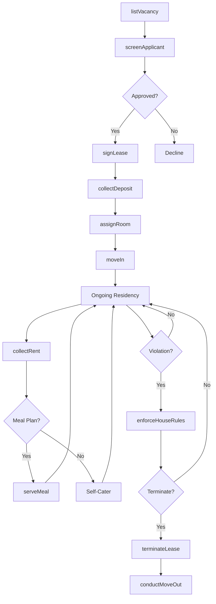
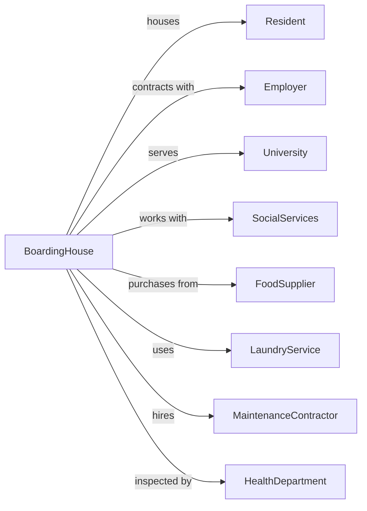

# Rooming and Boarding Houses, Dormitories, and Workers' Camps

> Business-as-Code definition for boarding and dormitory operations. Models extended-stay accommodations with shared facilities and meal service.

## Overview

Rooming houses, boarding houses, dormitories, and workers' camps provide temporary or longer-term accommodations that may serve as a principal residence. This definition exposes actions for resident management, meal planning, shared facility scheduling, and the unique operational requirements of extended-stay communal living.

## Actors

| Actor | Description |
|-------|-------------|
| Resident | Individual occupying room for extended period |
| Employer | Company housing workers at camp facility |
| University | Institution contracting dormitory services |
| SocialServices | Agency placing clients in transitional housing |
| FoodSupplier | Delivers provisions for meal service |
| LaundryService | Provides linen and laundry processing |
| MaintenanceContractor | Handles repairs and facility upkeep |
| HealthDepartment | Inspects food service and living conditions |

## Roles

| Role | Description |
|------|-------------|
| HouseManager | Oversees daily operations and resident relations |
| ResidentAdvisor | Supervises floor or section in dormitory setting |
| Cook | Prepares meals for residents |
| Housekeeper | Maintains common areas and cleans rooms |
| NightClerk | Handles after-hours security and emergencies |

## Entities

| Entity | Description |
|--------|-------------|
| Room | Individual or shared sleeping accommodation |
| Resident | Person occupying room with contact and billing info |
| LeaseAgreement | Contract specifying terms, rent, and policies |
| MealPlan | Included or optional food service arrangement |
| SharedFacility | Common bathroom, kitchen, or lounge area |
| HouseRule | Policy governing resident behavior and use |
| RentPayment | Monthly or weekly accommodation charge |
| SecurityDeposit | Refundable amount held against damages |
| WorkOrder | Maintenance request for room or facility |
| Meal | Prepared food service provided to residents |

## Actions

| Action | Description |
|--------|-------------|
| listVacancy | Advertise available room for rent |
| screenApplicant | Review prospective resident application |
| signLease | Execute rental agreement with new resident |
| collectDeposit | Receive security deposit and first payment |
| assignRoom | Allocate specific room to resident |
| moveIn | Complete resident arrival and orientation |
| collectRent | Process recurring payment for accommodation |
| serveMeal | Provide prepared food per meal plan |
| scheduleSharedSpace | Reserve common area for resident use |
| submitWorkOrder | Request maintenance or repair service |
| enforceHouseRules | Address policy violations |
| terminateLease | End residency per agreement terms |
| conductMoveOut | Complete departure inspection and deposit return |
| transferRoom | Move resident to different accommodation |

## Events

| Event | Description |
|-------|-------------|
| vacancyListed | Available room advertised |
| applicantScreened | Prospective resident reviewed |
| leaseSignedEvent | Rental agreement executed |
| depositCollected | Security deposit received |
| roomAssigned | Resident placed in accommodation |
| residentMovedIn | Arrival completed and resident settled |
| rentCollected | Payment received for period |
| mealServed | Food service provided |
| spaceReserved | Common area booked for use |
| workOrderSubmitted | Maintenance request created |
| workOrderCompleted | Repair or service finished |
| ruleViolationRecorded | Policy breach documented |
| leaseTerminated | Residency agreement ended |
| residentMovedOut | Departure completed and room vacated |

## Searches

| Search | Description |
|--------|-------------|
| getAvailableRooms | List vacant rooms with features |
| getResidentRoster | Retrieve current residents with room assignments |
| getRentDue | List outstanding rent payments |
| getMealPlanRoster | Get residents enrolled in meal service |
| getMaintenanceQueue | View open work orders |
| getLeaseExpirations | Find leases ending in date range |
| getOccupancyReport | Calculate occupancy statistics |
| getViolationHistory | Review policy breaches by resident |

## Workflow



## Actor Relationships



## Usage

### Calling Actions

```typescript
import { boardBoarders } from '@headlessly/board-boarders'

const house = boardBoarders()

// Check available rooms and upcoming lease expirations
const vacancies = await house.getAvailableRooms({ roomType: 'single', mealPlan: 'full-board' })
const expiring = await house.getLeaseExpirations({ from: '2024-04-01', to: '2024-06-30' })

// Screen new applicant
const screening = await house.screenApplicant({
  firstName: 'David',
  lastName: 'Park',
  email: 'd.park@email.com',
  phone: '+1-555-0167',
  employer: 'Northern Mining Co',
  employmentVerification: true,
  backgroundCheck: true,
  requestedMoveIn: '2024-04-01',
  preferredRoomType: 'single'
})

// Execute lease agreement
const lease = await house.signLease({
  applicantId: screening.applicantId,
  roomId: 'room-204',
  startDate: '2024-04-01',
  term: 6, // months
  monthlyRent: 850,
  mealPlan: 'full-board',
  securityDeposit: 850,
  houseRulesAcknowledged: true
})

// Complete move-in process
await house.moveIn({
  leaseId: lease.id,
  arrivalDate: '2024-04-01',
  keysIssued: ['room', 'front-door', 'mailbox'],
  orientationCompleted: true,
  emergencyContact: {
    name: 'Susan Park',
    phone: '+1-555-0189',
    relationship: 'spouse'
  }
})
```

### Event-Driven Automation

```typescript
// Auto-generate rent invoices
house.residentMovedIn(async ({ residentId, leaseId, monthlyRent }) => {
  const lease = await house.getLeaseDetails({ leaseId })

  // Schedule monthly rent collection
  scheduleRecurring({
    startDate: lease.startDate,
    frequency: 'monthly',
    action: async () => {
      await house.collectRent({
        residentId,
        amount: monthlyRent,
        period: currentMonth()
      })
    }
  })
})

// Notify before lease expiration
house.leaseSignedEvent(async ({ leaseId, endDate, residentId }) => {
  const notifyDate = subtractDays(endDate, 60)

  scheduleAt(notifyDate, async () => {
    await sendLeaseRenewalNotice({
      residentId,
      leaseId,
      expirationDate: endDate
    })
  })
})
```
