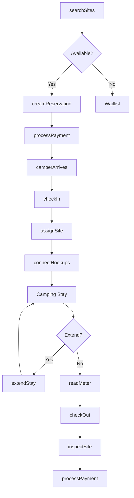
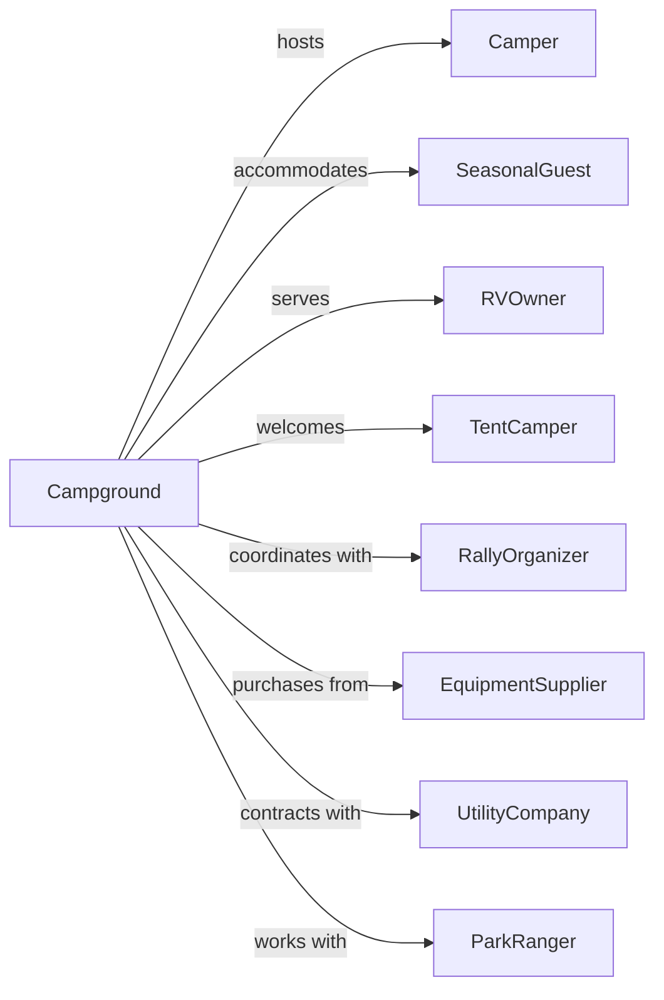

# RV (Recreational Vehicle) Parks and Campgrounds

> Business-as-Code definition for RV park and campground operations. Models site reservations, utility hookups, and campground amenities.

## Overview

RV parks and campgrounds provide sites for recreational vehicles, travel trailers, and tent camping with access to facilities like hookups, bathhouses, and recreation areas. This definition exposes actions for site management, utility metering, seasonal bookings, and campground amenity operations.

## Actors

| Actor | Description |
|-------|-------------|
| Camper | Individual or family using campsite for recreation |
| SeasonalGuest | Long-term camper with extended stay arrangement |
| RVOwner | Guest with recreational vehicle requiring hookups |
| TentCamper | Guest using tent site without RV hookups |
| RallyOrganizer | Coordinates group RV club gatherings |
| EquipmentSupplier | Provides propane, firewood, and camping supplies |
| UtilityCompany | Supplies electricity, water, and sewer services |
| ParkRanger | Enforces regulations in state or national park areas |

## Roles

| Role | Description |
|------|-------------|
| ParkOwner | Owns property and sets operational policies |
| CampgroundManager | Oversees daily operations and staff |
| RegistrationClerk | Handles check-ins and site assignments |
| MaintenanceWorker | Maintains grounds, facilities, and utilities |
| SecurityPatrol | Monitors quiet hours and enforces rules |

## Entities

| Entity | Description |
|--------|-------------|
| Site | Individual camping spot with specific features |
| Reservation | Booking for site with dates and camper details |
| Hookup | Utility connection for electric, water, or sewer |
| Amenity | Facility like pool, playground, or laundry |
| SeasonalContract | Long-term agreement for extended stays |
| Camper | Guest profile with vehicle and preference information |
| MeterReading | Utility usage measurement for billing |
| Firewood | Bundled wood sold for campfire use |
| QuietHours | Designated period for noise restrictions |
| SiteType | Category like full-hookup, partial, or primitive |

## Actions

| Action | Description |
|--------|-------------|
| searchSites | Find available sites matching criteria |
| createReservation | Book site for specified dates |
| checkIn | Register camper arrival and assign site |
| assignSite | Allocate specific site based on rig size and preferences |
| connectHookups | Establish utility connections at site |
| readMeter | Record utility usage for metered billing |
| processPayment | Collect fees for stay and additional charges |
| extendStay | Add nights to current reservation |
| checkOut | Complete departure and inspect site |
| sellFirewood | Sell bundled firewood to campers |
| createSeasonalContract | Establish long-term stay agreement |
| enforceQuietHours | Address noise violations during restricted periods |
| reportMaintenance | Log facility or site repair needs |
| blockSite | Mark site unavailable for maintenance |

## Events

| Event | Description |
|-------|-------------|
| reservationCreated | New booking confirmed for site |
| reservationCancelled | Booking cancelled with applicable policy |
| camperCheckedIn | Guest arrived and assigned to site |
| siteAssigned | Specific site allocated to reservation |
| hookupsConnected | Utilities established at site |
| meterRead | Utility usage recorded |
| paymentProcessed | Fees collected from camper |
| stayExtended | Additional nights added to booking |
| camperCheckedOut | Guest departed and site vacated |
| seasonalContractSigned | Long-term agreement executed |
| quietHoursViolation | Noise complaint recorded |
| maintenanceReported | Facility issue documented |
| siteInspected | Post-departure inspection completed |

## Searches

| Search | Description |
|--------|-------------|
| findAvailableSites | List open sites for date range and requirements |
| getArrivals | Retrieve expected check-ins for date |
| getDepartures | Retrieve expected check-outs for date |
| getOccupiedSites | List currently occupied sites |
| getSeasonalGuests | Retrieve long-term stay contracts |
| getMeterReadings | Get utility usage for billing period |
| getMaintenanceLog | View open and completed work orders |
| getSiteMap | Get visual layout of campground |

## Workflow



## Actor Relationships



## Usage

### Calling Actions

```typescript
import { campRVSites } from '@headlessly/camp-rv-sites'

const park = campRVSites()

// Check seasonal guests and current occupancy
const seasonals = await park.getSeasonalGuests({ status: 'active' })
const occupied = await park.getOccupiedSites({ section: 'lakeside' })

// Search for full-hookup sites
const sites = await park.searchSites({
  checkIn: '2024-08-15',
  checkOut: '2024-08-22',
  siteType: 'full-hookup',
  rigLength: 35,
  slideOuts: 2,
  amenities: ['pull-through', 'shade', 'wifi']
})

// Create reservation
const reservation = await park.createReservation({
  siteId: sites[0].id,
  guestName: 'Robert Miller',
  email: 'r.miller@email.com',
  phone: '+1-555-0199',
  checkIn: '2024-08-15',
  checkOut: '2024-08-22',
  rigType: 'class-a-motorhome',
  rigLength: 35,
  adults: 2,
  children: 2,
  pets: 1
})

// Check in arriving camper
await park.checkIn({
  reservationId: reservation.id,
  arrivalTime: new Date(),
  licensePlate: 'ABC-1234',
  hookupPreferences: ['50-amp', 'sewer', 'water']
})
```

### Event-Driven Automation

```typescript
// Send arrival instructions before check-in
park.reservationCreated(async ({ reservationId, checkIn, email }) => {
  const sendDate = subtractDays(checkIn, 3)

  scheduleAt(sendDate, async () => {
    await sendArrivalInstructions({
      reservationId,
      email,
      officeHours: '8am-8pm',
      afterHoursInstructions: 'Self-registration at kiosk'
    })
  })
})

// Auto-read meters and calculate final charges
park.camperCheckedOut(async ({ reservationId, siteId }) => {
  const reading = await park.readMeter({ siteId })
  const previousReading = await getPreviousReading(siteId)

  const usage = reading.kwh - previousReading.kwh
  const electricCharge = usage * 0.15

  await park.processPayment({
    reservationId,
    charges: [{ type: 'electric', amount: electricCharge }]
  })
})
```
