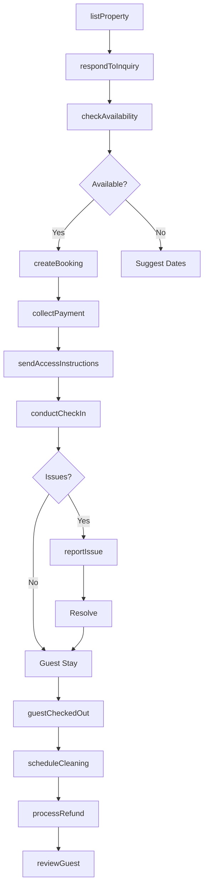
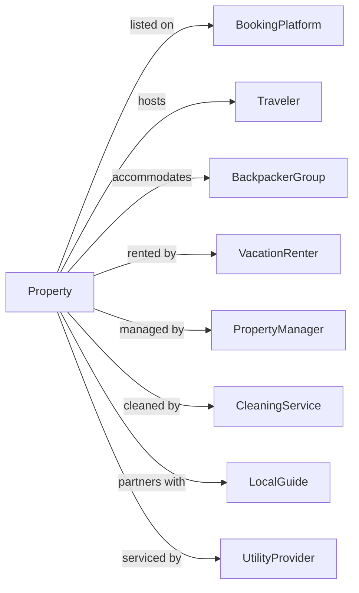

# All Other Traveler Accommodation

> Business-as-Code definition for alternative lodging operations. Models guest houses, hostels, cabins, and vacation rentals.

## Overview

This category encompasses diverse short-term lodging options including guest houses, hostels, housekeeping cabins, cottages, and tourist homes. This definition exposes actions for managing varied accommodation types, shared facilities, self-service stays, and flexible booking arrangements typical of alternative lodging.

## Actors

| Actor | Description |
|-------|-------------|
| Traveler | Budget-conscious or experience-seeking guest |
| BackpackerGroup | Young travelers seeking hostel-style accommodations |
| VacationRenter | Guest booking entire cabin or cottage |
| PropertyManager | Third-party operator managing multiple units |
| BookingPlatform | Online marketplace for alternative accommodations |
| CleaningService | Provides turnover cleaning between guests |
| LocalGuide | Offers tours and activities to guests |
| UtilityProvider | Supplies electricity, water, and internet services |

## Roles

| Role | Description |
|------|-------------|
| PropertyOwner | Owns accommodation and sets policies |
| HostManager | Handles day-to-day guest communications |
| Caretaker | Maintains property and handles on-site issues |
| CheckInAgent | Facilitates guest arrivals and key handoff |

## Entities

| Entity | Description |
|--------|-------------|
| Unit | Individual accommodation like cabin, cottage, or room |
| Bed | Individual sleeping space in shared dormitory |
| Reservation | Booking record with dates and guest details |
| Guest | Person or party staying at property |
| SharedFacility | Common kitchen, bathroom, or lounge area |
| AccessCode | Digital lock code or key box combination |
| HouseRules | Property policies and guest expectations |
| CleaningFee | One-time charge for turnover cleaning |
| SecurityDeposit | Refundable amount held against damages |
| Amenity | Included feature like WiFi, parking, or linens |

## Actions

| Action | Description |
|--------|-------------|
| listProperty | Publish accommodation on booking platforms |
| checkAvailability | Verify unit is open for requested dates |
| createBooking | Reserve unit with guest and payment information |
| collectPayment | Process booking payment and applicable fees |
| sendAccessInstructions | Provide entry codes and arrival details |
| assignBed | Allocate dormitory bed to hostel guest |
| conductCheckIn | Welcome guest and complete arrival process |
| reportIssue | Document maintenance or cleanliness problem |
| processRefund | Return security deposit or issue refund |
| scheduleCleaning | Arrange turnover service between guests |
| updateHouseRules | Modify property policies and instructions |
| blockDates | Mark unit unavailable for owner use or maintenance |
| reviewGuest | Rate guest behavior for future reference |
| respondToInquiry | Answer prospective guest questions |

## Events

| Event | Description |
|-------|-------------|
| propertyListed | Accommodation published on booking platform |
| bookingReceived | New reservation submitted by guest |
| bookingConfirmed | Payment processed and booking finalized |
| bookingCancelled | Reservation cancelled per policy terms |
| accessInstructionsSent | Entry details delivered to guest |
| guestCheckedIn | Guest arrived and accessed property |
| issueReported | Problem documented by guest or staff |
| issueResolved | Maintenance or service issue fixed |
| cleaningCompleted | Turnover service finished for unit |
| guestCheckedOut | Guest departed and unit vacated |
| depositRefunded | Security deposit returned to guest |
| depositClaimed | Deduction made from deposit for damages |
| guestReviewed | Feedback posted about guest stay |
| inquiryReceived | Prospective guest question submitted |

## Searches

| Search | Description |
|--------|-------------|
| findAvailableUnits | List properties open for date range |
| getUpcomingArrivals | Retrieve bookings arriving in window |
| getUpcomingDepartures | Retrieve bookings departing in window |
| getActiveGuests | List currently checked-in guests |
| getPendingCleanings | Find units needing turnover service |
| getOpenIssues | List unresolved maintenance problems |
| getGuestReviews | Retrieve feedback history for property |
| getRevenueReport | Calculate earnings for date period |

## Workflow



## Actor Relationships



## Usage

### Calling Actions

```typescript
import { lodgeTravelers } from '@headlessly/lodge-travelers'

const property = lodgeTravelers()

// Check available units for the holiday weekend
const available = await property.findAvailableUnits({ checkIn: '2024-07-04', checkOut: '2024-07-08', type: 'cabin' })

// Review any open maintenance issues before listing
const issues = await property.getOpenIssues({ unitId: 'mountain-view-cabin' })

// List a new vacation cabin
await property.listProperty({
  name: 'Mountain View Cabin',
  type: 'cabin',
  location: { lat: 39.5501, lng: -105.7821 },
  bedrooms: 2,
  maxGuests: 6,
  amenities: ['wifi', 'hot-tub', 'fireplace', 'pet-friendly'],
  baseRate: 175,
  cleaningFee: 85,
  securityDeposit: 300
})

// Create booking with payment
const booking = await property.createBooking({
  unitId: 'mountain-view-cabin',
  guestName: 'Mike Thompson',
  email: 'mike.t@email.com',
  checkIn: '2024-07-04',
  checkOut: '2024-07-08',
  guests: 4,
  pets: 1
})

// Send access instructions before arrival
await property.sendAccessInstructions({
  bookingId: booking.id,
  lockCode: '7584',
  wifiPassword: 'MountainView2024',
  parkingInstructions: 'Park in driveway, space for 2 vehicles',
  localRecommendations: ['hiking-trails', 'restaurants']
})
```

### Event-Driven Automation

```typescript
// Auto-send access details before check-in
property.bookingConfirmed(async ({ bookingId, checkIn }) => {
  const sendDate = subtractDays(checkIn, 2)

  scheduleAt(sendDate, async () => {
    const code = generateAccessCode()
    await property.sendAccessInstructions({
      bookingId,
      lockCode: code
    })
  })
})

// Schedule cleaning after checkout
property.guestCheckedOut(async ({ unitId, bookingId }) => {
  await property.scheduleCleaning({
    unitId,
    priority: 'standard',
    inspectionRequired: true
  })

  // Process deposit refund after inspection
  const issues = await property.getOpenIssues({ unitId })
  if (issues.length === 0) {
    await property.processRefund({
      bookingId,
      type: 'security-deposit',
      amount: 'full'
    })
  }
})
```
