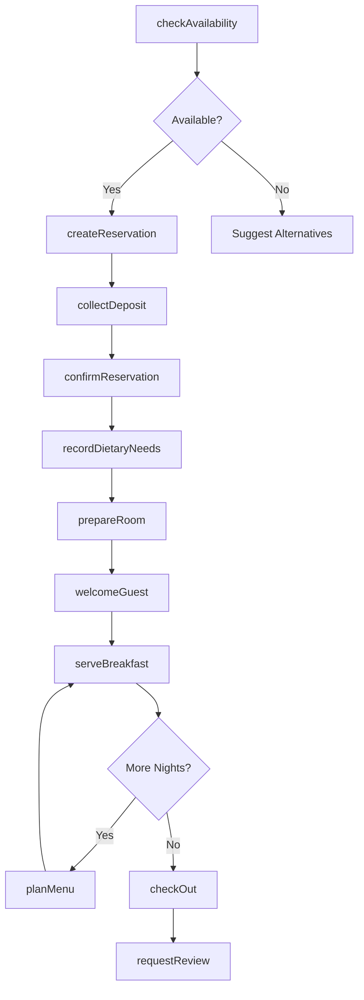
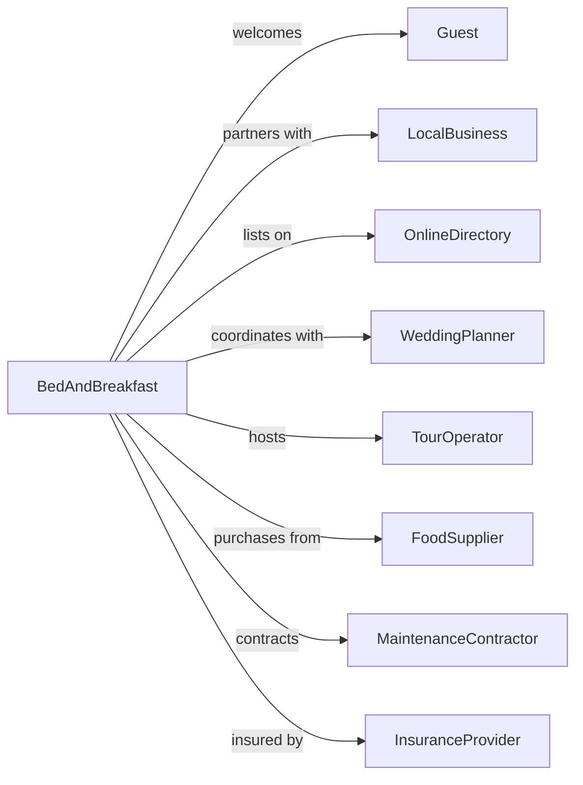

# Bed-and-Breakfast Inns

> Business-as-Code definition for bed-and-breakfast operations. Models personalized hospitality from inquiry through guest departure.

## Overview

Bed-and-breakfast inns provide intimate lodging experiences in private homes or small converted buildings, characterized by personalized service and included breakfast. This definition exposes actions for direct booking management, meal planning, guest experience customization, and the unique operational requirements of owner-operated properties.

## Actors

| Actor | Description |
|-------|-------------|
| Guest | Traveler seeking personalized, intimate lodging experience |
| WeddingPlanner | Coordinates accommodations for wedding parties |
| LocalBusiness | Provides partnership opportunities for guest referrals |
| FoodSupplier | Delivers fresh ingredients for breakfast service |
| OnlineDirectory | Lists property on B&B aggregator platforms |
| TourOperator | Books rooms for small group tours |
| MaintenanceContractor | Handles repairs and seasonal upkeep |
| InsuranceProvider | Covers property, liability, and innkeeper risks |

## Roles

| Role | Description |
|------|-------------|
| Innkeeper | Owner-operator managing all aspects of the property |
| BreakfastChef | Prepares daily morning meals for guests |
| Housekeeper | Maintains guest rooms and common areas |
| GuestServices | Handles inquiries, bookings, and guest relations |

## Entities

| Entity | Description |
|--------|-------------|
| Room | Named guest accommodation with unique character and amenities |
| Reservation | Booking with guest details, dates, and special requests |
| Guest | Visitor profile with preferences and stay history |
| Breakfast | Daily meal service with menu and dietary accommodations |
| Review | Guest feedback posted on travel platforms |
| GiftCertificate | Prepaid voucher for future stays |
| Package | Bundled offering combining room with experiences |
| SeasonalRate | Pricing tiers based on demand periods |
| Amenity | In-room or property feature enhancing guest experience |
| DietaryPreference | Guest food restrictions or requirements |

## Actions

| Action | Description |
|--------|-------------|
| checkAvailability | Verify room availability for requested dates |
| createReservation | Book room with guest contact and payment details |
| confirmReservation | Send confirmation with directions and policies |
| collectDeposit | Process advance payment to secure booking |
| prepareRoom | Ready specific room with guest preferences |
| welcomeGuest | Greet arrival with property tour and information |
| serveBreakfast | Provide morning meal with dietary accommodations |
| checkOut | Complete departure and collect payment balance |
| requestReview | Send follow-up requesting online feedback |
| issueGiftCertificate | Create prepaid voucher for gifting |
| createPackage | Bundle room with local experiences or amenities |
| adjustSeasonalRates | Update pricing for upcoming demand periods |
| recordDietaryNeeds | Note guest food allergies and preferences |
| planMenu | Design breakfast offerings for upcoming guests |

## Events

| Event | Description |
|-------|-------------|
| reservationRequested | Inquiry received for specific dates |
| reservationConfirmed | Booking finalized with deposit collected |
| reservationCancelled | Guest cancelled with applicable policy applied |
| guestArrived | Guest checked in and welcomed to property |
| breakfastServed | Morning meal provided to registered guests |
| guestDeparted | Check-out completed and room vacated |
| reviewReceived | Guest feedback posted on review platform |
| giftCertificatePurchased | Voucher sold for future redemption |
| giftCertificateRedeemed | Voucher applied to reservation |
| packageBooked | Bundled offering reserved by guest |
| seasonalRatesUpdated | Pricing changed for demand period |
| dietaryNoteAdded | Food restriction recorded for guest |
| menuPlanned | Breakfast selections finalized for date |

## Searches

| Search | Description |
|--------|-------------|
| findAvailableRooms | List rooms open for specified date range |
| getUpcomingArrivals | Retrieve guests arriving in date window |
| getGuestHistory | View past stays and preferences for returning guest |
| getBreakfastRequirements | List dietary needs for guests on specific date |
| getPendingReviews | Find recent guests who have not left reviews |
| getSeasonalCalendar | View rate periods and pricing tiers |
| getGiftCertificateBalance | Check remaining value on voucher |
| getOccupancyForecast | Project occupancy for future date range |

## Workflow



## Actor Relationships



## Usage

### Calling Actions

```typescript
import { lodgeInnGuests } from '@headlessly/lodge-inn-guests'

const inn = lodgeInnGuests()

// Review upcoming arrivals and dietary needs for the week
const arrivals = await inn.getUpcomingArrivals({ from: '2024-02-14', to: '2024-02-16' })
const dietaryNeeds = await inn.getBreakfastRequirements({ date: '2024-02-15' })

// Check availability for romantic getaway
const rooms = await inn.checkAvailability({
  checkIn: '2024-02-14',
  checkOut: '2024-02-16',
  guests: 2
})

// Create reservation with special requests
const reservation = await inn.createReservation({
  roomId: 'rose-garden-suite',
  guestName: 'Sarah Johnson',
  email: 'sarah.j@email.com',
  checkIn: '2024-02-14',
  checkOut: '2024-02-16',
  specialRequests: ['champagne-on-arrival', 'late-checkout'],
  occasion: 'anniversary'
})

// Record dietary requirements
await inn.recordDietaryNeeds({
  reservationId: reservation.id,
  restrictions: ['gluten-free', 'vegetarian'],
  allergies: ['tree-nuts'],
  preferences: ['fresh-fruit', 'herbal-tea']
})
```

### Event-Driven Automation

```typescript
// Prepare personalized welcome for arriving guests
inn.reservationConfirmed(async ({ reservationId, occasion, guestName }) => {
  const reservation = await inn.getGuestHistory({ reservationId })

  if (occasion === 'anniversary' || occasion === 'birthday') {
    await inn.prepareRoom({
      reservationId,
      specialTouches: ['flowers', 'welcome-card'],
      occasion
    })
  }
})

// Plan breakfast based on dietary needs
inn.guestArrived(async ({ reservationId, checkOutDate }) => {
  const dietary = await inn.getBreakfastRequirements({
    reservationId
  })

  await inn.planMenu({
    date: tomorrow(),
    accommodations: dietary,
    guestCount: await getInHouseCount()
  })
})
```
