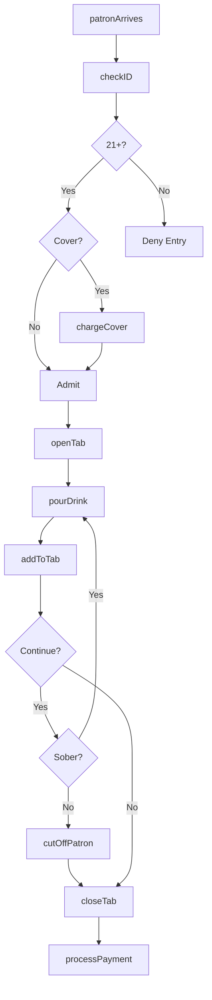
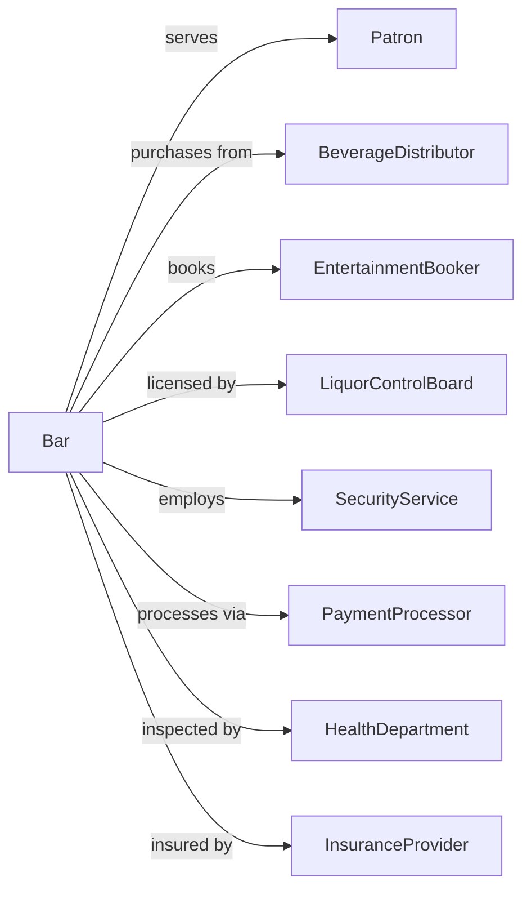

# Drinking Places (Alcoholic Beverages)

> Business-as-Code definition for bar and tavern operations. Models alcoholic beverage service, entertainment, and nightlife venue management.

## Overview

Drinking places including bars, taverns, nightclubs, and pubs primarily prepare and serve alcoholic beverages for immediate consumption, often with limited food service and entertainment. This definition exposes actions for beverage service, age verification, tab management, and the regulatory compliance requirements unique to alcohol-serving establishments.

## Actors

| Actor | Description |
|-------|-------------|
| Patron | Customer consuming beverages at the establishment |
| BeverageDistributor | Supplies beer, wine, and spirits inventory |
| EntertainmentBooker | Arranges live music, DJs, and performers |
| LiquorControlBoard | Regulates alcohol sales and licensing |
| SecurityService | Provides bouncers and crowd management |
| PaymentProcessor | Handles card transactions and tab settlements |
| HealthDepartment | Inspects food service areas |
| NeighborhoodAssociation | Represents local community interests |
| InsuranceProvider | Covers liquor liability and property |

## Roles

| Role | Description |
|------|-------------|
| BarOwner | Owns establishment and holds liquor license |
| BarManager | Oversees daily operations and staff scheduling |
| Bartender | Prepares and serves alcoholic beverages |
| Barback | Supports bartender with stocking and cleaning |
| Bouncer | Verifies age, manages entry, and ensures safety |
| DJ | Provides music and entertainment programming |
| Mixologist | Creates specialty cocktails and develops the drink menu |

## Entities

| Entity | Description |
|--------|-------------|
| LiquorLicense | Permit authorizing alcohol sales |
| Tab | Running customer account for evening |
| Drink | Individual beverage order |
| Inventory | Alcohol, mixers, and supplies on hand |
| Event | Scheduled entertainment or special occasion |
| CoverCharge | Entry fee for venue access |
| HappyHour | Promotional pricing period |
| IDCheck | Age verification record |
| Incident | Security or safety event documentation |
| PourCost | Beverage cost as percentage of sales |

## Actions

| Action | Description |
|--------|-------------|
| verifyAge | Check identification for legal drinking age |
| openTab | Create running account for patron |
| pourDrink | Prepare and serve beverage order |
| addToTab | Charge drink to open customer account |
| closeTab | Settle account and process payment |
| chargeCover | Collect entry fee from patron |
| runHappyHour | Activate promotional pricing period |
| bookEntertainment | Schedule performer or event |
| conductInventory | Count and value alcohol stock |
| orderInventory | Place purchase order with distributor |
| checkID | Verify patron age at door |
| handleIncident | Document and respond to security event |
| cutOffPatron | Refuse further service to intoxicated guest |
| calculatePourCost | Analyze beverage cost percentages |

## Events

| Event | Description |
|-------|-------------|
| patronEntered | Guest admitted to establishment |
| idVerified | Age confirmation completed |
| tabOpened | Customer account started |
| drinkServed | Beverage order delivered |
| chargeAdded | Item added to open tab |
| tabClosed | Account settled and paid |
| coverCollected | Entry fee received |
| happyHourStarted | Promotional pricing activated |
| happyHourEnded | Standard pricing resumed |
| entertainmentBooked | Performer confirmed for date |
| inventoryCompleted | Stock count finished |
| inventoryOrdered | Purchase submitted to distributor |
| incidentRecorded | Security event documented |
| serviceDenied | Patron cut off or refused entry |

## Searches

| Search | Description |
|--------|-------------|
| getOpenTabs | List active customer accounts |
| getTabDetails | Retrieve charges for specific tab |
| getInventoryLevels | Check current stock quantities |
| getSalesReport | Revenue by period, product, or shift |
| getUpcomingEvents | List scheduled entertainment |
| getIncidentLog | Review security events for period |
| getPourCostReport | Analyze beverage costs by category |
| getStaffSchedule | View bartender and security assignments |

## Workflow



## Actor Relationships



## Usage

### Calling Actions

```typescript
import { serveDrinks } from '@headlessly/serve-drinks'

const bar = serveDrinks()

// Check open tabs and tonight's event schedule
const openTabs = await bar.getOpenTabs()
const events = await bar.getUpcomingEvents({ date: '2024-08-17' })

// Verify ID and admit patron
const idCheck = await bar.verifyAge({
  idType: 'drivers-license',
  dateOfBirth: '1995-08-22',
  idNumber: 'D123456789',
  photo: true
})

// Open tab for patron
const tab = await bar.openTab({
  patronName: 'Alex',
  cardOnFile: { token: 'tok_visa_1234', last4: '4242' },
  partySize: 4
})

// Pour and add drinks to tab
await bar.pourDrink({
  tabId: tab.id,
  items: [
    { drink: 'old-fashioned', spirit: 'makers-mark', price: 14 },
    { drink: 'margarita', variant: 'spicy', price: 12 },
    { drink: 'ipa-draft', brand: 'lagunitas', price: 8 },
    { drink: 'glass-wine', type: 'pinot-noir', price: 11 }
  ]
})

// Close tab at end of night
await bar.closeTab({
  tabId: tab.id,
  gratuity: 0.20,
  splitMethod: 'even',
  splits: 4
})
```

### Event-Driven Automation

```typescript
// Auto-start happy hour pricing
bar.happyHourStarted(async ({ startTime, endTime }) => {
  await bar.runHappyHour({
    duration: { start: startTime, end: endTime },
    discounts: [
      { category: 'draft-beer', discount: 0.50 },
      { category: 'house-wine', discount: 0.40 },
      { category: 'well-drinks', discount: 0.40 }
    ]
  })

  await postToSocial({
    message: `Happy Hour is ON! $5 drafts, $6 wells until ${endTime}`,
    platforms: ['instagram-stories']
  })
})

// Alert manager on low inventory
bar.inventoryCompleted(async ({ levels }) => {
  const lowStock = levels.filter(item => item.quantity <= item.parLevel * 0.25)

  if (lowStock.length > 0) {
    await bar.orderInventory({
      items: lowStock.map(item => ({
        sku: item.sku,
        quantity: item.parLevel - item.quantity
      })),
      rush: lowStock.some(item => item.quantity === 0)
    })
  }
})
```
