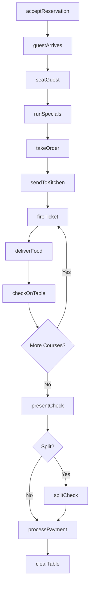
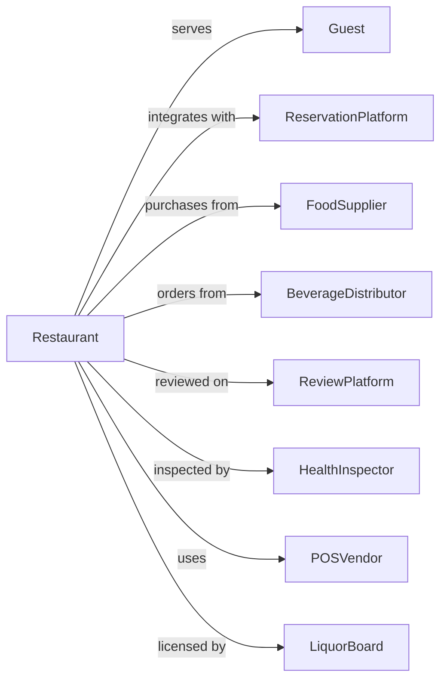

# Full-Service Restaurants

> Business-as-Code definition for full-service restaurant operations. Models table service dining from reservation through payment.

## Overview

Full-service restaurants provide food services to patrons who order and are served while seated with waiter or waitress service, paying after eating. This definition exposes actions for reservation management, table service, order processing, and the complete dining experience including beverage service and live entertainment.

## Actors

| Actor | Description |
|-------|-------------|
| Guest | Diner visiting the restaurant |
| ReservationPlatform | Third-party booking service like OpenTable |
| FoodSupplier | Delivers produce, proteins, and ingredients |
| BeverageDistributor | Provides wine, beer, and spirits |
| ReviewPlatform | Aggregates and publishes customer feedback |
| HealthInspector | Conducts food safety inspections |
| POSVendor | Provides point-of-sale system and support |
| LiquorBoard | Regulates alcohol service licensing |
| CreditCardProcessor | Handles payment transactions |

## Roles

| Role | Description |
|------|-------------|
| GeneralManager | Oversees all restaurant operations |
| ExecutiveChef | Leads kitchen and menu development |
| SousChef | Assists chef and manages kitchen stations |
| LineCook | Prepares dishes at specific station |
| Server | Takes orders and delivers food to tables |
| Host | Manages seating and reservation flow |
| Sommelier | Advises on wine selection and service |
| Busser | Clears tables and assists service staff |
| Pastry Chef | Creates desserts, breads, and pastry items for the menu |

## Entities

| Entity | Description |
|--------|-------------|
| Reservation | Booking for specific date, time, and party size |
| Table | Seating unit with capacity and status |
| Menu | Food and beverage offerings with pricing |
| Order | Guest selections for kitchen and bar |
| Check | Bill for table with all charges |
| Course | Meal phase like appetizer, entree, or dessert |
| Special | Daily or seasonal featured item |
| WineList | Curated selection of wines by the glass and bottle |
| Ticket | Kitchen order ticket with timing |
| Gratuity | Tip added by guest or automatic for parties |

## Actions

| Action | Description |
|--------|-------------|
| acceptReservation | Book table for future date and time |
| seatGuest | Escort party to assigned table |
| takeOrder | Record food and beverage selections |
| sendToKitchen | Transmit order ticket to culinary team |
| fireTicket | Signal kitchen to begin cooking course |
| deliverFood | Bring completed dishes to table |
| checkOnTable | Visit table to ensure satisfaction |
| suggestWine | Recommend pairing from wine list |
| runSpecials | Describe daily featured items |
| presentCheck | Deliver bill to table |
| processPayment | Complete transaction and close check |
| splitCheck | Divide bill among multiple payments |
| applyDiscount | Reduce total for promotion or issue |
| clearTable | Remove dishes and reset for next party |

## Events

| Event | Description |
|-------|-------------|
| reservationMade | Booking confirmed for date and time |
| reservationCancelled | Booking cancelled by guest or restaurant |
| guestSeated | Party escorted to table |
| orderTaken | Food and beverage selections recorded |
| orderSentToKitchen | Ticket transmitted to culinary team |
| courseFired | Kitchen began preparing course |
| courseDelivered | Dishes brought to table |
| checkRequested | Guest asked for bill |
| checkPresented | Bill delivered to table |
| paymentProcessed | Transaction completed |
| tableCleared | Dishes removed and table reset |
| reviewPosted | Guest feedback published online |
| specialSold | Daily feature ordered |
| wineRecommended | Sommelier suggestion accepted |

## Searches

| Search | Description |
|--------|-------------|
| getReservations | List bookings for date or date range |
| getTableStatus | View availability and status of all tables |
| getOpenChecks | List tables with unsettled bills |
| getCurrentMenu | Retrieve active food and beverage offerings |
| getSpecials | Get current daily features |
| getServerTables | View tables assigned to specific server |
| getSalesReport | Revenue by period, category, or server |
| getGuestHistory | Retrieve past visits and preferences |

## Workflow



## Actor Relationships



## Usage

### Calling Actions

```typescript
import { serveDiners } from '@headlessly/serve-diners'

const restaurant = serveDiners()

// Accept dinner reservation
const reservation = await restaurant.acceptReservation({
  guestName: 'Thompson',
  phone: '+1-555-0142',
  date: '2024-07-20',
  time: '19:30',
  partySize: 4,
  specialRequests: ['birthday celebration', 'window table'],
  occasion: 'birthday'
})

// Take order from seated party
const order = await restaurant.takeOrder({
  tableId: 'table-12',
  items: [
    { course: 'appetizer', item: 'tuna-tartare', quantity: 1 },
    { course: 'appetizer', item: 'burrata', quantity: 1, notes: 'extra basil' },
    { course: 'entree', item: 'ribeye', quantity: 2, temp: 'medium-rare' },
    { course: 'entree', item: 'halibut', quantity: 1 },
    { course: 'entree', item: 'risotto', quantity: 1, modification: 'add truffle' }
  ],
  beverages: [
    { type: 'wine-bottle', item: 'caymus-cabernet-2019' },
    { type: 'cocktail', item: 'negroni' }
  ]
})

// Fire courses in sequence
await restaurant.fireTicket({
  orderId: order.id,
  course: 'appetizer'
})

// Later...
await restaurant.fireTicket({
  orderId: order.id,
  course: 'entree'
})
```

### Event-Driven Automation

```typescript
// Auto-confirm reservations
restaurant.reservationMade(async ({ reservationId, guestPhone, date, time }) => {
  await sendSMS({
    to: guestPhone,
    message: `Confirmed: Table for ${partySize} on ${date} at ${time}. Reply CANCEL to cancel.`
  })

  // Send reminder day before
  scheduleAt(subtractDays(date, 1), async () => {
    await sendSMS({
      to: guestPhone,
      message: `Reminder: Your reservation is tomorrow at ${time}. See you soon!`
    })
  })
})

// Alert manager on negative feedback
restaurant.reviewPosted(async ({ rating, comment, guestName }) => {
  if (rating <= 2) {
    await notifyManager({
      alert: 'negative-review',
      guestName,
      rating,
      comment,
      action: 'follow-up recommended'
    })
  }
})
```
