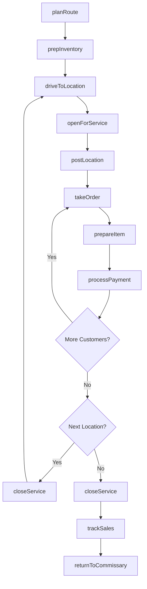
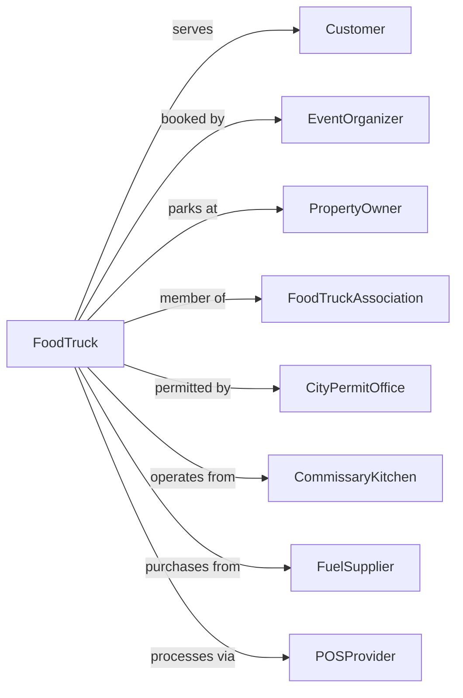

# Mobile Food Services

> Business-as-Code definition for mobile food operations. Models food trucks, carts, and concession vehicles serving prepared meals and snacks.

## Overview

Mobile food services prepare and serve meals and snacks for immediate consumption from motorized vehicles or nonmotorized carts. This definition exposes actions for route management, location booking, menu optimization, and the unique operational requirements of food trucks, ice cream trucks, and mobile concessions.

## Actors

| Actor | Description |
|-------|-------------|
| Customer | Individual purchasing food from mobile unit |
| EventOrganizer | Books food trucks for festivals and events |
| PropertyOwner | Provides parking location for regular service |
| FoodTruckAssociation | Coordinates pod locations and group events |
| CityPermitOffice | Issues mobile vending permits and licenses |
| CommissaryKitchen | Provides licensed kitchen for food prep and storage |
| FuelSupplier | Provides propane and vehicle fuel |
| POSProvider | Supplies payment processing equipment |
| HealthDepartment | Inspects mobile units and issues food permits |

## Roles

| Role | Description |
|------|-------------|
| Owner | Owns vehicle and manages business operations |
| Driver | Operates vehicle and navigates to locations |
| Cook | Prepares food items on the mobile unit |
| Cashier | Takes orders and processes payments |
| SocialMediaManager | Promotes locations and specials online |

## Entities

| Entity | Description |
|--------|-------------|
| Vehicle | Food truck, cart, or trailer used for service |
| Route | Planned sequence of locations for service |
| Location | Specific spot where vehicle operates |
| Permit | License authorizing mobile food sales |
| Menu | Available items with prices |
| Inventory | Food supplies and ingredients on hand |
| Order | Customer purchase with items and payment |
| Event | Scheduled appearance at festival or private function |
| Commissary | Licensed kitchen facility for prep and storage |
| SocialPost | Announcement of location and specials |

## Actions

| Action | Description |
|--------|-------------|
| planRoute | Schedule locations for service day |
| bookLocation | Reserve spot at property or event |
| prepInventory | Stock vehicle with ingredients and supplies |
| openForService | Begin sales at current location |
| takeOrder | Receive customer food request |
| prepareItem | Cook or assemble ordered food |
| processPayment | Complete transaction via card or cash |
| closeService | End sales and secure equipment |
| postLocation | Announce current position on social media |
| applyForPermit | Submit application for vending license |
| scheduleInspection | Book health department review |
| bookEvent | Accept private event or festival booking |
| trackSales | Record revenue and item counts |
| maintainVehicle | Service truck and equipment |

## Events

| Event | Description |
|-------|-------------|
| routePlanned | Daily locations scheduled |
| locationBooked | Spot reserved for specific date |
| inventoryStocked | Vehicle loaded with supplies |
| serviceOpened | Sales began at location |
| orderReceived | Customer purchase submitted |
| orderCompleted | Food prepared and served |
| paymentProcessed | Transaction completed |
| serviceClosed | Location service ended |
| locationPosted | Social media announcement published |
| permitApproved | Vending license granted |
| inspectionPassed | Health review completed successfully |
| eventBooked | Private function confirmed |
| dailySalesRecorded | Revenue totals logged |
| maintenanceCompleted | Vehicle service finished |

## Searches

| Search | Description |
|--------|-------------|
| getTodayRoute | Get planned locations for current day |
| getUpcomingEvents | List booked festivals and private functions |
| getInventoryLevels | Check ingredient stock on vehicle |
| getSalesHistory | Retrieve revenue by location or period |
| getTopSellingItems | Identify best-performing menu items |
| getPermitStatus | Check license expiration and renewal status |
| getLocationPerformance | Analyze sales by spot |
| getCustomerFavorites | View most ordered combinations |

## Workflow



## Actor Relationships



## Usage

### Calling Actions

```typescript
import { serveStreetFood } from '@headlessly/serve-street-food'

const truck = serveStreetFood()

// Check best-performing locations and upcoming events
const topSpots = await truck.getLocationPerformance({ period: 'last-30-days', sortBy: 'revenue' })
const bookedEvents = await truck.getUpcomingEvents({ month: '2024-06' })

// Plan route for lunch service
const route = await truck.planRoute({
  date: '2024-06-20',
  locations: [
    { spot: 'downtown-plaza', arrival: '11:00', departure: '14:00' },
    { spot: 'tech-park-lot-b', arrival: '14:30', departure: '18:00' }
  ],
  estimatedCustomers: 150
})

// Prep inventory based on route
await truck.prepInventory({
  routeId: route.id,
  items: [
    { name: 'ground-beef', quantity: 20, unit: 'lbs' },
    { name: 'brioche-buns', quantity: 100, unit: 'count' },
    { name: 'french-fries', quantity: 30, unit: 'lbs' },
    { name: 'beverages', quantity: 50, unit: 'count' }
  ],
  propaneCheck: true,
  generatorFuel: true
})

// Process customer order
const order = await truck.takeOrder({
  items: [
    { name: 'signature-burger', quantity: 1, modifications: ['no-onions'] },
    { name: 'loaded-fries', quantity: 1 },
    { name: 'craft-soda', quantity: 1 }
  ],
  orderType: 'walk-up'
})

await truck.processPayment({
  orderId: order.id,
  amount: order.total,
  method: 'contactless-card',
  tipAmount: 3.00
})
```

### Event-Driven Automation

```typescript
// Auto-post location when service opens
truck.serviceOpened(async ({ locationId, locationName }) => {
  await truck.postLocation({
    platforms: ['twitter', 'instagram'],
    message: `We're open at ${locationName}! Come grab lunch until 2pm`,
    coordinates: await getLocationCoordinates(locationId),
    includeMenu: true
  })
})

// Alert when inventory runs low
truck.orderCompleted(async ({ items }) => {
  const levels = await truck.getInventoryLevels()

  for (const item of levels) {
    if (item.quantity <= item.alertThreshold) {
      await notifyOwner({
        item: item.name,
        remaining: item.quantity,
        estimatedServings: Math.floor(item.quantity / item.portionSize)
      })
    }
  }
})
```
