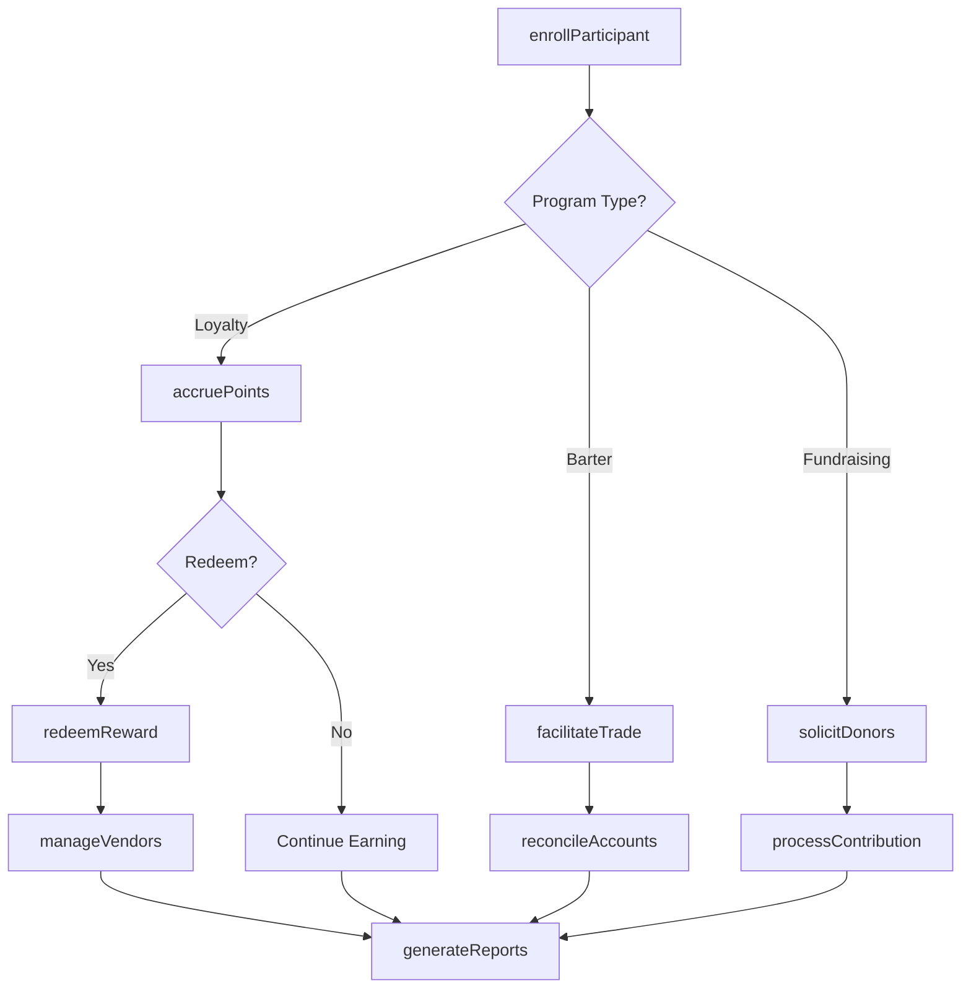
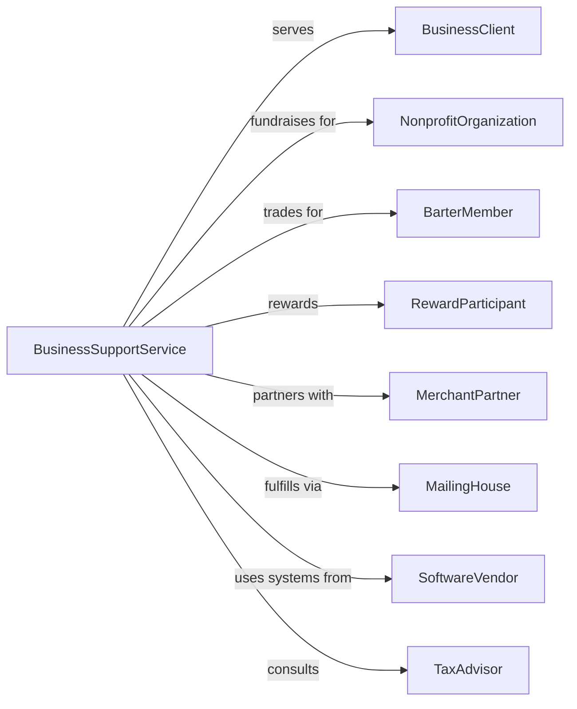

# All Other Business Support Services

> Business-as-Code definition for miscellaneous business support operations. Models specialized services including address bar coding, bartering, fundraising, and loyalty programs.

## Overview

All other business support services encompass specialized offerings including address bar coding, fundraising campaign management, barter exchange facilitation, loyalty and incentive program administration, and other niche business services. These establishments provide unique operational support that falls outside traditional document, collection, and reporting categories.

## Actors

| Actor | Description |
|-------|-------------|
| BusinessClient | Company contracting for specialized support services |
| NonprofitOrganization | Entity using fundraising campaign services |
| BarterMember | Business participating in trade exchange network |
| RewardParticipant | Consumer enrolled in loyalty program |
| MerchantPartner | Retailer accepting loyalty points or barter credits |
| MailingHouse | Handles bulk mail processing and delivery |
| SoftwareVendor | Provides program management and tracking systems |
| TaxAdvisor | Provides guidance on barter and incentive tax treatment |

## Roles

| Role | Description |
|------|-------------|
| ProgramManager | Oversees specialized service delivery and client relationships |
| CampaignCoordinator | Manages fundraising initiatives and donor outreach |
| TradeCoordinator | Facilitates barter exchange transactions |
| DataSpecialist | Processes address bar coding and mail preparation |
| RewardAdministrator | Manages loyalty point accruals and redemptions |
| ComplianceAnalyst | Ensures regulatory adherence for financial services |

## Entities

| Entity | Description |
|--------|-------------|
| ServiceContract | Agreement defining specialized service terms |
| FundraisingCampaign | Organized initiative to solicit donations |
| BarterAccount | Trade credit balance for exchange member |
| LoyaltyProgram | Structured customer reward initiative |
| PointBalance | Accumulated reward credits for participant |
| BarCodeRecord | Address standardization and coding data |
| TradeTransaction | Barter exchange between member businesses |
| DonorRecord | Information on fundraising contributor |
| RedemptionRequest | Claim for loyalty reward fulfillment |
| CampaignReport | Analysis of fundraising or program performance |

## Actions

| Action | Description |
|--------|-------------|
| processBarcodes | Apply postal bar codes to mailing addresses |
| launchCampaign | Initiate fundraising or promotional initiative |
| facilitateTrade | Coordinate barter exchange between members |
| enrollParticipant | Add member to loyalty or barter program |
| accruePoints | Credit rewards to participant account |
| redeemReward | Process points exchange for goods or services |
| reconcileAccounts | Balance trade credits across barter network |
| generateReports | Produce program performance analytics |
| solicitDonors | Contact potential contributors for fundraising |
| processContribution | Record and acknowledge donation receipt |
| manageVendors | Coordinate with reward fulfillment partners |
| auditProgram | Review operations for compliance and accuracy |

## Events

| Event | Description |
|-------|-------------|
| barcodesProcessed | Address coding completed for mailing batch |
| campaignLaunched | Fundraising initiative activated |
| tradeFacilitated | Barter exchange completed between members |
| participantEnrolled | New member added to program |
| pointsAccrued | Rewards credited to participant account |
| rewardRedeemed | Points exchanged for benefit |
| accountsReconciled | Trade credit balances verified |
| reportGenerated | Analytics delivered to client |
| donorSolicited | Outreach completed to potential contributor |
| contributionProcessed | Donation recorded and acknowledged |
| programAudited | Compliance review completed |
| memberDeactivated | Participant removed from program |

## Searches

| Search | Description |
|--------|-------------|
| findClients | List business accounts by service type or status |
| getCampaigns | Retrieve fundraising initiatives by period or performance |
| searchMembers | Find barter or loyalty participants by criteria |
| getTradeHistory | View barter transactions by member or date |
| findRedemptions | List reward claims by status or participant |
| getPointBalances | Check loyalty account standings |
| searchDonors | Find contributors by amount or frequency |
| getBarcodeBatches | Retrieve mail processing jobs by client |

## Workflow



## Actor Relationships



## Usage

### Calling Actions

```typescript
import { supportBusinessSupport } from '@headlessly/support-business-support'

const support = supportBusinessSupport()

// Enroll business in barter network
const member = await support.enrollParticipant({
  programType: 'barter',
  business: {
    name: 'Main Street Restaurant',
    industry: 'food-service',
    contact: 'owner@mainstreet.com'
  },
  offeringCategories: ['dining', 'catering'],
  seekingCategories: ['advertising', 'printing'],
  creditLine: 5000
})

// Facilitate barter trade
await support.facilitateTrade({
  seller: member.id,
  buyer: 'print-shop-456',
  description: 'Catering for company event',
  tradeCredits: 1500,
  deliveryDate: '2024-04-15'
})

// Launch fundraising campaign
const campaign = await support.launchCampaign({
  clientId: 'charity-foundation',
  name: 'Spring Annual Fund',
  goal: 100000,
  startDate: '2024-04-01',
  endDate: '2024-06-30',
  channels: ['directMail', 'email', 'phone'],
  donorSegments: ['lapsed', 'recurring', 'major']
})
```

### Event-Driven Automation

```typescript
// Auto-acknowledge donations
support.contributionProcessed(async ({ campaignId, donorId, amount }) => {
  await support.sendAcknowledgment({
    campaignId,
    donorId,
    amount,
    taxDeductible: true,
    personalizedMessage: amount >= 1000
  })
})

// Auto-reconcile barter accounts monthly
support.accountsReconciled(async ({ networkId, period }) => {
  await support.generateReports({
    networkId,
    period,
    reportType: 'barter-reconciliation',
    include: ['tradeVolume', 'creditBalances', 'activeMembers'],
    deliverTo: 'network-administrator'
  })
})
```
