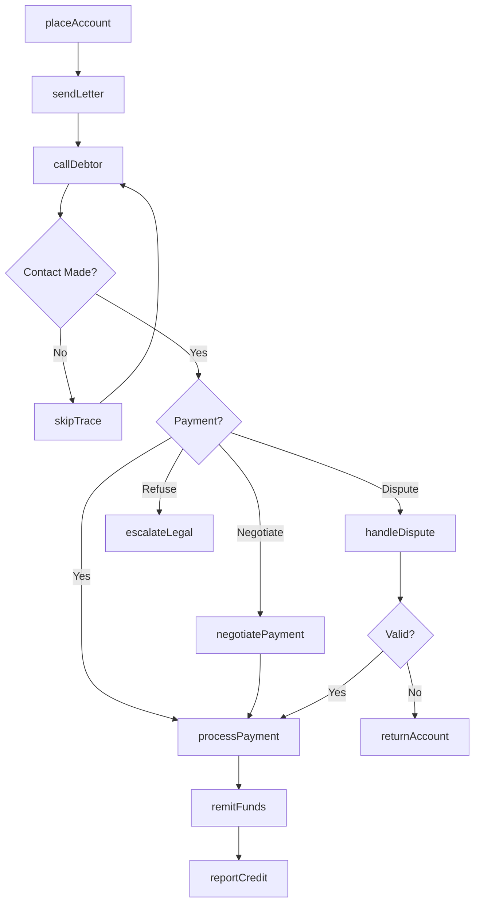
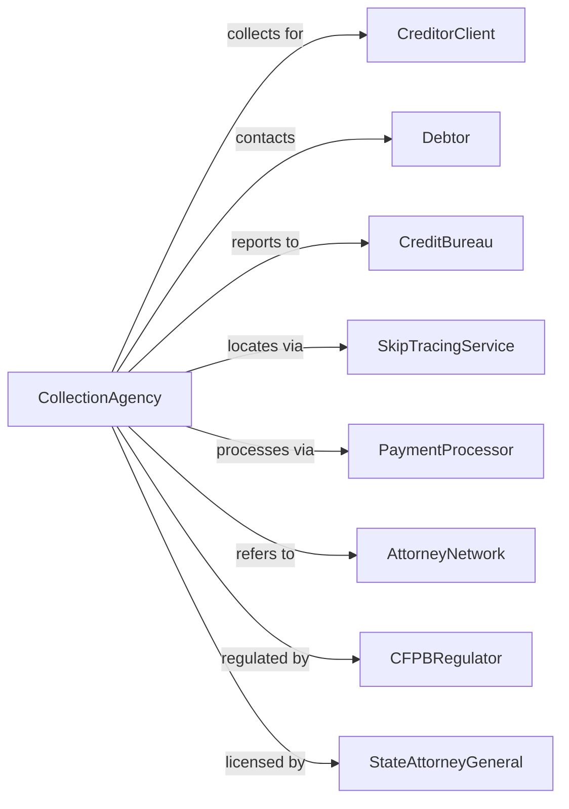

# Collection Agencies

> Business-as-Code definition for debt collection operations. Models the complete collection cycle from account placement through payment recovery and remittance.

## Overview

Collection agencies recover delinquent payments on behalf of creditors, using contact strategies including calls, letters, and skip tracing to locate debtors and negotiate payment arrangements. Operating under strict regulatory guidelines including the FDCPA, these establishments earn fees based on amounts collected and remit recovered funds to their clients.

## Actors

| Actor | Description |
|-------|-------------|
| CreditorClient | Business placing delinquent accounts for collection |
| Debtor | Individual or business owing payment on account |
| CreditBureau | Receives and reports collection trade lines |
| SkipTracingService | Locates debtors with outdated contact information |
| PaymentProcessor | Handles payment transactions and ACH processing |
| AttorneyNetwork | Provides legal collection services when needed |
| CFPBRegulator | Federal agency enforcing consumer protection laws |
| StateAttorneyGeneral | State-level enforcement of collection regulations |

## Roles

| Role | Description |
|------|-------------|
| CollectionAgent | Contacts debtors and negotiates payment arrangements |
| AccountManager | Manages creditor relationships and placements |
| SkipTracer | Locates debtors using investigative techniques |
| ComplianceOfficer | Ensures adherence to FDCPA and state regulations |
| PaymentSpecialist | Processes payments and manages remittances |
| CollectionManager | Oversees agent teams and collection strategies |
| DebtNegotiator | Specializes in structuring settlements and hardship payment plans with debtors |

## Entities

| Entity | Description |
|--------|-------------|
| DelinquentAccount | Placed debt assigned for collection |
| PaymentPlan | Agreed schedule of installment payments |
| CollectionLetter | Written demand for payment |
| CallRecord | Documentation of debtor communication |
| SkipTrace | Investigation to locate debtor |
| Settlement | Negotiated resolution for less than full balance |
| CreditReport | Trade line reported to credit bureaus |
| Remittance | Payment forwarded to creditor client |
| DisputeRecord | Debtor challenge to debt validity |
| ComplianceLog | Record of regulatory adherence |

## Actions

| Action | Description |
|--------|-------------|
| placeAccount | Receive and onboard delinquent account from creditor |
| sendLetter | Mail written demand for payment |
| callDebtor | Contact debtor by phone to request payment |
| skipTrace | Investigate to locate debtor with outdated info |
| negotiatePayment | Establish payment plan or settlement |
| processPayment | Accept and record payment from debtor |
| remitFunds | Forward collected amounts to creditor |
| reportCredit | Submit trade line to credit bureaus |
| handleDispute | Process and investigate debtor dispute |
| returnAccount | Send uncollectible account back to creditor |
| escalateLegal | Refer account to attorney for litigation |
| auditCompliance | Review activities for regulatory adherence |

## Events

| Event | Description |
|-------|-------------|
| accountPlaced | New delinquent account received from creditor |
| letterSent | Written demand mailed to debtor |
| debtorContacted | Successful communication with debtor |
| debtorLocated | Skip trace identified current contact information |
| paymentNegotiated | Payment arrangement established |
| paymentReceived | Debtor made payment on account |
| fundsRemitted | Collected amount forwarded to creditor |
| creditReported | Trade line submitted to bureau |
| disputeReceived | Debtor challenged debt validity |
| accountReturned | Uncollectible account sent back to creditor |
| legalReferral | Account escalated to attorney |
| complianceViolation | Potential regulatory issue identified |

## Searches

| Search | Description |
|--------|-------------|
| findAccounts | List accounts by creditor, status, or balance |
| getPaymentHistory | Retrieve payment records for account |
| searchDebtors | Find accounts by debtor name or identifier |
| getDisputes | List open or resolved dispute records |
| findCollectors | View agent assignments and performance |
| getRemittances | Retrieve payments forwarded to creditors |
| getComplianceLog | Access audit trail for specific account |
| trackPerformance | View collection rates and metrics |

## Workflow



## Actor Relationships



## Usage

### Calling Actions

```typescript
import { collectDelinquentDebt } from '@headlessly/collect-delinquent-debt'

const collections = collectDelinquentDebt()

// Review aged accounts and collection performance
const aged = await collections.findAccounts({ creditorId: 'medical-group-123', daysDelinquent: 90 })
const performance = await collections.trackPerformance({ period: '2024-Q1', creditorId: 'medical-group-123' })

// Place accounts from creditor
const batch = await collections.placeAccount({
  creditorId: 'medical-group-123',
  accounts: [
    {
      originalCreditor: 'City Medical Center',
      accountNumber: 'MED-2024-001',
      debtor: {
        name: 'John Doe',
        ssn: '***-**-1234',
        address: '123 Main St, Anytown, ST 12345',
        phone: '555-1234'
      },
      balance: 2500,
      chargeOffDate: '2024-01-15',
      serviceDate: '2023-06-20'
    }
  ],
  feeStructure: { percentage: 25, minimum: 50 }
})

// Negotiate payment plan
await collections.negotiatePayment({
  accountId: 'MED-2024-001',
  arrangement: {
    type: 'installment',
    totalAmount: 2500,
    downPayment: 250,
    monthlyPayment: 150,
    startDate: '2024-05-01',
    method: 'ACH'
  }
})

// Process payment
await collections.processPayment({
  accountId: 'MED-2024-001',
  amount: 250,
  method: 'ACH',
  accountInfo: { routingNumber: '123456789', accountNumber: '987654321' }
})
```

### Event-Driven Automation

```typescript
// Auto-remit when threshold reached
collections.paymentReceived(async ({ accountId, amount, creditorId }) => {
  const account = await collections.getAccount({ accountId })
  const pendingRemittance = await collections.getPendingRemittance({ creditorId })

  if (pendingRemittance.total >= 500) {
    await collections.remitFunds({
      creditorId,
      accounts: pendingRemittance.accounts,
      totalAmount: pendingRemittance.total,
      method: 'ACH',
      reportFormat: 'detail'
    })
  }
})

// Auto-escalate aged accounts
collections.accountPlaced(async ({ accountId, balance, daysDelinquent }) => {
  if (daysDelinquent > 180 && balance > 5000) {
    await collections.escalateLegal({
      accountId,
      reason: 'high-balance-aged',
      attorneyNetwork: 'preferred-legal-partners'
    })
  }
})
```
