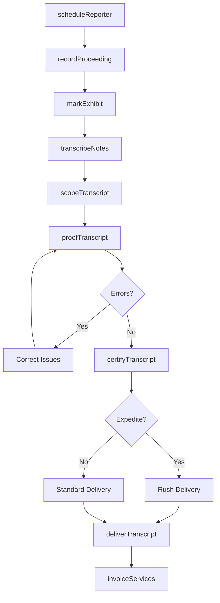
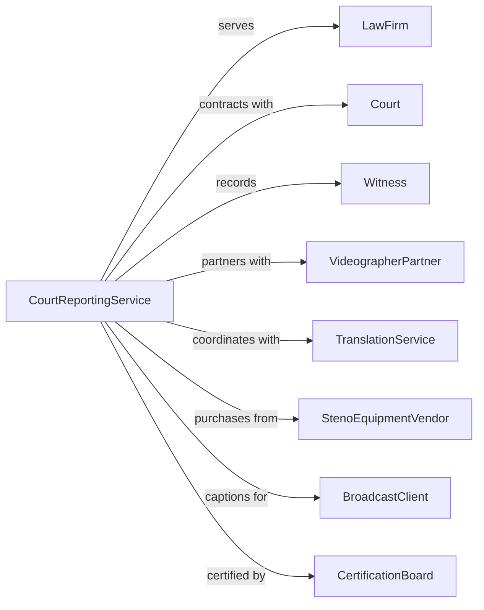

# Court Reporting and Stenotype Services

> Business-as-Code definition for court reporting and legal transcription operations. Models verbatim recording of proceedings and transcript production.

## Overview

Court reporting services provide verbatim stenographic recording of legal proceedings including depositions, trials, hearings, and arbitrations. These establishments produce official transcripts, offer real-time captioning for live events, and provide related services such as video synchronization and remote deposition technology. Court reporters must maintain professional certifications and adhere to strict accuracy standards.

## Actors

| Actor | Description |
|-------|-------------|
| LawFirm | Attorney office scheduling deposition services |
| Court | Judicial body requiring official proceedings record |
| Witness | Individual being deposed or testifying |
| VideographerPartner | Provides video recording of proceedings |
| TranslationService | Offers interpretation for non-English speakers |
| StenoEquipmentVendor | Supplies stenotype machines and software |
| BroadcastClient | Media or organization requiring captioning |
| CertificationBoard | Professional body certifying court reporters |

## Roles

| Role | Description |
|------|-------------|
| CourtReporter | Creates verbatim stenographic record |
| Scopist | Edits and proofreads reporter notes to transcript |
| Proofreader | Reviews final transcript for accuracy |
| SchedulingCoordinator | Manages reporter assignments and logistics |
| RealTimeCaptioner | Provides live text display during proceedings |
| VideoTechnician | Synchronizes transcript with video recording |
| Stenographer | Operates stenotype machine to capture verbatim speech at 200+ words per minute |

## Entities

| Entity | Description |
|--------|-------------|
| Proceeding | Deposition, trial, hearing, or other recorded event |
| Transcript | Official written record of proceeding |
| StenoNotes | Raw stenographic output from reporter |
| Exhibit | Document or evidence marked during proceeding |
| Certificate | Reporter attestation to transcript accuracy |
| VideoSync | Synchronized transcript and video file |
| RealTimeStream | Live text feed during proceeding |
| WordIndex | Searchable keyword listing for transcript |
| AppearanceSheet | Record of parties present at proceeding |
| InvoiceDetail | Billing for reporting services |

## Actions

| Action | Description |
|--------|-------------|
| scheduleReporter | Assign court reporter to proceeding |
| recordProceeding | Create verbatim stenographic record |
| markExhibit | Document evidence introduced during proceeding |
| transcribeNotes | Convert stenographic notes to text |
| scopeTranscript | Edit and refine raw transcript |
| proofTranscript | Review final document for errors |
| certifyTranscript | Attest to accuracy and completeness |
| deliverTranscript | Provide final document to ordering party |
| streamRealTime | Display live text during proceeding |
| syncVideo | Align transcript with video recording |
| produceIndex | Generate searchable word index |
| invoiceServices | Bill for reporting and transcript services |

## Events

| Event | Description |
|-------|-------------|
| reporterScheduled | Court reporter assigned to proceeding |
| proceedingRecorded | Stenographic record completed |
| exhibitMarked | Evidence documented during proceeding |
| notesTranscribed | Raw steno converted to text |
| transcriptScoped | Editing and refinement completed |
| transcriptProofed | Final accuracy review completed |
| transcriptCertified | Reporter attested to accuracy |
| transcriptDelivered | Final document sent to parties |
| realTimeStreamed | Live captioning provided |
| videoSynced | Transcript aligned with recording |
| indexProduced | Searchable index generated |
| servicesInvoiced | Billing sent to client |

## Searches

| Search | Description |
|--------|-------------|
| findProceedings | List jobs by date, client, or status |
| searchTranscripts | Locate transcripts by case or keyword |
| getReporters | Find available reporters by certification |
| getExhibits | List evidence marked in proceeding |
| findSchedule | View reporter availability and assignments |
| searchClients | Find law firms and court contacts |
| getInvoices | Retrieve billing records by client or period |
| trackProduction | View transcript completion status |

## Workflow



## Actor Relationships



## Usage

### Calling Actions

```typescript
import { transcribeLegalProceedings } from '@headlessly/transcribe-legal-proceedings'

const reporting = transcribeLegalProceedings()

// Schedule deposition
const proceeding = await reporting.scheduleReporter({
  client: {
    firm: 'Smith & Associates',
    attorney: 'Jane Smith',
    caseNumber: '2024-CV-1234'
  },
  proceeding: {
    type: 'deposition',
    witness: 'John Doe',
    date: '2024-04-15',
    time: '9:00 AM',
    location: '100 Legal Way, Suite 500',
    estimatedDuration: 4
  },
  services: {
    realTime: true,
    roughDraft: true,
    expeditedTranscript: '3-day',
    videoSync: true
  }
})

// Record and produce transcript
await reporting.recordProceeding({
  proceedingId: proceeding.id,
  startTime: '9:05 AM',
  endTime: '1:15 PM',
  exhibitsMarked: ['Exhibit A', 'Exhibit B', 'Exhibit C'],
  appearances: [
    { name: 'Jane Smith', role: 'Examining Attorney' },
    { name: 'Bob Jones', role: 'Defending Attorney' },
    { name: 'John Doe', role: 'Witness' }
  ]
})

// Deliver final transcript
await reporting.deliverTranscript({
  proceedingId: proceeding.id,
  format: ['PDF', 'ASCII', 'E-Transcript'],
  delivery: {
    method: 'electronic',
    recipients: ['jane@smithlaw.com', 'bob@joneslaw.com']
  },
  include: ['wordIndex', 'exhibitList', 'certificate']
})
```

### Event-Driven Automation

```typescript
// Auto-invoice after transcript delivery
reporting.transcriptDelivered(async ({ proceedingId, clientId, pages }) => {
  const services = await reporting.getServicesRendered({ proceedingId })

  await reporting.invoiceServices({
    proceedingId,
    clientId,
    lineItems: [
      { service: 'appearance-fee', rate: 75, quantity: 1 },
      { service: 'page-rate', rate: 6.50, quantity: pages },
      { service: 'expedite', rate: services.expediteFee },
      { service: 'realtime', rate: 150, quantity: services.hours }
    ],
    paymentTerms: 'net-30'
  })
})

// Auto-assign scopist for large transcripts
reporting.proceedingRecorded(async ({ proceedingId, pageEstimate }) => {
  if (pageEstimate > 200) {
    await reporting.assignScopist({
      proceedingId,
      deadline: calculateDeadline(services.expedite),
      priority: 'high'
    })
  }
})
```
