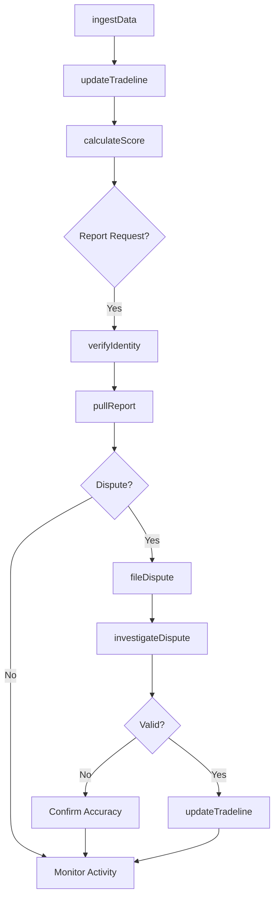
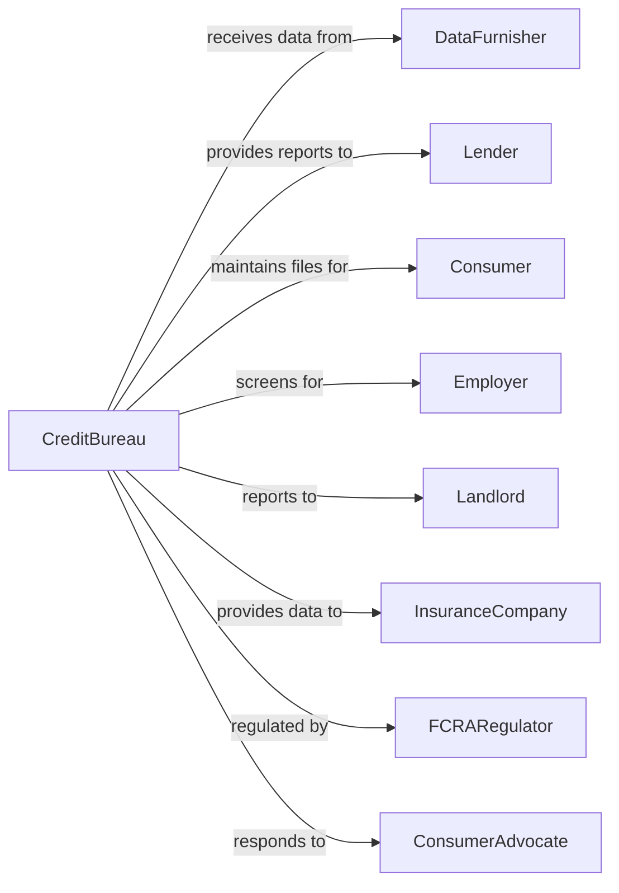

# Credit Bureaus

> Business-as-Code definition for credit reporting and consumer data operations. Models the compilation, maintenance, and distribution of creditworthiness information.

## Overview

Credit bureaus compile and maintain credit histories, employment records, and other data used to evaluate consumer and business creditworthiness. These establishments collect information from data furnishers, process dispute investigations, and provide credit reports and scores to lenders, employers, landlords, and consumers under strict regulatory guidelines including FCRA.

## Actors

| Actor | Description |
|-------|-------------|
| DataFurnisher | Creditor reporting payment history and account data |
| Lender | Financial institution requesting credit reports for decisions |
| Consumer | Individual whose credit history is maintained |
| Employer | Company requesting background checks for employment |
| Landlord | Property owner checking tenant creditworthiness |
| InsuranceCompany | Insurer using credit data for underwriting |
| FCRARegulator | Federal agency enforcing credit reporting laws |
| ConsumerAdvocate | Organization protecting consumer credit rights |

## Roles

| Role | Description |
|------|-------------|
| DataAnalyst | Processes and validates incoming furnisher data |
| DisputeInvestigator | Researches and resolves consumer disputes |
| ComplianceOfficer | Ensures adherence to FCRA and state regulations |
| ProductManager | Develops credit scoring and reporting products |
| ClientRelationsManager | Manages relationships with data users |
| SecurityOfficer | Protects consumer data and prevents breaches |
| DisputeInvestigator | Researches and resolves consumer accuracy challenges under FCRA deadlines |
| CreditScoreModeler | Develops and calibrates scoring algorithms that predict consumer creditworthiness |

## Entities

| Entity | Description |
|--------|-------------|
| CreditFile | Consumer record containing all credit data |
| TradeLine | Individual account reported by furnisher |
| CreditScore | Numerical representation of creditworthiness |
| CreditReport | Formatted presentation of credit file |
| Inquiry | Record of credit file access |
| Dispute | Consumer challenge to reported information |
| PublicRecord | Bankruptcy, lien, or judgment information |
| FraudAlert | Security flag on consumer file |
| CreditFreeze | Consumer-initiated file access restriction |
| DataFurnisherAgreement | Contract with entity reporting data |

## Actions

| Action | Description |
|--------|-------------|
| ingestData | Receive and process account data from furnishers |
| updateTradeline | Modify existing account information |
| calculateScore | Generate credit score from file data |
| pullReport | Retrieve and format credit report for user |
| fileDispute | Record consumer challenge to reported information |
| investigateDispute | Research and resolve accuracy challenge |
| placeFraudAlert | Add security warning to consumer file |
| freezeFile | Block access to credit file per consumer request |
| monitorFile | Track changes and alert consumer to activity |
| verifyIdentity | Authenticate consumer making request |
| furnishData | Send credit data to other bureaus or users |
| auditAccuracy | Review data quality and furnisher compliance |

## Events

| Event | Description |
|-------|-------------|
| dataIngested | New account information processed from furnisher |
| tradelineUpdated | Account record modified |
| scoreCalculated | Credit score generated |
| reportPulled | Credit report accessed by permissible user |
| disputeFiled | Consumer submitted accuracy challenge |
| disputeResolved | Investigation completed with outcome |
| fraudAlertPlaced | Security flag added to file |
| fileFrozen | Credit file access restricted |
| alertTriggered | Monitoring detected significant change |
| identityVerified | Consumer authentication successful |
| breachDetected | Unauthorized data access identified |
| accuracyAudited | Data quality review completed |

## Searches

| Search | Description |
|--------|-------------|
| findConsumer | Locate credit file by identifying information |
| getTradeLines | List accounts on consumer credit file |
| getInquiries | Retrieve record of file access requests |
| findDisputes | List disputes by status or date |
| searchFurnishers | Find data providers by name or industry |
| getScoreHistory | View credit score trends over time |
| getPublicRecords | Retrieve bankruptcies, liens, judgments |
| getAlerts | List fraud alerts and freezes on file |

## Workflow



## Actor Relationships



## Usage

### Calling Actions

```typescript
import { supportCreditBureaus } from '@headlessly/support-credit-bureaus'

const bureau = supportCreditBureaus()

// Ingest furnisher data
await bureau.ingestData({
  furnisherId: 'bank-of-america',
  records: [
    {
      consumerSSN: '***-**-1234',
      accountType: 'creditCard',
      accountNumber: '****5678',
      creditLimit: 10000,
      balance: 2500,
      paymentStatus: 'current',
      lastPayment: '2024-03-15',
      dateOpened: '2020-06-01'
    }
  ],
  reportingPeriod: '2024-03'
})

// Pull credit report
const report = await bureau.pullReport({
  requestor: {
    id: 'mortgage-lender-123',
    permissiblePurpose: 'creditApplication'
  },
  consumer: {
    ssn: '***-**-1234',
    name: 'John Doe',
    address: '123 Main St, Anytown, ST 12345',
    dob: '1985-06-15'
  },
  reportType: 'full',
  includeScore: true
})

// File consumer dispute
await bureau.fileDispute({
  consumerSSN: '***-**-1234',
  tradeline: {
    furnisher: 'collection-agency-xyz',
    accountNumber: '****9012'
  },
  disputeType: 'not-my-account',
  statement: 'I have never had an account with this creditor.',
  supportingDocuments: ['identity-theft-report.pdf']
})
```

### Event-Driven Automation

```typescript
// Auto-notify consumer of significant changes
bureau.alertTriggered(async ({ consumerSSN, changeType, details }) => {
  if (changeType === 'newAccount' || changeType === 'inquiry') {
    await bureau.notifyConsumer({
      consumerSSN,
      alertType: changeType,
      details,
      channel: 'email',
      requireAction: changeType === 'newAccount'
    })
  }
})

// Auto-process dispute resolution
bureau.disputeResolved(async ({ disputeId, outcome, tradeline }) => {
  if (outcome === 'deleted') {
    await bureau.updateTradeline({
      tradeline,
      action: 'delete',
      reason: 'dispute-verified'
    })

    await bureau.calculateScore({
      consumerSSN: tradeline.consumerSSN,
      recalculateReason: 'dispute-resolution'
    })
  }
})
```
