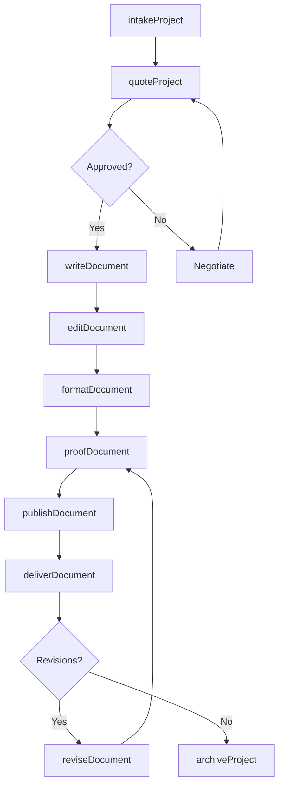
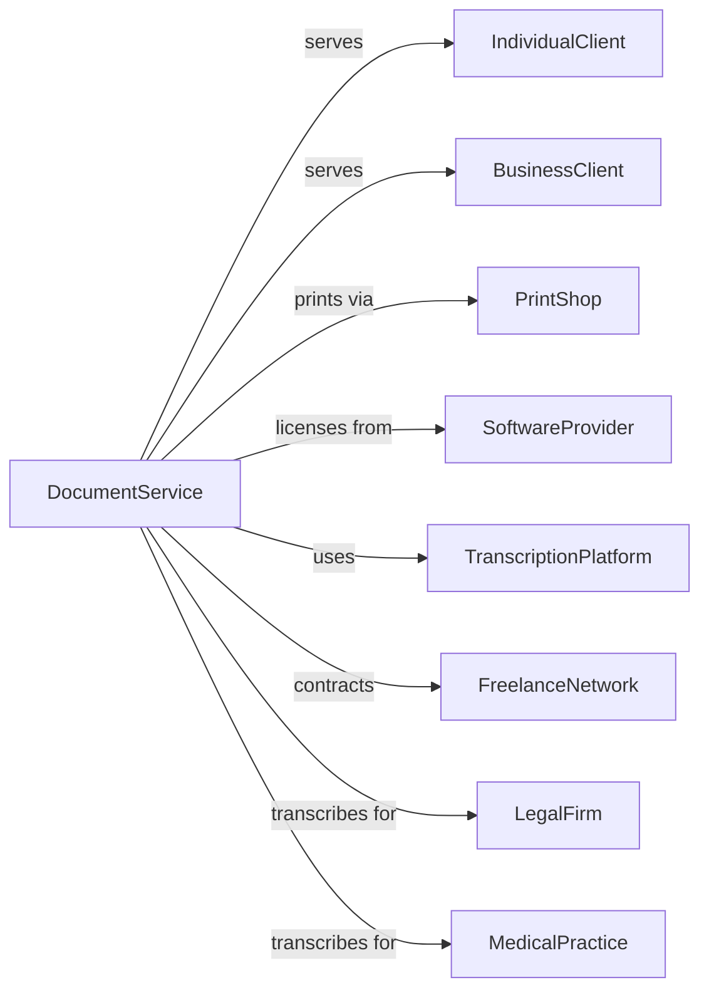

# Document Preparation Services

> Business-as-Code definition for document preparation operations. Models services from resume writing through transcription and desktop publishing.

## Overview

Document preparation services provide specialized support including letter and resume writing, document editing and proofreading, typing, word processing, desktop publishing, and transcription services. These establishments help individuals and businesses create professional documents, convert audio to text, and produce publication-ready materials for various business and personal needs.

## Actors

| Actor | Description |
|-------|-------------|
| IndividualClient | Person seeking resume, letter, or personal document services |
| BusinessClient | Company requiring document processing or transcription |
| PrintShop | Handles physical printing and binding of prepared documents |
| SoftwareProvider | Supplies word processing and design applications |
| TranscriptionPlatform | Provides audio file sharing and management tools |
| FreelanceNetwork | Pool of contracted writers, editors, and transcriptionists |
| LegalFirm | Client requiring legal document transcription |
| MedicalPractice | Client requiring medical transcription services |

## Roles

| Role | Description |
|------|-------------|
| DocumentSpecialist | Creates and formats professional documents |
| ResumeWriter | Crafts resumes and career-related documents |
| Editor | Reviews and corrects grammar, style, and content |
| Proofreader | Catches errors in final document review |
| Transcriptionist | Converts audio and video recordings to text |
| DesktopPublisher | Creates publication-ready layouts and designs |

## Entities

| Entity | Description |
|--------|-------------|
| Document | Written material being created or processed |
| Resume | Professional career summary document |
| Transcript | Text version of audio or video recording |
| Template | Standardized format for recurring document types |
| StyleGuide | Standards for formatting and language usage |
| AudioFile | Recording to be transcribed |
| Proof | Final review copy before delivery |
| Project | Collection of related document work |
| ClientBrief | Requirements and specifications from client |
| DeliveryPackage | Completed documents in requested formats |

## Actions

| Action | Description |
|--------|-------------|
| intakeProject | Receive requirements and source materials from client |
| writeDocument | Create original content based on client specifications |
| editDocument | Revise content for clarity, style, and accuracy |
| proofDocument | Conduct final review for errors and formatting |
| transcribeAudio | Convert recordings to written text |
| formatDocument | Apply styling, layout, and design elements |
| publishDocument | Prepare final output in requested formats |
| deliverDocument | Send completed work to client |
| reviseDocument | Make changes based on client feedback |
| archiveProject | Store completed work for future reference |
| quoteProject | Estimate pricing based on scope and complexity |
| trackDeadline | Monitor due dates and production schedule |

## Events

| Event | Description |
|-------|-------------|
| projectIntaked | New work request received and documented |
| documentWritten | Original content creation completed |
| documentEdited | Revisions and corrections applied |
| documentProofed | Final quality review completed |
| audioTranscribed | Recording converted to text |
| documentFormatted | Layout and design applied |
| documentPublished | Final output generated |
| documentDelivered | Completed work sent to client |
| revisionRequested | Client requested changes to delivered work |
| projectArchived | Work stored in completed project files |
| deadlineApproaching | Due date within notification window |
| quoteAccepted | Client approved pricing estimate |

## Searches

| Search | Description |
|--------|-------------|
| findProjects | List projects by client, status, or deadline |
| searchDocuments | Locate documents by type, date, or keyword |
| getTranscripts | Retrieve transcription jobs by client or status |
| findTemplates | Access document templates by category |
| getDeadlines | View upcoming due dates across projects |
| searchClients | Find client accounts by industry or volume |
| getRevisionHistory | Track changes made to specific document |

## Workflow



## Actor Relationships



## Usage

### Calling Actions

```typescript
import { prepareDocuments } from '@headlessly/prepare-documents'

const docs = prepareDocuments()

// Check upcoming deadlines and active transcription jobs
const deadlines = await docs.getDeadlines({ daysAhead: 7 })
const transcriptions = await docs.getTranscripts({ status: 'in-progress' })

// Intake resume writing project
const project = await docs.intakeProject({
  clientId: 'individual-123',
  type: 'resume',
  specifications: {
    industry: 'technology',
    experienceLevel: 'senior',
    targetRoles: ['Product Manager', 'Director of Product'],
    includeLinkedIn: true
  },
  sourceDocuments: ['current-resume.pdf', 'job-history.docx'],
  deadline: '2024-04-15'
})

// Create and edit resume
await docs.writeDocument({
  projectId: project.id,
  template: 'executive-modern',
  sections: ['summary', 'experience', 'skills', 'education']
})

// Transcribe medical dictation
const transcript = await docs.transcribeAudio({
  clientId: 'medical-practice-456',
  audioFile: 'patient-notes-20240401.mp3',
  turnaround: '24-hours',
  format: 'SOAP',
  includeTimestamps: false
})
```

### Event-Driven Automation

```typescript
// Auto-notify when deadline approaching
docs.deadlineApproaching(async ({ projectId, dueDate, daysRemaining }) => {
  if (daysRemaining <= 2) {
    await docs.trackDeadline({
      projectId,
      alert: 'urgent',
      notifyTeam: true,
      escalateTo: 'supervisor'
    })
  }
})

// Auto-archive after delivery confirmed
docs.documentDelivered(async ({ projectId, clientId }) => {
  const feedback = await docs.awaitClientConfirmation({ projectId })

  if (feedback.status === 'approved') {
    await docs.archiveProject({
      projectId,
      retentionPeriod: '7-years',
      includeVersionHistory: true
    })
  }
})
```
