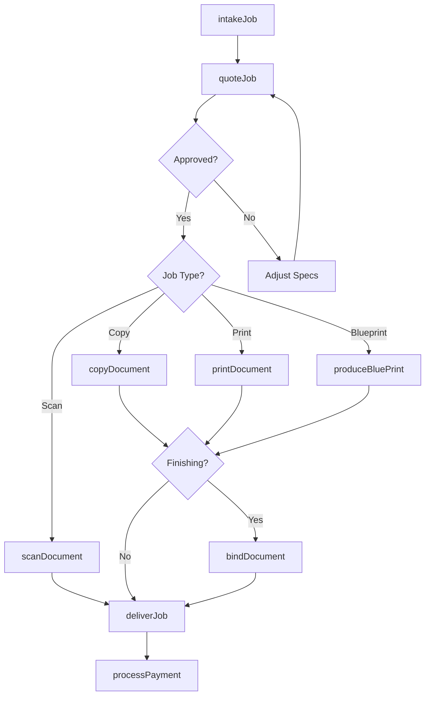
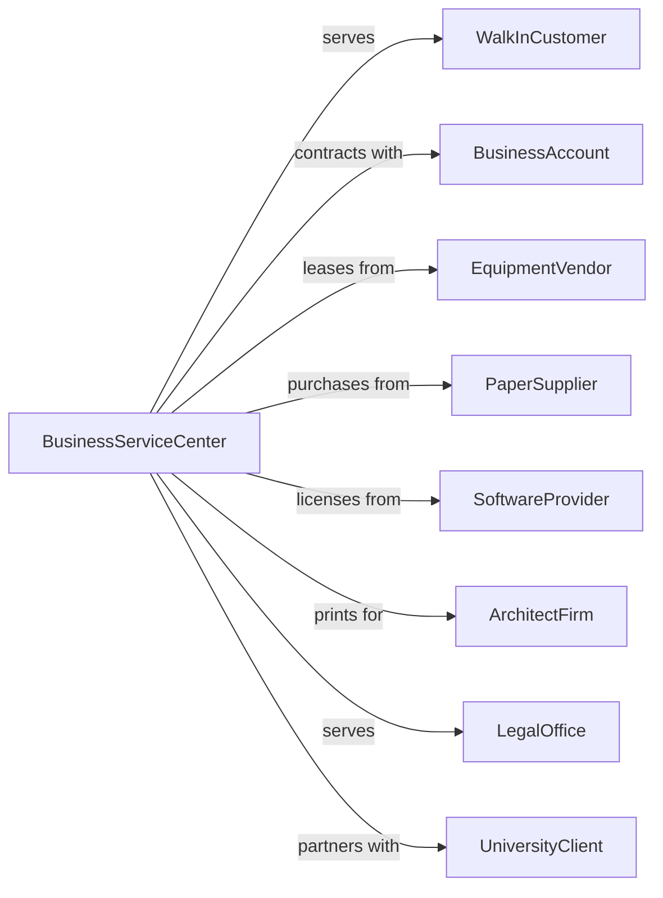

# Other Business Service Centers (including Copy Shops)

> Business-as-Code definition for copy shop and business service center operations. Models document reproduction, binding, and office support services.

## Overview

Business service centers and copy shops provide photocopying, document duplication, blueprinting, scanning, binding, and laminating services. Many establishments also offer complementary services including faxing, computer rental, internet access, and office supplies. These centers serve students, small businesses, and individuals needing professional document reproduction without maintaining their own equipment.

## Actors

| Actor | Description |
|-------|-------------|
| WalkInCustomer | Individual seeking immediate copying or services |
| BusinessAccount | Company with ongoing document reproduction needs |
| EquipmentVendor | Supplies copiers, printers, and binding equipment |
| PaperSupplier | Provides paper stock, specialty media, and supplies |
| SoftwareProvider | Licenses document processing and POS software |
| ArchitectFirm | Client requiring blueprints and large-format copies |
| LegalOffice | Client needing litigation document services |
| UniversityClient | Educational institution with student printing needs |

## Roles

| Role | Description |
|------|-------------|
| StoreManager | Oversees operations and customer relationships |
| ProductionSpecialist | Operates high-volume copying and finishing equipment |
| CustomerServiceRep | Assists customers and processes transactions |
| GraphicsOperator | Handles scanning, color correction, and file preparation |
| EquipmentTechnician | Maintains and troubleshoots production equipment |

## Entities

| Entity | Description |
|--------|-------------|
| CopyJob | Order for document reproduction services |
| Document | Source material being copied or processed |
| PrintQueue | Pending jobs awaiting production |
| BindingOrder | Request for document finishing services |
| Blueprint | Large-format technical drawing reproduction |
| ScanFile | Digital capture of physical document |
| PricingSheet | Rates for various services and quantities |
| AccountCredit | Prepaid balance for business account |
| EquipmentLog | Usage and maintenance records for machines |
| SupplyInventory | Stock levels of paper, toner, and materials |

## Actions

| Action | Description |
|--------|-------------|
| intakeJob | Receive document reproduction order from customer |
| copyDocument | Reproduce documents per specifications |
| scanDocument | Convert physical documents to digital files |
| printDocument | Output digital files to paper |
| bindDocument | Apply finishing such as binding, stapling, or laminating |
| produceBluePrint | Create large-format technical reproductions |
| deliverJob | Complete order and release to customer |
| processPayment | Collect payment for services rendered |
| setupAccount | Create business account with credit terms |
| maintainEquipment | Perform routine service on production machines |
| orderSupplies | Replenish paper, toner, and finishing materials |
| quoteJob | Estimate pricing for customer project |

## Events

| Event | Description |
|-------|-------------|
| jobIntaked | New order received and queued |
| documentCopied | Reproduction completed |
| documentScanned | Digital capture completed |
| documentPrinted | Output production completed |
| documentBound | Finishing applied to document |
| bluePrintProduced | Large-format reproduction completed |
| jobDelivered | Order released to customer |
| paymentProcessed | Transaction completed |
| accountCreated | New business account established |
| equipmentServiced | Maintenance performed on machine |
| suppliesOrdered | Replenishment order placed |
| quoteSent | Price estimate delivered to customer |

## Searches

| Search | Description |
|--------|-------------|
| findJobs | List orders by status, customer, or date |
| getQueue | View pending jobs by priority or machine |
| searchAccounts | Find business accounts by name or activity |
| getEquipmentStatus | Check machine availability and status |
| findSupplyLevels | View inventory of paper and consumables |
| getUsageReport | Retrieve production statistics by period |
| searchPricing | Look up rates for specific services |

## Workflow



## Actor Relationships



## Usage

### Calling Actions

```typescript
import { copyDocuments } from '@headlessly/copy-documents'

const copyShop = copyDocuments()

// Check print queue and equipment status
const queue = await copyShop.getQueue({ priority: 'high' })
const equipment = await copyShop.getEquipmentStatus()

// Intake copy job
const job = await copyShop.intakeJob({
  customer: 'walk-in',
  type: 'copy',
  specifications: {
    quantity: 500,
    size: 'letter',
    color: 'black-and-white',
    sided: 'double',
    paperStock: '20lb-bond',
    collate: true
  },
  finishing: {
    type: 'spiral-bind',
    coverStock: 'clear-front'
  },
  turnaround: '2-hour'
})

// Produce large-format blueprint
await copyShop.produceBluePrint({
  customer: 'architect-account-123',
  files: ['floor-plan-1.pdf', 'floor-plan-2.pdf'],
  size: '36x48',
  quantity: 5,
  foldOption: 'accordion',
  deliveryMethod: 'pickup'
})

// Set up business account
const account = await copyShop.setupAccount({
  companyName: 'Smith Law Firm',
  contact: {
    name: 'Office Manager',
    email: 'office@smithlaw.com',
    phone: '555-1234'
  },
  creditLimit: 500,
  billingCycle: 'monthly',
  discount: 10
})
```

### Event-Driven Automation

```typescript
// Auto-notify when job ready
copyShop.jobDelivered(async ({ jobId, customerId, contactMethod }) => {
  await copyShop.notifyCustomer({
    jobId,
    method: contactMethod || 'email',
    message: `Your order #${jobId} is ready for pickup.`
  })
})

// Auto-reorder supplies when low
copyShop.suppliesOrdered(async ({ item, currentLevel, reorderPoint }) => {
  if (currentLevel <= reorderPoint) {
    await copyShop.orderSupplies({
      item,
      quantity: item.standardOrderQty,
      vendor: item.preferredVendor,
      priority: currentLevel < reorderPoint * 0.5 ? 'rush' : 'standard'
    })
  }
})
```
