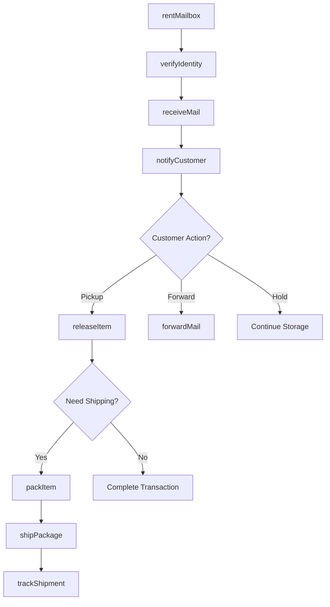
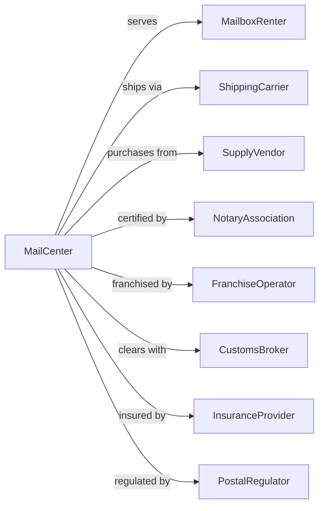

# Private Mail Centers

> Business-as-Code definition for private mailbox and postal service operations. Models mailbox rental, package handling, and shipping services for individuals and businesses.

## Overview

Private mail centers provide mailbox rental services, mail receiving and forwarding, package acceptance, and shipping services using multiple carriers. These establishments often offer complementary services including copying, faxing, notary, office supplies, and document services, serving as convenient one-stop locations for small businesses and individuals needing professional mailing addresses and business support.

## Actors

| Actor | Description |
|-------|-------------|
| MailboxRenter | Individual or business leasing private mailbox |
| ShippingCarrier | Companies like UPS, FedEx, USPS providing delivery services |
| SupplyVendor | Provides packing materials, boxes, and office supplies |
| NotaryAssociation | Certifies notary services offered by center |
| FranchiseOperator | Parent company for franchised mail center locations |
| CustomsBroker | Facilitates international shipment clearance |
| InsuranceProvider | Covers shipment loss and business liability |
| PostalRegulator | Government agency overseeing private mailbox regulations |

## Roles

| Role | Description |
|------|-------------|
| StoreManager | Oversees daily operations and staff |
| ServiceAssociate | Handles customer transactions and shipments |
| PackingSpecialist | Prepares items for secure shipping |
| NotaryPublic | Witnesses and authenticates document signatures |
| InventoryClerk | Manages supplies and restocking |
| MailSortClerk | Receives, logs, and organizes incoming mail into private mailbox slots |

## Entities

| Entity | Description |
|--------|-------------|
| Mailbox | Private postal address assigned to renter |
| Package | Item received or shipped on behalf of customer |
| ShipmentLabel | Carrier-specific shipping documentation |
| RentalAgreement | Contract for mailbox rental terms |
| TrackingNumber | Unique identifier for shipment status |
| MailLog | Record of items received for mailbox holder |
| NotarizedDocument | Officially witnessed and authenticated paperwork |
| PackingSlip | Details of items shipped and packing used |
| ServiceInvoice | Bill for services rendered |
| SupplyInventory | Stock levels of packing materials and products |

## Actions

| Action | Description |
|--------|-------------|
| rentMailbox | Establish new mailbox rental with customer |
| receiveMail | Accept and log incoming mail and packages |
| notifyCustomer | Alert mailbox holder of waiting items |
| releaseItem | Hand over mail or package to authorized recipient |
| forwardMail | Redirect mail to alternate address |
| shipPackage | Process outbound shipment via selected carrier |
| packItem | Professionally package items for shipping |
| processNotary | Witness and authenticate document signatures |
| sellSupplies | Retail packing materials and office products |
| renewRental | Extend mailbox agreement for additional term |
| verifyIdentity | Confirm customer identity per postal regulations |
| trackShipment | Monitor package status through delivery |

## Events

| Event | Description |
|-------|-------------|
| mailboxRented | New rental agreement activated |
| mailReceived | Incoming item logged to mailbox |
| customerNotified | Alert sent about waiting items |
| itemReleased | Mail or package picked up by customer |
| mailForwarded | Items redirected to new address |
| packageShipped | Outbound shipment processed |
| itemPacked | Professional packing completed |
| documentNotarized | Signature authentication completed |
| suppliesSold | Retail transaction completed |
| rentalRenewed | Mailbox agreement extended |
| rentalExpired | Mailbox term ended without renewal |
| shipmentDelivered | Package confirmed received at destination |

## Searches

| Search | Description |
|--------|-------------|
| findMailboxes | List rentals by status, size, or renewal date |
| getMailLog | Retrieve items received for specific mailbox |
| searchShipments | Find packages by tracking number or customer |
| getInventory | Check supply levels for packing materials |
| findExpiringRentals | List mailboxes approaching renewal date |
| getNotaryLog | Retrieve notarization records by date |
| trackPackages | View status of outbound shipments |

## Workflow



## Actor Relationships



## Usage

### Calling Actions

```typescript
import { supportPrivateMail } from '@headlessly/support-private-mail'

const mailCenter = supportPrivateMail()

// Rent new mailbox
const rental = await mailCenter.rentMailbox({
  customer: {
    name: 'Jane Smith',
    idType: 'driversLicense',
    idNumber: 'S123456789',
    email: 'jane@example.com',
    phone: '555-1234'
  },
  boxSize: 'medium',
  term: 12,
  address: {
    format: 'suite',
    number: '205'
  },
  services: ['mailNotification', 'packageHold']
})

// Receive and log package
await mailCenter.receiveMail({
  mailboxId: rental.id,
  type: 'package',
  carrier: 'UPS',
  trackingNumber: '1Z999AA10123456784',
  description: 'Medium box'
})

// Ship outbound package
const shipment = await mailCenter.shipPackage({
  customer: 'jane@example.com',
  carrier: 'FedEx',
  service: 'ground',
  destination: {
    name: 'John Doe',
    street: '123 Main St',
    city: 'Chicago',
    state: 'IL',
    zip: '60601'
  },
  package: { weight: 5, dimensions: { l: 12, w: 10, h: 8 } },
  insurance: 100,
  signature: true
})
```

### Event-Driven Automation

```typescript
// Auto-notify on package receipt
mailCenter.mailReceived(async ({ mailboxId, type, carrier }) => {
  const rental = await mailCenter.getRental({ mailboxId })

  if (rental.notifications.includes('immediate')) {
    await mailCenter.notifyCustomer({
      mailboxId,
      method: rental.preferredContact,
      message: `New ${type} received via ${carrier}. Ready for pickup.`
    })
  }
})

// Auto-remind expiring rentals
mailCenter.rentalExpired(async ({ mailboxId, customerId, expirationDate }) => {
  const daysUntil = daysBetween(new Date(), expirationDate)

  if (daysUntil === 30 || daysUntil === 7) {
    await mailCenter.notifyCustomer({
      mailboxId,
      method: 'email',
      message: `Your mailbox rental expires in ${daysUntil} days. Renew to maintain service.`,
      includeRenewalLink: true
    })
  }
})
```
