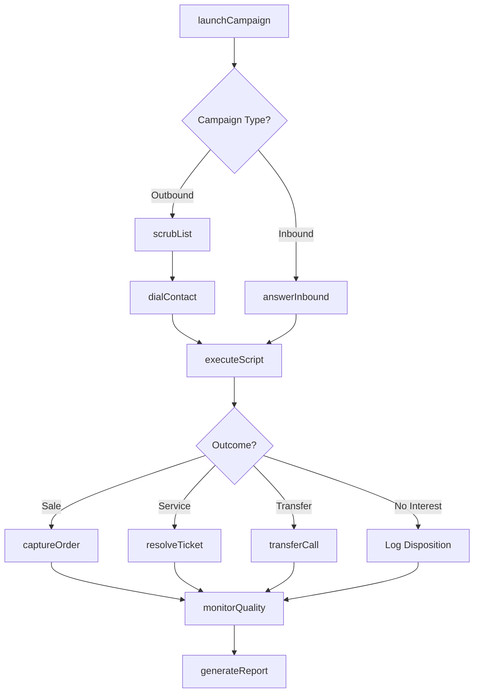
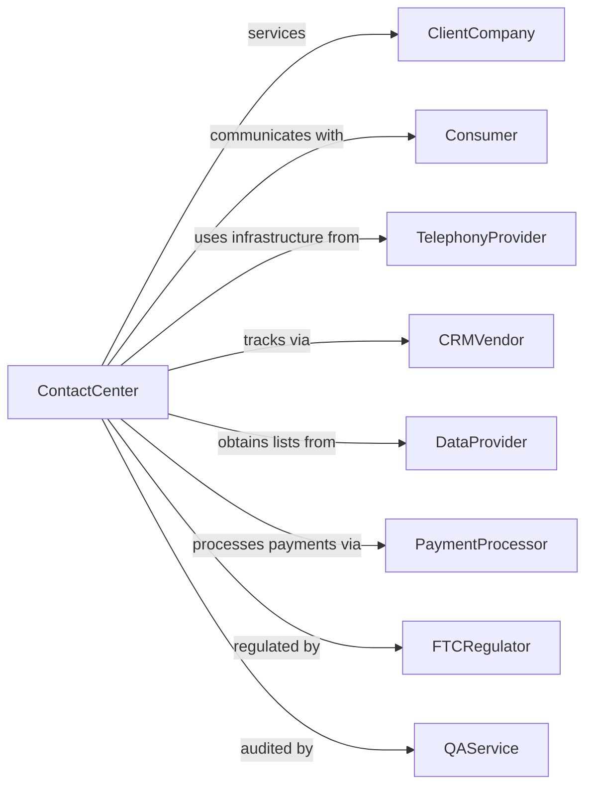

# Telemarketing Bureaus and Other Contact Centers

> Business-as-Code definition for contact center operations. Models inbound and outbound communication services from sales campaigns through customer support.

## Overview

Telemarketing bureaus and contact centers operate facilities that initiate or receive communications via telephone, email, chat, and other channels to promote products, take orders, solicit contributions, or provide customer support on behalf of clients. These establishments handle high-volume customer interactions using specialized infrastructure and trained agents without owning the products or services being discussed.

## Actors

| Actor | Description |
|-------|-------------|
| ClientCompany | Business contracting for contact center services |
| Consumer | Individual being contacted or requesting support |
| TelephonyProvider | Supplies phone systems, dialers, and ACD equipment |
| CRMVendor | Provides customer relationship management software |
| DataProvider | Supplies contact lists and lead information |
| PaymentProcessor | Handles credit card and payment transactions |
| FTCRegulator | Enforces telemarketing rules and Do Not Call compliance |
| QAService | Provides call monitoring and quality assurance |

## Roles

| Role | Description |
|------|-------------|
| ContactCenterAgent | Handles inbound and outbound customer interactions |
| TeamSupervisor | Manages agent performance and escalates issues |
| CampaignManager | Designs and oversees client marketing programs |
| QualityAnalyst | Monitors calls and scores agent performance |
| WorkforceScheduler | Plans staffing levels based on call volume forecasts |
| ComplianceOfficer | Ensures adherence to telemarketing regulations |
| Dialer Administrator | Configures predictive and preview dialers to maximize contact rates within TCPA limits |

## Entities

| Entity | Description |
|--------|-------------|
| Campaign | Defined outreach or support program for client |
| CallScript | Guided dialogue for agent-customer interactions |
| LeadList | Database of contacts for outbound campaigns |
| CallDisposition | Outcome code for completed interaction |
| Order | Sales transaction captured during call |
| Ticket | Customer service issue being tracked |
| DoNotCallList | Registry of consumers who opted out |
| CallRecording | Audio capture for quality and compliance |
| PerformanceMetric | KPI measuring agent or campaign effectiveness |
| QueueStatus | Real-time view of calls waiting and agents available |

## Actions

| Action | Description |
|--------|-------------|
| launchCampaign | Initiate new outbound or inbound program |
| dialContact | Place outbound call to prospect or customer |
| answerInbound | Receive incoming customer call or message |
| executeScript | Follow guided dialogue during interaction |
| captureOrder | Record sales transaction from customer |
| resolveTicket | Address and close customer service issue |
| transferCall | Route customer to appropriate destination |
| scrubList | Remove Do Not Call entries from contact database |
| monitorQuality | Listen to calls and evaluate agent performance |
| forecastVolume | Predict call volumes for staffing planning |
| generateReport | Produce campaign performance analytics |
| manageCompliance | Ensure adherence to regulatory requirements |

## Events

| Event | Description |
|-------|-------------|
| campaignLaunched | New program activated for client |
| contactDialed | Outbound call placed to prospect |
| inboundAnswered | Customer call received by agent |
| scriptExecuted | Agent completed guided interaction |
| orderCaptured | Sales transaction recorded |
| ticketResolved | Customer issue addressed and closed |
| callTransferred | Customer routed to new destination |
| listScrubbed | Contact database cleaned for compliance |
| qualityMonitored | Call evaluated for performance |
| volumeForecasted | Staffing prediction generated |
| reportGenerated | Analytics delivered to client |
| complianceAlertRaised | Potential regulatory issue identified |

## Searches

| Search | Description |
|--------|-------------|
| findCampaigns | List programs by client, status, or type |
| getCallLogs | Retrieve interaction records by date or agent |
| searchContacts | Query lead database by criteria |
| getOrders | Find sales transactions by campaign or period |
| findTickets | List open or resolved service issues |
| getMetrics | Access KPIs by campaign, agent, or period |
| checkCompliance | Verify Do Not Call status for contact |
| getQueueStatus | View real-time call volumes and wait times |

## Workflow



## Actor Relationships



## Usage

### Calling Actions

```typescript
import { staffContactCenter } from '@headlessly/staff-contact-center'

const center = staffContactCenter()

// Check active campaigns and queue status
const campaigns = await center.findCampaigns({ clientId: 'insurance-co', status: 'active' })
const queue = await center.getQueueStatus()

// Launch outbound sales campaign
const campaign = await center.launchCampaign({
  clientId: 'insurance-co',
  name: 'Q2 Medicare Advantage',
  type: 'outbound-sales',
  startDate: '2024-04-01',
  endDate: '2024-06-30',
  script: 'medicare-advantage-v3',
  targetVolume: 50000,
  compliance: ['TCPA', 'CMS-guidelines']
})

// Scrub list before dialing
await center.scrubList({
  campaignId: campaign.id,
  listId: 'medicare-eligible-2024',
  scrubAgainst: ['federal-dnc', 'state-dnc', 'internal-dnc'],
  removeInvalid: true
})

// Process inbound customer service
await center.answerInbound({
  campaignId: 'customer-support-main',
  callerId: '555-1234',
  queue: 'tier-1-support',
  maxWaitTime: 60
})

// Capture order during call
await center.captureOrder({
  campaignId: campaign.id,
  agentId: 'agent-456',
  customer: {
    name: 'Jane Doe',
    phone: '555-1234',
    email: 'jane@example.com'
  },
  product: 'medicare-advantage-gold',
  amount: 0,
  paymentMethod: 'cms-enrollment'
})
```

### Event-Driven Automation

```typescript
// Auto-adjust staffing based on queue status
center.volumeForecasted(async ({ campaignId, predictedVolume, period }) => {
  const currentStaff = await center.getAgentCount({ campaignId })
  const neededStaff = Math.ceil(predictedVolume / 20) // 20 calls per agent

  if (neededStaff > currentStaff) {
    await center.requestAdditionalStaff({
      campaignId,
      period,
      additionalAgents: neededStaff - currentStaff
    })
  }
})

// Auto-escalate compliance issues
center.complianceAlertRaised(async ({ campaignId, alertType, agentId }) => {
  await center.manageCompliance({
    campaignId,
    action: 'investigate',
    alertType,
    agentId,
    notifyClient: alertType === 'dnc-violation',
    suspendAgent: alertType === 'script-deviation'
  })
})
```
