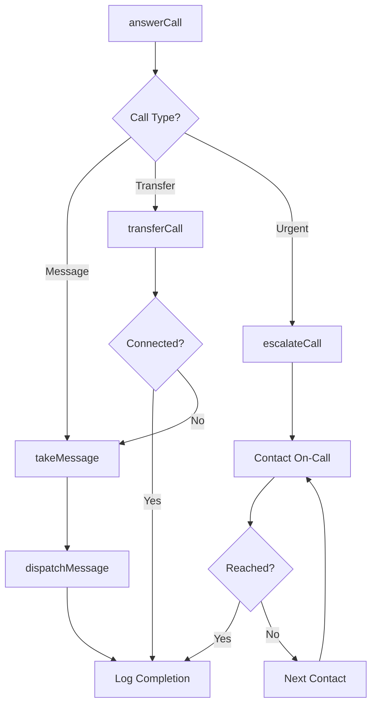
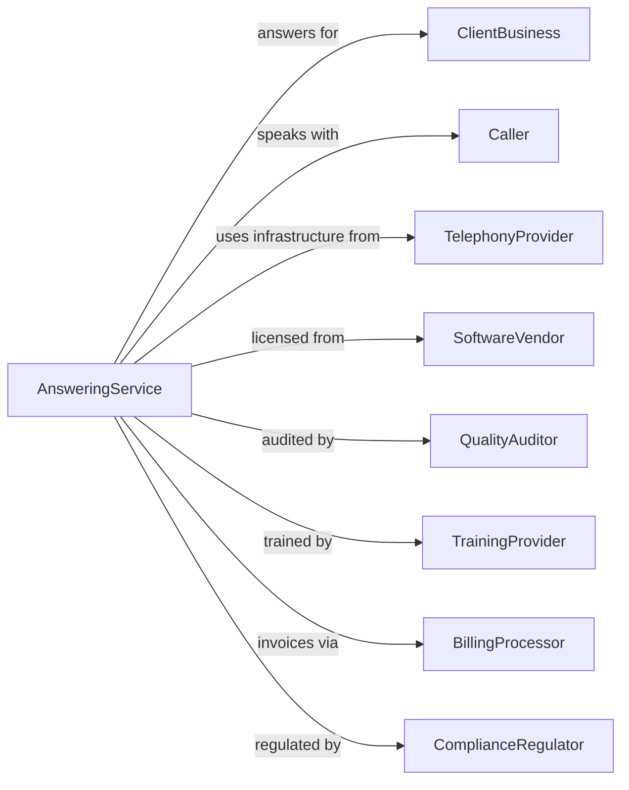

# Telephone Answering Services

> Business-as-Code definition for live telephone answering operations. Models call handling from intake through message delivery.

## Overview

Telephone answering services provide live operators to answer calls on behalf of clients, taking messages, transferring calls, and relaying information according to client-specific protocols. These services enable businesses to maintain professional phone coverage during off-hours, peak periods, or as a full-time virtual receptionist solution without employing dedicated reception staff.

## Actors

| Actor | Description |
|-------|-------------|
| ClientBusiness | Company subscribing to answering services |
| Caller | Person contacting the client via answered line |
| TelephonyProvider | Supplies phone systems and call routing infrastructure |
| SoftwareVendor | Provides call management and CRM platforms |
| QualityAuditor | Monitors calls for compliance and service quality |
| TrainingProvider | Delivers operator certification and skills training |
| BillingProcessor | Handles usage tracking and client invoicing |
| ComplianceRegulator | Enforces telecommunications and privacy regulations |

## Roles

| Role | Description |
|------|-------------|
| LiveOperator | Answers calls and handles caller interactions |
| ShiftSupervisor | Oversees operator team and escalates issues |
| AccountManager | Manages client relationships and service configuration |
| QualityAnalyst | Reviews call recordings and scores performance |
| ScriptWriter | Develops call handling protocols and responses |
| TrainingCoordinator | Onboards and trains operators on client accounts |
| AfterHoursDispatcher | Routes urgent overnight calls through client-specific escalation trees |

## Entities

| Entity | Description |
|--------|-------------|
| CallScript | Instructions for handling calls for specific client |
| Message | Recorded information from caller to be relayed |
| CallLog | Record of all calls received and actions taken |
| Account | Client configuration including scripts and contacts |
| Escalation | Protocol for urgent or priority calls |
| OnCallSchedule | Rotation of client contacts for after-hours |
| VoiceGreeting | Customized announcement for client line |
| CallMetrics | Statistics on volume, duration, and handling |
| Contact | Client personnel authorized to receive messages |
| QualityScore | Rating of operator performance on calls |

## Actions

| Action | Description |
|--------|-------------|
| answerCall | Receive incoming call with appropriate greeting |
| takeMessage | Record caller information and purpose of call |
| transferCall | Connect caller to requested party |
| dispatchMessage | Deliver message to client via preferred method |
| escalateCall | Route urgent calls per client protocol |
| screenCall | Filter calls based on client criteria |
| scheduleCallback | Arrange future call between client and caller |
| updateAccount | Modify client scripts, contacts, or preferences |
| monitorQuality | Review calls for adherence to standards |
| generateReport | Produce call activity summaries for clients |
| trainOperator | Prepare staff on client-specific protocols |
| configureRouting | Set up call forwarding and overflow rules |

## Events

| Event | Description |
|-------|-------------|
| callAnswered | Incoming call received by operator |
| messageTaken | Caller information recorded |
| callTransferred | Caller connected to requested party |
| messageDispatched | Message delivered to client contact |
| callEscalated | Urgent call routed per protocol |
| callScreened | Call filtered per client criteria |
| callbackScheduled | Future call arranged between parties |
| accountUpdated | Client configuration modified |
| qualityReviewed | Call evaluated for performance |
| reportGenerated | Activity summary delivered to client |
| operatorTrained | Staff completed account certification |
| routingConfigured | Call flow rules established |

## Searches

| Search | Description |
|--------|-------------|
| findCalls | Search call logs by date, client, or caller |
| getMessages | Retrieve undelivered or recent messages |
| searchAccounts | Find client accounts by industry or feature |
| getMetrics | Access call statistics by period or account |
| findOperators | List staff by skill, availability, or certification |
| getSchedules | View on-call rotations by client |
| getQualityScores | Retrieve performance ratings by operator or account |

## Workflow



## Actor Relationships



## Usage

### Calling Actions

```typescript
import { answerTelephoneCalls } from '@headlessly/answer-telephone-calls'

const answering = answerTelephoneCalls()

// Check undelivered messages and on-call schedule
const pending = await answering.getMessages({ status: 'undelivered', accountId: 'law-firm-123' })
const schedule = await answering.getSchedules({ accountId: 'law-firm-123', date: '2024-06-15' })

// Configure new client account
const account = await answering.updateAccount({
  clientId: 'law-firm-123',
  businessName: 'Smith & Associates',
  greeting: 'Thank you for calling Smith & Associates. How may I direct your call?',
  scripts: {
    newClient: 'gather contact info, matter type, urgency',
    existingClient: 'verify name, get case number, take message',
    emergency: 'transfer to on-call attorney immediately'
  },
  contacts: [
    { name: 'Sarah Smith', role: 'partner', phone: '555-0101', email: 'sarah@smithlaw.com' },
    { name: 'Reception', role: 'general', phone: '555-0100' }
  ],
  dispatchMethod: 'email-and-sms',
  operatingHours: { afterHours: true, weekends: true }
})

// Handle incoming call
await answering.answerCall({
  accountId: account.id,
  callerId: '555-1234',
  timestamp: new Date()
})

// Take and dispatch message
const message = await answering.takeMessage({
  accountId: account.id,
  callerName: 'John Doe',
  callerPhone: '555-1234',
  regarding: 'Personal injury consultation',
  urgency: 'normal',
  callbackRequested: true
})

await answering.dispatchMessage({
  messageId: message.id,
  method: 'email-and-sms',
  recipients: ['sarah@smithlaw.com']
})
```

### Event-Driven Automation

```typescript
// Auto-escalate after-hours urgent calls
answering.callAnswered(async ({ accountId, callType, time }) => {
  const account = await answering.getAccount({ accountId })
  const isAfterHours = !isWithinBusinessHours(time, account.operatingHours)

  if (callType === 'urgent' && isAfterHours) {
    await answering.escalateCall({
      accountId,
      protocol: 'after-hours-emergency',
      escalationPath: account.onCallSchedule
    })
  }
})

// Auto-generate daily reports
answering.reportGenerated(async ({ accountId, period }) => {
  const metrics = await answering.getMetrics({ accountId, period })

  if (metrics.callVolume > 0) {
    await answering.generateReport({
      accountId,
      type: 'daily-summary',
      include: ['callVolume', 'avgHandleTime', 'messageCount', 'transferRate'],
      deliverTo: 'client-admin'
    })
  }
})
```
