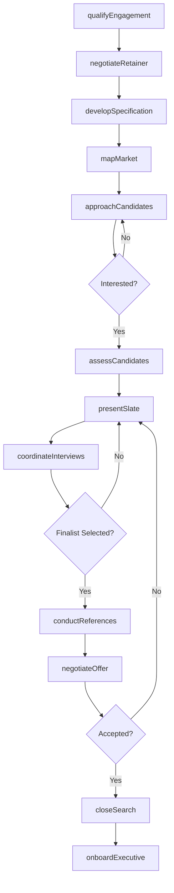
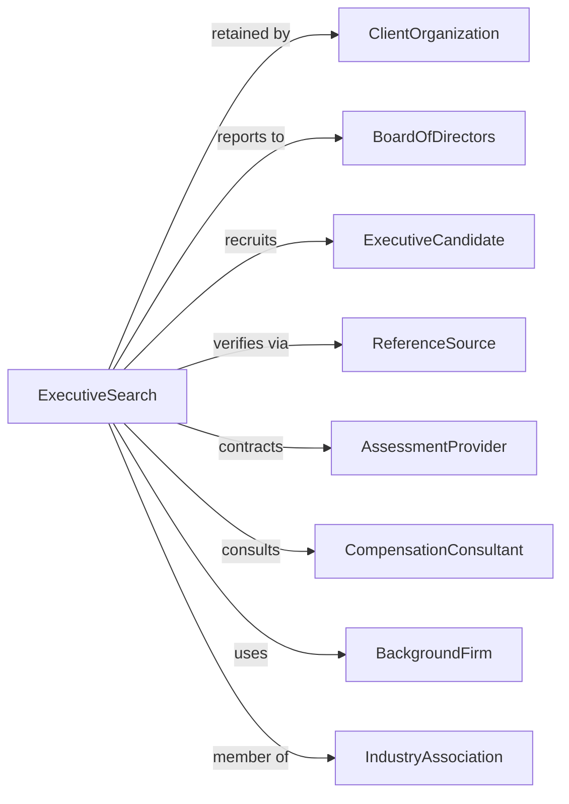

# Executive Search Services

> Business-as-Code definition for executive search and retained recruitment operations. Models the specialized process of identifying and placing senior leadership talent.

## Overview

Executive search services specialize in recruiting senior-level executives, board members, and specialized professionals typically through retained search engagements. Unlike contingency placement, these firms work exclusively with clients on specific assignments, conducting confidential outreach to passive candidates and providing comprehensive assessment services.

## Actors

| Actor | Description |
|-------|-------------|
| ClientOrganization | Company seeking to fill executive or board position |
| BoardOfDirectors | Governance body involved in senior hiring decisions |
| ExecutiveCandidate | Senior professional being recruited for position |
| ReferenceSource | Provides confidential insights on candidate |
| AssessmentProvider | Delivers psychometric and leadership evaluations |
| CompensationConsultant | Advises on executive pay packages |
| BackgroundFirm | Conducts thorough executive background verification |
| IndustryAssociation | Professional body like AESC setting ethical standards |

## Roles

| Role | Description |
|------|-------------|
| ManagingPartner | Leads client relationships and firm strategy |
| SearchConsultant | Manages search assignments and candidate engagement |
| ResearchAssociate | Conducts market mapping and candidate identification |
| AssessmentSpecialist | Administers leadership evaluations and debriefs |
| ClientRelationsManager | Maintains ongoing client partnerships |
| Headhunter | Conducts confidential outreach to passive senior candidates in competing firms |

## Entities

| Entity | Description |
|--------|-------------|
| SearchEngagement | Retained assignment to fill executive position |
| PositionSpecification | Detailed profile of role requirements and ideal candidate |
| CandidateSlate | Curated list of qualified candidates for presentation |
| MarketMap | Analysis of target companies and potential candidates |
| AssessmentReport | Leadership evaluation and fit analysis |
| ReferenceReport | Compiled feedback from candidate references |
| CompensationBenchmark | Market data on executive pay for comparable roles |
| RetainerAgreement | Contract defining engagement terms and fees |
| ProgressReport | Regular update on search status and activities |
| OfferLetter | Formal executive employment proposal |

## Actions

| Action | Description |
|--------|-------------|
| qualifyEngagement | Assess client needs and determine search fit |
| negotiateRetainer | Establish engagement terms, fees, and timeline |
| developSpecification | Create detailed position and candidate profile |
| mapMarket | Research target companies and identify potential candidates |
| approachCandidates | Conduct confidential outreach to executives |
| assessCandidates | Evaluate leadership capabilities and cultural fit |
| presentSlate | Deliver curated candidate recommendations to client |
| coordinateInterviews | Arrange meetings between candidates and client |
| conductReferences | Perform thorough reference verification |
| negotiateOffer | Facilitate executive compensation discussions |
| closeSearch | Finalize placement and collect success fee |
| onboardExecutive | Support transition of placed executive |

## Events

| Event | Description |
|-------|-------------|
| engagementSigned | Retainer agreement executed with client |
| specificationApproved | Position profile finalized by client |
| marketMapped | Target candidate universe identified |
| candidateApproached | Initial outreach made to executive |
| candidateInterested | Executive expressed interest in opportunity |
| assessmentCompleted | Leadership evaluation finished |
| slatePresented | Candidate recommendations delivered to client |
| interviewConducted | Client met with executive candidate |
| referencesVerified | Background and reference checks completed |
| offerExtended | Compensation proposal presented to finalist |
| offerAccepted | Executive agreed to join client organization |
| searchClosed | Assignment completed successfully |

## Searches

| Search | Description |
|--------|-------------|
| findEngagements | List active searches by industry, level, or status |
| searchCandidates | Query executive database by function, industry, or location |
| getMarketMaps | Retrieve target company and candidate research |
| findReferences | Identify appropriate reference sources for candidate |
| getCompensationData | Access executive pay benchmarks by role and market |
| trackProgress | View search pipeline and milestone status |
| searchHistory | Retrieve past placements by client or candidate |

## Workflow



## Actor Relationships



## Usage

### Calling Actions

```typescript
import { recruitExecutives } from '@headlessly/recruit-executives'

const search = recruitExecutives()

// Qualify and initiate new search engagement
const engagement = await search.qualifyEngagement({
  clientId: 'fortune-500-tech',
  position: 'Chief Financial Officer',
  reportingTo: 'CEO',
  boardInvolvement: true,
  urgency: 'moderate',
  confidential: true
})

// Develop position specification
const spec = await search.developSpecification({
  engagementId: engagement.id,
  responsibilities: ['financial strategy', 'investor relations', 'M&A'],
  requirements: ['public company CFO experience', 'tech sector', 'CPA'],
  compensation: { base: 500000, bonus: '100%', equity: 'competitive' },
  culture: ['innovative', 'growth-oriented', 'collaborative']
})

// Map target market
const marketMap = await search.mapMarket({
  engagementId: engagement.id,
  targetCompanies: ['competitors', 'adjacent-tech', 'high-growth'],
  targetFunctions: ['CFO', 'SVP Finance', 'Division CFO'],
  geographyFlex: 'willing-to-relocate'
})
```

### Event-Driven Automation

```typescript
// Auto-generate progress report when milestone reached
search.slatePresented(async ({ engagementId, candidateCount }) => {
  await search.generateProgressReport({
    engagementId,
    milestone: 'slate-presentation',
    metrics: {
      candidatesApproached: await search.getApproachCount({ engagementId }),
      candidatesInterested: candidateCount,
      timelineStatus: 'on-track'
    },
    deliverTo: ['client-sponsor', 'board-chair']
  })
})

// Auto-initiate reference checks for finalists
search.interviewConducted(async ({ engagementId, candidateId, result }) => {
  if (result === 'finalist') {
    await search.conductReferences({
      candidateId,
      referenceTypes: ['professional', 'board', 'peer'],
      minimumCount: 6,
      confidential: true
    })
  }
})
```
