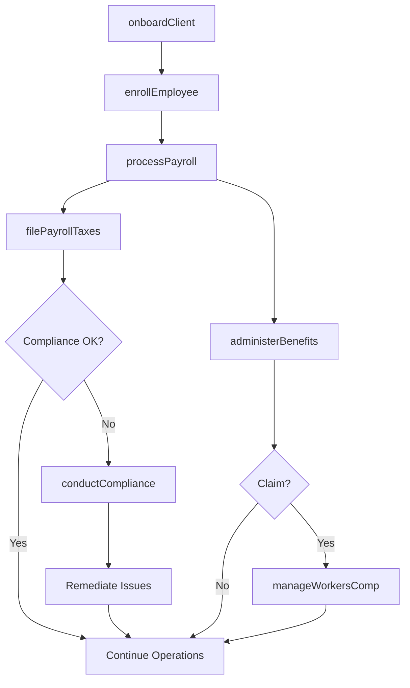
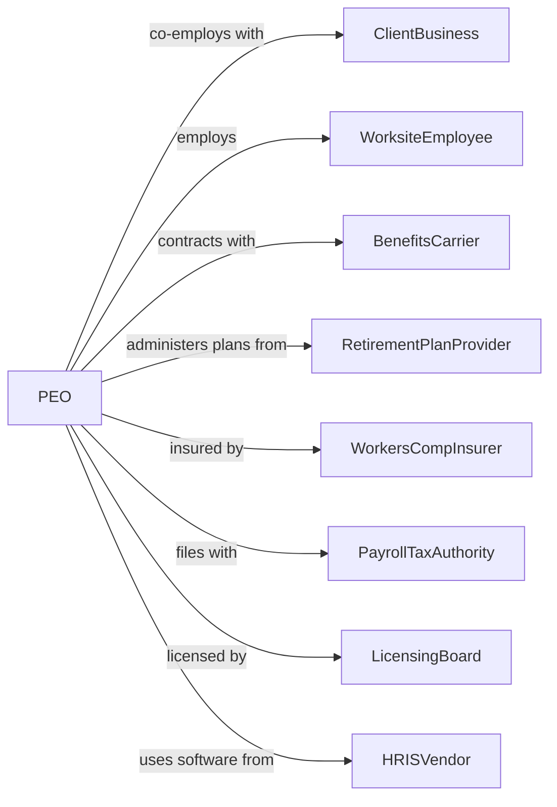

# Professional Employer Organizations

> Business-as-Code definition for PEO co-employment operations. Models comprehensive HR outsourcing from payroll through benefits administration.

## Overview

Professional employer organizations enter co-employment relationships with client businesses, assuming employer responsibilities for payroll, benefits, workers compensation, and HR administration while the client retains control over day-to-day work direction. This arrangement allows small and mid-sized businesses to access enterprise-level benefits and HR expertise while reducing administrative burden and employment liability.

## Actors

| Actor | Description |
|-------|-------------|
| ClientBusiness | Company entering co-employment arrangement for HR services |
| WorksiteEmployee | Worker jointly employed by PEO and client company |
| BenefitsCarrier | Insurance company providing health, dental, and other benefits |
| RetirementPlanProvider | Administers 401k and other retirement programs |
| WorkersCompInsurer | Provides workers compensation coverage under PEO master policy |
| PayrollTaxAuthority | Federal and state agencies collecting employment taxes |
| LicensingBoard | State agency regulating PEO operations |
| HRISVendor | Provides human resources information system technology |

## Roles

| Role | Description |
|------|-------------|
| ClientRelationsManager | Oversees client accounts and service delivery |
| HRBusinessPartner | Provides strategic HR guidance to client companies |
| BenefitsAdministrator | Manages enrollment, claims, and benefits questions |
| PayrollProcessor | Handles wage calculations, deductions, and disbursements |
| ComplianceSpecialist | Ensures adherence to employment laws and regulations |
| RiskManager | Oversees workers compensation and safety programs |
| CoEmploymentCounsel | Navigates the legal complexities of joint employer relationships across jurisdictions |

## Entities

| Entity | Description |
|--------|-------------|
| ClientServiceAgreement | Contract defining co-employment terms and responsibilities |
| WorksiteEmployeeRoster | List of employees covered under PEO arrangement |
| BenefitsPlan | Health, dental, vision, and other coverage options |
| PayrollRegister | Record of employee wages, deductions, and net pay |
| TaxFiling | Quarterly and annual employment tax submissions |
| WorkersCompPolicy | Master insurance policy covering all client employees |
| EmployeeHandbook | Standardized policies and procedures document |
| ComplianceAudit | Review of employment practices and documentation |
| OnboardingPacket | New hire paperwork and enrollment forms |
| TerminationRecord | Documentation of employment separation |

## Actions

| Action | Description |
|--------|-------------|
| onboardClient | Set up new client in PEO systems and transfer employees |
| enrollEmployee | Add worksite employee to payroll and benefits |
| processPayroll | Calculate wages, withhold taxes, and disburse payments |
| administerBenefits | Handle enrollment, changes, and claims support |
| filePayrollTaxes | Submit employment tax deposits and returns |
| manageWorkersComp | Administer claims and safety programs |
| conductCompliance | Perform HR audits and ensure legal adherence |
| provideHRSupport | Deliver guidance on employee relations issues |
| terminateEmployee | Process separations and final pay |
| renewBenefits | Conduct annual open enrollment and plan selection |
| generateReports | Produce payroll, benefits, and compliance reports |
| offboardClient | Transition employees back to client or successor PEO |

## Events

| Event | Description |
|-------|-------------|
| clientOnboarded | New client account activated with employees transferred |
| employeeEnrolled | Worksite employee added to PEO payroll and benefits |
| payrollProcessed | Pay period wages calculated and disbursed |
| benefitsEnrolled | Employee completed benefits selections |
| taxesFiled | Employment tax returns submitted to authorities |
| workersCompClaimFiled | Workplace injury claim initiated |
| complianceIssueIdentified | Potential employment law violation detected |
| employeeTerminated | Worksite employee separated from service |
| openEnrollmentCompleted | Annual benefits selection period closed |
| auditCompleted | HR compliance review finished |
| clientRenewed | Service agreement extended for new term |
| clientOffboarded | Client transitioned off PEO platform |

## Searches

| Search | Description |
|--------|-------------|
| findClients | List client accounts by size, industry, or status |
| getEmployeeRoster | Retrieve worksite employees by client or status |
| searchPayrollHistory | Find payroll records by period, employee, or client |
| getBenefitsEnrollment | View benefits selections by plan or employee |
| findWorkersCompClaims | List injury claims by client, status, or date |
| getComplianceStatus | Check audit findings and remediation progress |
| getTaxFilings | Retrieve tax submissions by period or jurisdiction |

## Workflow



## Actor Relationships



## Usage

### Calling Actions

```typescript
import { coEmployWorksiteEmployees } from '@headlessly/co-employ-worksite-employees'

const peo = coEmployWorksiteEmployees()

// Onboard new client company
const client = await peo.onboardClient({
  companyName: 'Growth Startup Inc',
  employeeCount: 45,
  industry: 'technology',
  stateLocations: ['CA', 'TX', 'NY'],
  effectiveDate: '2024-04-01',
  services: ['payroll', 'benefits', 'workersComp', 'hrSupport']
})

// Enroll employees to PEO
await peo.enrollEmployee({
  clientId: client.id,
  employee: {
    name: 'Sarah Johnson',
    ssn: '***-**-1234',
    startDate: '2024-04-01',
    salary: 85000,
    payFrequency: 'biweekly',
    workLocation: 'CA'
  },
  benefits: {
    medical: 'PPO-2500',
    dental: 'standard',
    vision: 'premium',
    retirement: { contribution: 6 }
  }
})

// Process biweekly payroll
await peo.processPayroll({
  clientId: client.id,
  payPeriod: '2024-04-01 to 2024-04-14',
  payDate: '2024-04-19',
  includeBonus: false
})
```

### Event-Driven Automation

```typescript
// Auto-file taxes after payroll processing
peo.payrollProcessed(async ({ clientId, payPeriod, totals }) => {
  await peo.filePayrollTaxes({
    clientId,
    period: payPeriod,
    federalDeposit: totals.federalWithholding + totals.fica,
    stateDeposits: totals.stateWithholdingByState,
    depositDate: calculateDepositDeadline(payPeriod)
  })
})

// Auto-initiate workers comp claim workflow
peo.workersCompClaimFiled(async ({ claimId, employeeId, injuryType }) => {
  await peo.manageWorkersComp({
    claimId,
    actions: [
      'notifyInsurer',
      'scheduleIME',
      'assignClaimsAdjuster'
    ],
    notifyClient: true,
    trackReturnToWork: true
  })
})
```
