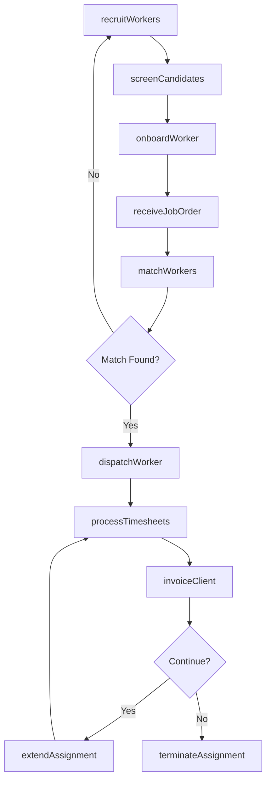
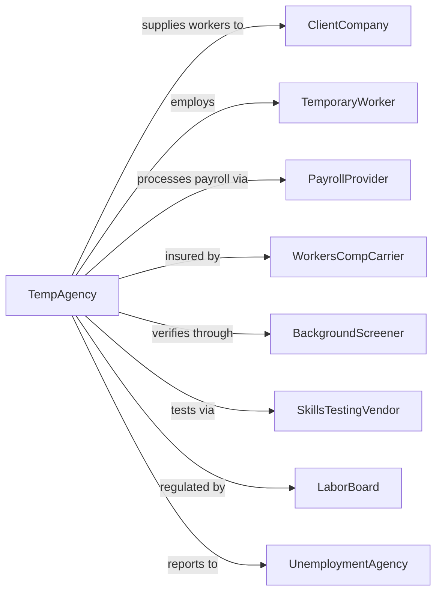

# Temporary Help Services

> Business-as-Code definition for temporary staffing operations. Models the complete cycle of recruiting, deploying, and managing contingent workers.

## Overview

Temporary help services supply workers to client businesses for limited periods to supplement their workforce. The temporary workers remain employees of the staffing agency, which handles payroll, benefits, and employment taxes, while the client directs daily work activities. This model provides workforce flexibility for seasonal demands, special projects, and employee absences.

## Actors

| Actor | Description |
|-------|-------------|
| ClientCompany | Business requiring temporary workforce supplementation |
| TemporaryWorker | Individual employed by agency and assigned to client site |
| PayrollProvider | Processes wages, taxes, and benefits administration |
| WorkersCompCarrier | Provides workers compensation insurance coverage |
| BackgroundScreener | Conducts pre-employment verification checks |
| SkillsTestingVendor | Administers assessments for technical and clerical skills |
| LaborBoard | Government agency enforcing employment regulations |
| UnemploymentAgency | Administers unemployment insurance claims |

## Roles

| Role | Description |
|------|-------------|
| BranchManager | Oversees local office operations and client relationships |
| StaffingCoordinator | Matches available workers to client assignments |
| Recruiter | Sources, screens, and onboards temporary employees |
| PayrollSpecialist | Processes timesheets and manages compensation |
| ClientServiceRep | Maintains relationships and handles client requests |

## Entities

| Entity | Description |
|--------|-------------|
| Assignment | Placement of temporary worker at client location |
| Timesheet | Record of hours worked during pay period |
| JobOrder | Client request for temporary workers |
| WorkerProfile | Comprehensive record of employee skills and availability |
| BillRate | Hourly amount charged to client for worker services |
| PayRate | Hourly compensation paid to temporary worker |
| SkillsAssessment | Evaluation of worker capabilities and certifications |
| ServiceAgreement | Contract defining terms between agency and client |
| WorkersCompClaim | Report of workplace injury or illness |
| PerformanceReview | Evaluation of worker performance on assignment |

## Actions

| Action | Description |
|--------|-------------|
| recruitWorkers | Source and attract candidates for temporary positions |
| screenCandidates | Conduct interviews, background checks, and skills tests |
| onboardWorker | Complete new hire paperwork and orientation |
| receiveJobOrder | Document client staffing requirements |
| matchWorkers | Assign qualified employees to client positions |
| dispatchWorker | Send employee to client site for assignment start |
| processTimesheets | Collect and verify hours worked for payroll |
| invoiceClient | Bill client for temporary services rendered |
| handlePerformance | Address worker performance issues or client feedback |
| extendAssignment | Continue worker placement beyond original end date |
| terminateAssignment | End worker placement at client site |
| processUnemployment | Handle unemployment claims from former workers |

## Events

| Event | Description |
|-------|-------------|
| workerRecruited | New candidate completed application process |
| candidateScreened | Background and skills verification completed |
| workerOnboarded | Employee completed new hire requirements |
| jobOrderReceived | Client submitted staffing request |
| workerMatched | Employee assigned to fill job order |
| workerDispatched | Employee reported to client work site |
| timesheetSubmitted | Hours worked recorded for pay period |
| clientInvoiced | Bill sent to client for services |
| performanceIssueRaised | Concern about worker conduct or quality reported |
| assignmentExtended | Placement duration increased |
| assignmentEnded | Worker completed or terminated placement |
| claimFiled | Workers comp or unemployment claim submitted |

## Searches

| Search | Description |
|--------|-------------|
| findAvailableWorkers | List workers by skills, location, and availability |
| getJobOrders | Retrieve open staffing requests by client or role |
| searchAssignments | Find active placements by worker, client, or status |
| getTimesheets | Retrieve time records by period or worker |
| findClients | List client accounts by industry, volume, or status |
| getPayrollData | Access compensation records for specified period |
| trackMetrics | View fill rates, turnover, and performance data |

## Workflow



## Actor Relationships



## Usage

### Calling Actions

```typescript
import { deployTemporaryWorkers } from '@headlessly/deploy-temporary-workers'

const staffing = deployTemporaryWorkers()

// Receive job order from client
const jobOrder = await staffing.receiveJobOrder({
  clientId: 'manufacturing-co',
  position: 'Warehouse Associate',
  quantity: 15,
  startDate: '2024-04-01',
  duration: '90 days',
  shift: 'first',
  payRange: { min: 18, max: 22 },
  requirements: ['forklift certified', 'steel-toe boots']
})

// Match available workers to order
const matches = await staffing.matchWorkers({
  jobOrderId: jobOrder.id,
  filters: {
    skills: ['forklift', 'warehouse'],
    availability: 'immediate',
    location: { within: 25, unit: 'miles' }
  }
})

// Dispatch workers to client
for (const worker of matches.selected) {
  await staffing.dispatchWorker({
    workerId: worker.id,
    jobOrderId: jobOrder.id,
    reportDate: '2024-04-01',
    reportTime: '6:00 AM',
    contactName: 'Floor Supervisor'
  })
}
```

### Event-Driven Automation

```typescript
// Auto-invoice when timesheets approved
staffing.timesheetSubmitted(async ({ assignmentId, hoursWorked, weekEnding }) => {
  const assignment = await staffing.getAssignment({ assignmentId })

  await staffing.invoiceClient({
    clientId: assignment.clientId,
    period: weekEnding,
    lineItems: [{
      workerId: assignment.workerId,
      hours: hoursWorked,
      billRate: assignment.billRate
    }]
  })
})

// Auto-recruit when job order unfilled
staffing.jobOrderReceived(async ({ jobOrderId, quantity, skills }) => {
  const available = await staffing.findAvailableWorkers({ skills })

  if (available.length < quantity) {
    await staffing.recruitWorkers({
      targetSkills: skills,
      quantity: quantity - available.length,
      urgency: 'high',
      sources: ['jobBoards', 'referrals', 'socialMedia']
    })
  }
})
```
