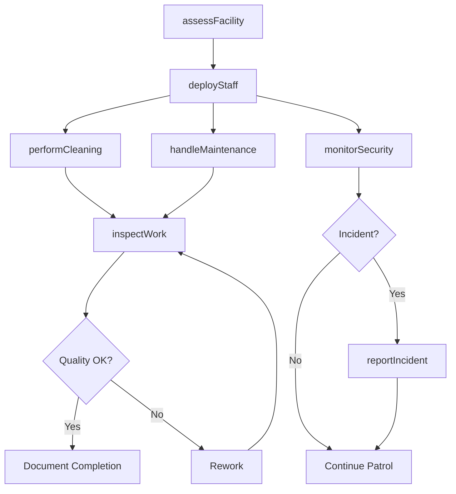
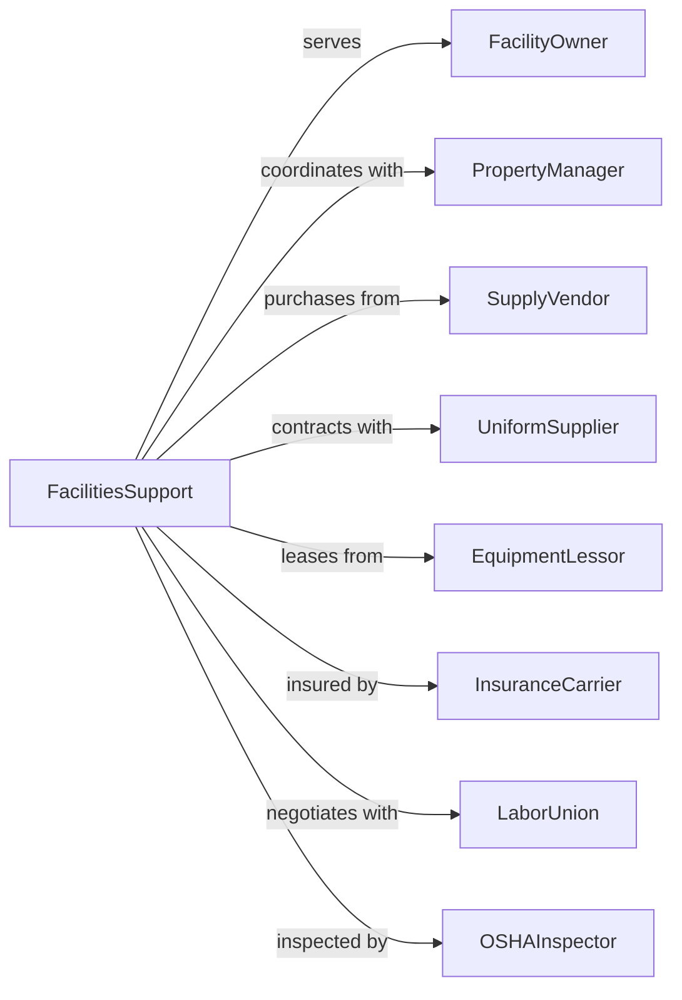

# Facilities Support Services

> Business-as-Code definition for integrated facilities management operations. Models comprehensive on-site support services from janitorial through security staffing.

## Overview

Facilities support services provide operating staff to perform combined support functions within client facilities including janitorial, maintenance, security, mail routing, reception, and laundry services. These establishments deploy personnel who work on-site at client locations, delivering an integrated approach to facility operations that allows clients to focus on their core business activities.

## Actors

| Actor | Description |
|-------|-------------|
| FacilityOwner | Property owner or operator contracting for support services |
| PropertyManager | Manages facility operations on behalf of owner |
| SupplyVendor | Provides cleaning supplies, equipment, and consumables |
| UniformSupplier | Furnishes staff uniforms and protective gear |
| EquipmentLessor | Leases specialized cleaning and maintenance equipment |
| InsuranceCarrier | Provides workers compensation and liability coverage |
| LaborUnion | Represents facility support workers in certain markets |
| OSHAInspector | Enforces workplace safety regulations |

## Roles

| Role | Description |
|------|-------------|
| FacilitiesManager | Oversees all support operations at client site |
| ShiftSupervisor | Directs daily activities of support staff |
| Custodian | Performs cleaning and janitorial duties |
| MaintenanceTechnician | Handles repairs and preventive maintenance |
| SecurityOfficer | Monitors premises and controls access |
| Receptionist | Manages front desk and visitor services |

## Entities

| Entity | Description |
|--------|-------------|
| ServiceAgreement | Contract defining scope and service levels |
| WorkOrder | Request for specific maintenance or service task |
| InspectionChecklist | Form for verifying completed work quality |
| StaffSchedule | Shift assignments and coverage plan |
| SupplyInventory | Stock levels of cleaning and maintenance supplies |
| IncidentReport | Documentation of safety or security events |
| KeyCard | Access credential for secured areas |
| MaintenanceLog | Record of equipment repairs and service history |
| QualityScore | Metric measuring service delivery standards |
| TrainingRecord | Documentation of staff certifications and training |

## Actions

| Action | Description |
|--------|-------------|
| assessFacility | Evaluate facility needs and develop service plan |
| deployStaff | Assign personnel to client site based on requirements |
| performCleaning | Execute janitorial services per schedule |
| handleMaintenance | Complete repairs and preventive maintenance tasks |
| monitorSecurity | Conduct patrols and access control functions |
| routeMail | Sort and deliver internal correspondence |
| manageReception | Staff front desk and handle visitor check-in |
| inspectWork | Verify service quality against standards |
| orderSupplies | Replenish consumables and equipment |
| reportIncident | Document and communicate safety or security events |
| trainPersonnel | Conduct orientation and skills training |
| adjustStaffing | Modify coverage based on changing needs |
| processLaundry | Clean and distribute linens and uniforms |

## Events

| Event | Description |
|-------|-------------|
| facilityAssessed | Initial evaluation completed with recommendations |
| staffDeployed | Personnel assigned and on-site at client facility |
| cleaningCompleted | Scheduled janitorial services finished |
| maintenanceResolved | Repair or preventive task completed |
| securityIncidentReported | Safety or access event documented |
| inspectionPassed | Quality check met required standards |
| suppliesOrdered | Replenishment order placed with vendor |
| staffTrained | Personnel completed required certification |
| contractRenewed | Service agreement extended |
| shiftHandoffCompleted | Transition between work shifts executed |
| complaintReceived | Client reported service issue |
| emergencyResponded | Urgent situation addressed by staff |

## Searches

| Search | Description |
|--------|-------------|
| findFacilities | List client sites with filters for size or service type |
| getWorkOrders | Retrieve open or completed work requests |
| searchStaff | Find personnel by skill, certification, or availability |
| getInspections | Retrieve quality inspection results |
| findIncidents | List security or safety events by date or type |
| getSupplyLevels | Check inventory status across locations |
| getSchedule | Retrieve staff assignments for specified period |

## Workflow



## Actor Relationships



## Usage

### Calling Actions

```typescript
import { operateFacilityOperations } from '@headlessly/operate-facility-operations'

const facilities = operateFacilityOperations()

// Review open work orders and supply levels at site
const workOrders = await facilities.getWorkOrders({ siteId: 'corporate-hq', status: 'open' })
const supplies = await facilities.getSupplyLevels({ siteId: 'corporate-hq' })

// Assess new facility for service planning
const assessment = await facilities.assessFacility({
  siteId: 'corporate-hq',
  squareFootage: 150000,
  floors: 12,
  operatingHours: '6am-10pm',
  requiredServices: ['janitorial', 'security', 'maintenance', 'reception']
})

// Deploy staff based on assessment
await facilities.deployStaff({
  siteId: 'corporate-hq',
  positions: [
    { role: 'custodian', count: 8, shift: 'day' },
    { role: 'custodian', count: 4, shift: 'night' },
    { role: 'securityOfficer', count: 2, shift: '24/7' },
    { role: 'receptionist', count: 2, shift: 'day' }
  ],
  startDate: '2024-04-01'
})

// Create work order for maintenance
await facilities.handleMaintenance({
  siteId: 'corporate-hq',
  type: 'repair',
  description: 'HVAC unit not cooling on floor 8',
  priority: 'high',
  requestedBy: 'tenant-services'
})
```

### Event-Driven Automation

```typescript
// Auto-reorder supplies when low
facilities.suppliesOrdered(async ({ siteId, item, quantity }) => {
  const levels = await facilities.getSupplyLevels({ siteId })
  const lowItems = levels.filter(s => s.quantity < s.reorderPoint)

  for (const supply of lowItems) {
    await facilities.orderSupplies({
      siteId,
      item: supply.name,
      quantity: supply.reorderQuantity,
      vendor: supply.preferredVendor
    })
  }
})

// Auto-escalate unresolved incidents
facilities.securityIncidentReported(async ({ incidentId, severity }) => {
  if (severity === 'critical') {
    await facilities.reportIncident({
      incidentId,
      escalateTo: 'propertyManager',
      notifyClient: true,
      requireFollowUp: true
    })
  }
})
```
