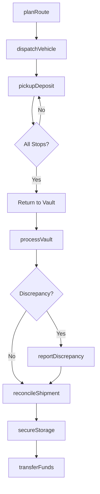
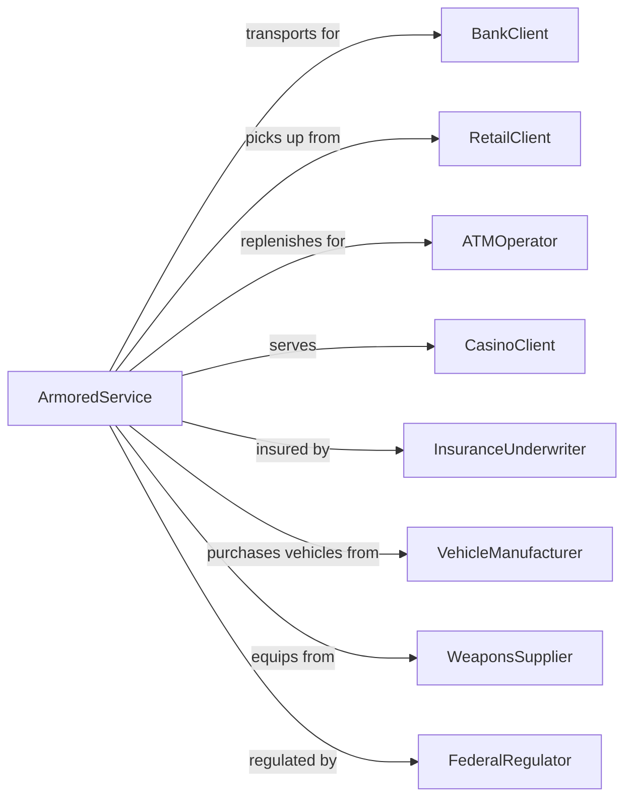

# Armored Car Services

> Business-as-Code definition for armored transport and cash logistics operations. Models secure movement of currency and valuables from pickup through vault processing.

## Overview

Armored car services provide secure pickup, transport, and delivery of currency, coins, and other valuables using reinforced vehicles and armed personnel. These establishments serve financial institutions, retailers, and businesses requiring safe movement of cash deposits, ATM replenishment, and coin exchange. Operations include vault processing, cash counting, and secure storage services.

## Actors

| Actor | Description |
|-------|-------------|
| BankClient | Financial institution requiring cash transport |
| RetailClient | Business needing deposit pickup and change orders |
| ATMOperator | Company requiring ATM cash replenishment |
| CasinoClient | Gaming establishment with high-volume cash handling |
| InsuranceUnderwriter | Provides cargo and liability coverage |
| VehicleManufacturer | Supplies armored transport vehicles |
| WeaponsSupplier | Provides firearms and security equipment |
| FederalRegulator | Oversees currency handling compliance |

## Roles

| Role | Description |
|------|-------------|
| ArmoredMessenger | Armed guard handling cash pickup and delivery |
| VehicleDriver | Operates armored transport vehicle |
| VaultTeller | Processes and verifies cash in secure facility |
| RoutePlanner | Schedules pickups and optimizes delivery routes |
| SecurityManager | Oversees operational security and compliance |
| MaintenanceTech | Services armored vehicles and security equipment |
| CashVaultProcessor | Counts, verifies, and sorts currency in a high-security vault facility |

## Entities

| Entity | Description |
|--------|-------------|
| Route | Scheduled sequence of pickup and delivery stops |
| Shipment | Currency or valuables being transported |
| Manifest | Itemized list of contents for transport |
| DepositBag | Sealed container of cash from client |
| ChangeOrder | Client request for specific currency denominations |
| VaultInventory | Cash holdings in secure processing facility |
| ATMCassette | Currency container for ATM replenishment |
| ArmoredVehicle | Reinforced transport vehicle |
| ChainOfCustody | Documentation tracking shipment handling |
| DiscrepancyReport | Documentation of count variances |

## Actions

| Action | Description |
|--------|-------------|
| planRoute | Schedule and optimize pickup/delivery sequence |
| dispatchVehicle | Send armored transport on route |
| pickupDeposit | Collect sealed currency from client location |
| deliverChange | Provide requested currency denominations |
| replenishATM | Load cash cassettes into automated teller |
| processVault | Count, verify, and sort currency in facility |
| reconcileShipment | Compare manifest to actual contents |
| reportDiscrepancy | Document and investigate count variances |
| secureStorage | Place valuables in secure vault |
| transferFunds | Move currency between facilities or accounts |
| maintainVehicle | Service armored transport |
| trainCrewMember | Certify personnel on security procedures |

## Events

| Event | Description |
|-------|-------------|
| routePlanned | Pickup/delivery schedule optimized |
| vehicleDispatched | Armored transport deployed on route |
| depositPickedUp | Currency collected from client |
| changeDelivered | Requested denominations provided |
| atmReplenished | Cash loaded into automated teller |
| vaultProcessed | Currency counted and verified |
| shipmentReconciled | Manifest matched to contents |
| discrepancyReported | Count variance documented |
| valuablesSecured | Items placed in vault storage |
| fundsTransferred | Currency moved between locations |
| vehicleServiced | Armored transport maintained |
| crewTrained | Personnel certified on procedures |

## Searches

| Search | Description |
|--------|-------------|
| findRoutes | List delivery schedules by date or region |
| getShipments | Retrieve transports by client or status |
| searchDeposits | Find cash pickups by location or amount |
| getVaultInventory | Check currency holdings by denomination |
| findDiscrepancies | List count variances by date or client |
| trackVehicle | View armored transport location |
| getATMStatus | Check automated teller cash levels |
| searchManifests | Find shipment documentation |

## Workflow



## Actor Relationships



## Usage

### Calling Actions

```typescript
import { secureArmoredCar } from '@headlessly/secure-armored-car'

const armored = secureArmoredCar()

// Plan daily route
const route = await armored.planRoute({
  date: '2024-04-01',
  region: 'downtown',
  stops: [
    { clientId: 'retail-store-1', type: 'pickup', window: '9:00-10:00' },
    { clientId: 'bank-branch-5', type: 'delivery', window: '10:30-11:00' },
    { clientId: 'retail-store-2', type: 'pickup', window: '11:30-12:00' },
    { clientId: 'atm-location-12', type: 'replenish', window: '13:00-13:30' }
  ],
  crew: ['messenger-101', 'driver-202'],
  vehicle: 'armored-15'
})

// Pickup deposit
await armored.pickupDeposit({
  routeId: route.id,
  stopId: 'retail-store-1',
  items: [
    { type: 'deposit-bag', sealNumber: 'ABC123', declaredAmount: 15000 },
    { type: 'deposit-bag', sealNumber: 'ABC124', declaredAmount: 8500 }
  ],
  signature: 'store-manager',
  pickupTime: '2024-04-01T09:15'
})

// Replenish ATM
await armored.replenishATM({
  routeId: route.id,
  atmId: 'atm-location-12',
  cassettes: [
    { denomination: 20, count: 2000, total: 40000 },
    { denomination: 100, count: 500, total: 50000 }
  ],
  previousCash: 12500,
  replenishTime: '2024-04-01T13:10'
})
```

### Event-Driven Automation

```typescript
// Auto-investigate discrepancies
armored.discrepancyReported(async ({ shipmentId, variance, clientId }) => {
  if (Math.abs(variance) > 100) {
    await armored.initiateInvestigation({
      shipmentId,
      clientId,
      variance,
      reviewVideo: true,
      notifySupervisor: true,
      suspendClient: Math.abs(variance) > 1000
    })
  }
})

// Auto-schedule ATM replenishment
armored.atmReplenished(async ({ atmId, currentLevel, capacity }) => {
  const fillPercentage = currentLevel / capacity

  if (fillPercentage < 0.25) {
    await armored.scheduleReplenishment({
      atmId,
      priority: fillPercentage < 0.1 ? 'urgent' : 'standard',
      requestedAmount: capacity * 0.8
    })
  }
})
```
