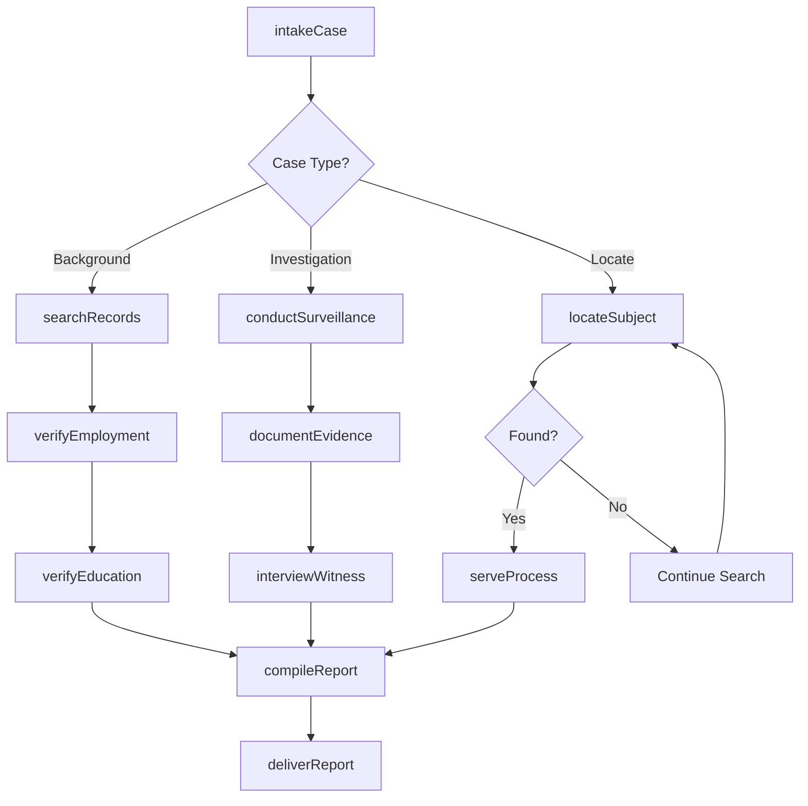
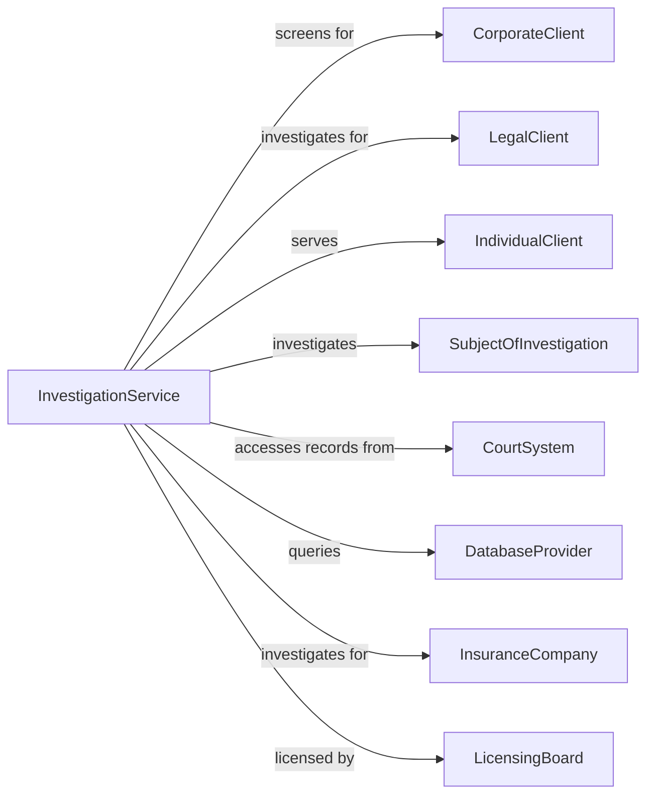

# Investigation and Personal Background Check Services

> Business-as-Code definition for private investigation and background screening operations. Models investigative services from case intake through report delivery.

## Overview

Investigation and personal background check services provide detective, investigative, and screening services including pre-employment verification, criminal records searches, surveillance, and personal investigations. These establishments serve corporate clients conducting due diligence, attorneys gathering evidence, and individuals seeking information about persons of interest.

## Actors

| Actor | Description |
|-------|-------------|
| CorporateClient | Business ordering pre-employment or due diligence checks |
| LegalClient | Attorney requiring investigative support for cases |
| IndividualClient | Person seeking personal investigation services |
| SubjectOfInvestigation | Person being investigated or screened |
| CourtSystem | Provides access to public records and filings |
| DatabaseProvider | Supplies access to information databases |
| InsuranceCompany | Client investigating claims or fraud |
| LicensingBoard | State agency regulating investigator licensing |

## Roles

| Role | Description |
|------|-------------|
| PrivateInvestigator | Conducts surveillance and investigative fieldwork |
| BackgroundScreener | Processes employment and tenant verifications |
| ResearchAnalyst | Searches databases and public records |
| CaseManager | Oversees investigation assignments and quality |
| FieldOperative | Performs surveillance and interviews |
| ComplianceOfficer | Ensures adherence to FCRA and privacy regulations |
| PrivateInvestigator | Licensed PI conducting surveillance, interviews, and evidence gathering in the field |

## Entities

| Entity | Description |
|--------|-------------|
| Investigation | Active case or inquiry assignment |
| BackgroundReport | Compiled screening results and findings |
| SurveillanceLog | Record of observation activities |
| CriminalRecord | Criminal history search results |
| EmploymentVerification | Confirmed work history information |
| EducationVerification | Confirmed academic credentials |
| PublicRecord | Court, property, or other official filing |
| WitnessStatement | Documented interview testimony |
| PhotoEvidence | Images captured during investigation |
| CaseFile | Complete documentation for investigation |

## Actions

| Action | Description |
|--------|-------------|
| intakeCase | Accept and document new investigation request |
| conductSurveillance | Observe and document subject activities |
| searchRecords | Query databases and public filings |
| verifyEmployment | Confirm subject work history with employers |
| verifyEducation | Confirm academic credentials with institutions |
| interviewWitness | Gather testimony from relevant parties |
| compileReport | Assemble findings into deliverable document |
| deliverReport | Provide completed investigation to client |
| locateSubject | Find current whereabouts of person |
| serveProcess | Deliver legal documents to individual |
| investigateFraud | Examine suspected fraudulent activity |
| documentEvidence | Photograph, video, or record findings |

## Events

| Event | Description |
|-------|-------------|
| caseIntaked | New investigation accepted and assigned |
| surveillanceConducted | Observation session completed |
| recordsSearched | Database query completed |
| employmentVerified | Work history confirmed |
| educationVerified | Academic credentials confirmed |
| witnessInterviewed | Testimony gathered and documented |
| reportCompiled | Investigation findings assembled |
| reportDelivered | Completed report provided to client |
| subjectLocated | Person found at current address |
| processServed | Legal documents delivered |
| fraudInvestigated | Suspicious activity examined |
| evidenceDocumented | Findings recorded and preserved |

## Searches

| Search | Description |
|--------|-------------|
| findCases | List investigations by client, status, or type |
| searchSubjects | Query subject database by identifying information |
| getCriminalRecords | Retrieve criminal history search results |
| getVerifications | Find completed employment or education checks |
| findReports | Locate background reports by date or client |
| searchPublicRecords | Query court and property filings |
| getInvestigators | List available field operatives |
| trackProgress | View investigation milestone status |

## Workflow



## Actor Relationships



## Usage

### Calling Actions

```typescript
import { investigateBackgrounds } from '@headlessly/investigate-backgrounds'

const investigation = investigateBackgrounds()

// Check active cases and available investigators
const activeCases = await investigation.findCases({ status: 'active', type: 'pre-employment' })
const investigators = await investigation.getInvestigators({ available: true })

// Intake background check case
const bgCheck = await investigation.intakeCase({
  clientId: 'hr-department-acme',
  caseType: 'pre-employment',
  subject: {
    name: 'John Doe',
    ssn: '***-**-1234',
    dob: '1985-06-15',
    consent: true
  },
  scope: ['criminal-7year', 'employment-5year', 'education', 'references'],
  turnaround: '3-business-days'
})

// Conduct surveillance investigation
const survCase = await investigation.intakeCase({
  clientId: 'law-firm-smith',
  caseType: 'surveillance',
  subject: {
    name: 'Jane Smith',
    lastKnownAddress: '123 Main St, Anytown, ST 12345',
    vehicle: { make: 'Honda', model: 'Civic', color: 'Blue', plate: 'ABC123' }
  },
  objective: 'Document daily activities for disability claim',
  duration: '5-days',
  budget: 5000
})

// Search records and compile report
const records = await investigation.searchRecords({
  caseId: bgCheck.id,
  searches: [
    { type: 'criminal', jurisdictions: ['federal', 'state', 'county'] },
    { type: 'sex-offender', scope: 'national' },
    { type: 'ssn-trace', purpose: 'address-history' }
  ]
})
```

### Event-Driven Automation

```typescript
// Auto-compile report when all verifications complete
investigation.educationVerified(async ({ caseId }) => {
  const caseStatus = await investigation.getCaseStatus({ caseId })

  if (caseStatus.allVerificationsComplete) {
    await investigation.compileReport({
      caseId,
      format: 'standard-background',
      includeDocuments: true,
      flagDiscrepancies: true
    })
  }
})

// Auto-notify client on adverse findings
investigation.recordsSearched(async ({ caseId, results }) => {
  const hasAdverse = results.some(r => r.status === 'record-found')

  if (hasAdverse) {
    await investigation.notifyClient({
      caseId,
      alertType: 'adverse-finding',
      requirePreAdverseAction: true,
      findings: results.filter(r => r.status === 'record-found')
    })
  }
})
```
