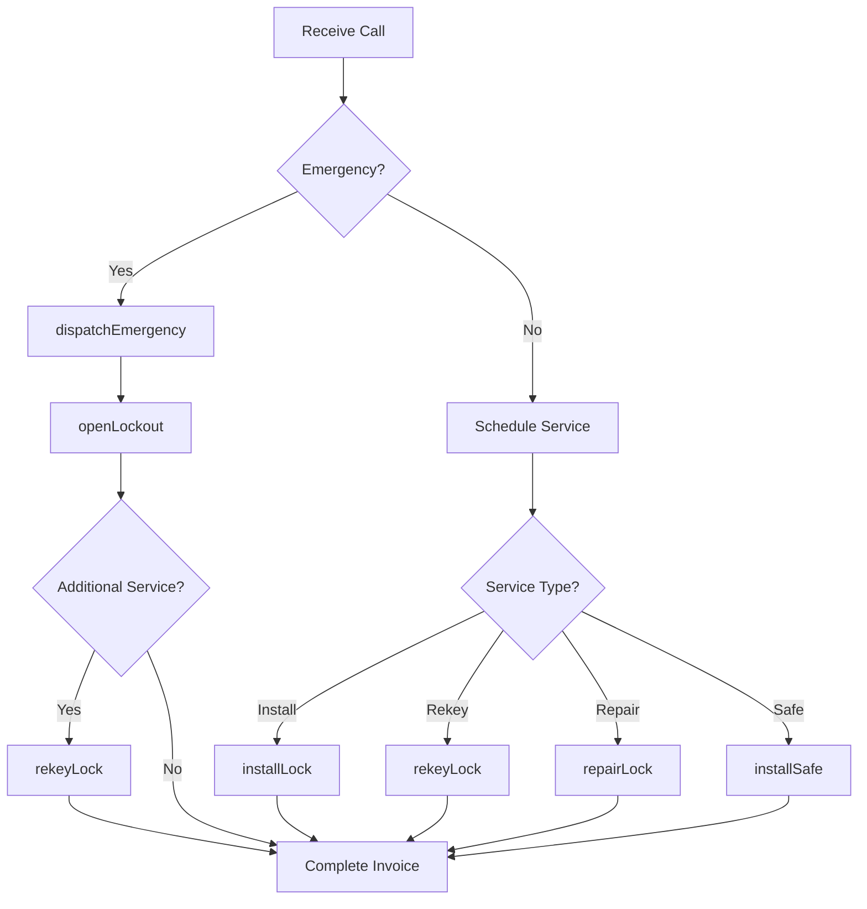
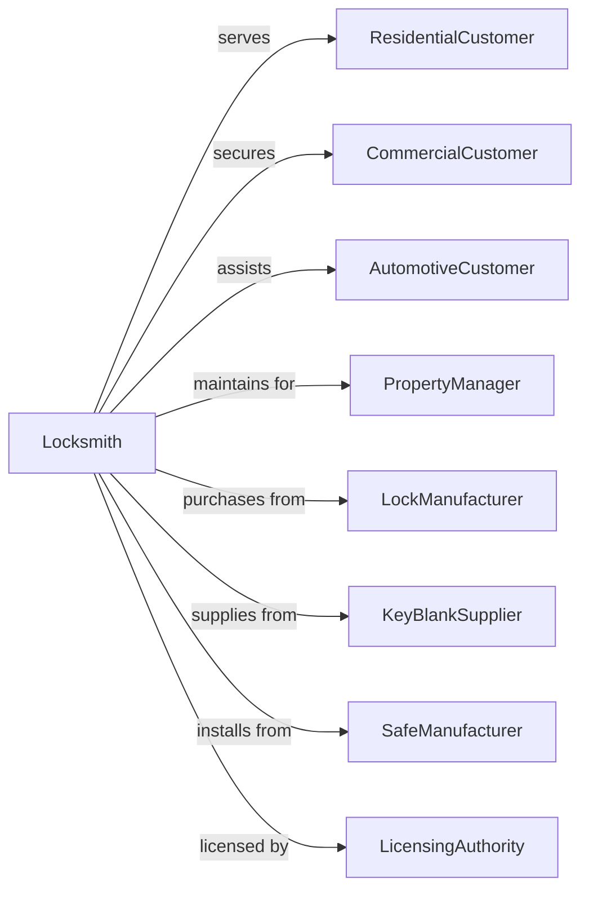

# Locksmiths

> Business-as-Code definition for locksmith and physical security operations. Models lock installation, repair, and emergency services.

## Overview

Locksmiths provide installation, repair, and emergency opening services for mechanical and electronic locks, safes, and security vaults. These establishments serve residential, commercial, and automotive customers needing key cutting, lock rekeying, access control systems, and emergency lockout assistance. Services range from traditional pin tumbler locks to modern electronic keyless entry systems.

## Actors

| Actor | Description |
|-------|-------------|
| ResidentialCustomer | Homeowner needing lock services |
| CommercialCustomer | Business requiring access control |
| AutomotiveCustomer | Vehicle owner needing lock or key services |
| PropertyManager | Oversees multiple units requiring lock maintenance |
| LockManufacturer | Produces locks, cylinders, and hardware |
| KeyBlankSupplier | Provides key blanks and cutting equipment |
| SafeManufacturer | Produces safes and vault equipment |
| LicensingAuthority | Regulates locksmith credentials |

## Roles

| Role | Description |
|------|-------------|
| MasterLocksmith | Certified expert handling complex jobs |
| ServiceTechnician | Performs installations and repairs |
| EmergencyDispatcher | Coordinates lockout response calls |
| SafeTechnician | Specializes in safe and vault work |
| KeyCutter | Duplicates and programs keys |
| ShopManager | Oversees storefront operations |

## Entities

| Entity | Description |
|--------|-------------|
| Lock | Mechanical or electronic locking device |
| Key | Physical or electronic access credential |
| Safe | Secure container for valuables |
| MasterKeySystem | Hierarchical key access structure |
| RekeyKit | Pins and tools for changing lock combination |
| KeyCode | Specification for cutting or programming key |
| ServiceCall | Emergency or scheduled work request |
| AccessControlSystem | Electronic entry management hardware |
| KeyBlank | Uncut key for duplication |
| LockCylinder | Core component containing pin tumblers |

## Actions

| Action | Description |
|--------|-------------|
| installLock | Mount and configure new locking device |
| rekeyLock | Change pin combination without replacing lock |
| duplicateKey | Cut copy of existing key |
| openLockout | Gain entry without key for locked-out customer |
| repairLock | Fix malfunctioning locking mechanism |
| installSafe | Deliver and anchor secure storage |
| openSafe | Gain access to locked safe |
| designMasterKey | Create hierarchical key access system |
| programTransponder | Code automotive key for ignition |
| extractBrokenKey | Remove key fragment from lock |
| upgradeHardware | Replace locks with higher security |
| dispatchEmergency | Send technician for lockout call |

## Events

| Event | Description |
|-------|-------------|
| lockInstalled | New locking device mounted and functional |
| lockRekeyed | Pin combination changed |
| keyDuplicated | Copy cut from original |
| lockoutOpened | Customer regained entry |
| lockRepaired | Mechanism fixed and operational |
| safeInstalled | Secure storage delivered and anchored |
| safeOpened | Access gained to locked safe |
| masterKeyDesigned | Hierarchical system created |
| transponderProgrammed | Automotive key coded |
| keyExtracted | Broken fragment removed |
| hardwareUpgraded | Higher security locks installed |
| emergencyDispatched | Technician sent for lockout |

## Searches

| Search | Description |
|--------|-------------|
| findCustomers | List accounts by service type or location |
| getServiceCalls | Retrieve work orders by status or date |
| searchKeys | Find key records by code or customer |
| getMasterSystems | View hierarchical key structures |
| findTechnicians | List staff by availability or specialty |
| getInventory | Check lock and key blank stock |
| searchSafes | Find safe service records |
| trackEmergencies | View lockout response times |

## Workflow



## Actor Relationships



## Usage

### Calling Actions

```typescript
import { secureLocksmiths } from '@headlessly/secure-locksmiths'

const locksmith = secureLocksmiths()

// Dispatch emergency lockout
const emergency = await locksmith.dispatchEmergency({
  customerPhone: '555-1234',
  location: '123 Main St, Apt 4B',
  lockoutType: 'residential',
  description: 'Locked out of apartment, keys inside',
  estimatedArrival: 30
})

// Open lockout and rekey
await locksmith.openLockout({
  callId: emergency.id,
  method: 'pick',
  entryTime: '2024-04-01T14:35',
  technicianId: 'tech-123'
})

await locksmith.rekeyLock({
  callId: emergency.id,
  locks: [
    { location: 'front-door', type: 'deadbolt', brand: 'Schlage' },
    { location: 'front-door', type: 'knob', brand: 'Schlage' }
  ],
  keyQuantity: 3,
  reason: 'security-after-lockout'
})

// Design master key system
const masterSystem = await locksmith.designMasterKey({
  customerId: 'property-mgmt-456',
  property: 'apartment-complex-a',
  structure: {
    grandMaster: 1,
    subMasters: [
      { name: 'Building-A', units: 24 },
      { name: 'Building-B', units: 24 },
      { name: 'Common-Areas', locations: ['pool', 'gym', 'clubhouse'] }
    ]
  },
  lockBrand: 'Medeco',
  securityLevel: 'high-security'
})
```

### Event-Driven Automation

```typescript
// Auto-follow up after emergency service
locksmith.lockoutOpened(async ({ callId, customerId }) => {
  await locksmith.scheduleFollowUp({
    callId,
    customerId,
    delay: '24-hours',
    purpose: 'satisfaction-check',
    offerServices: ['rekey', 'spare-keys', 'upgrade']
  })
})

// Auto-reorder low inventory
locksmith.keyDuplicated(async ({ keyBlank, remainingStock }) => {
  if (remainingStock < 10) {
    await locksmith.reorderInventory({
      item: keyBlank,
      quantity: 50,
      supplier: 'preferred-key-supply',
      priority: remainingStock < 3 ? 'rush' : 'standard'
    })
  }
})
```
