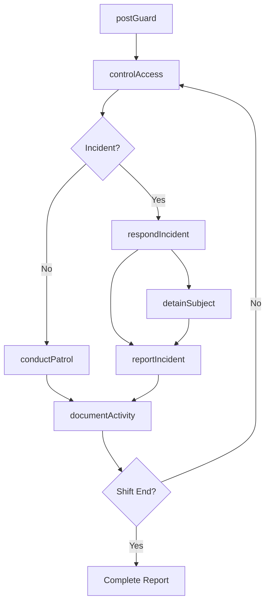
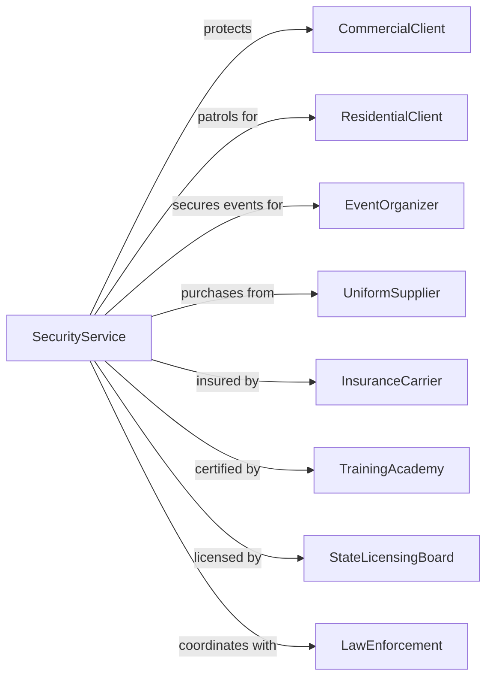

# Security Guards and Patrol Services

> Business-as-Code definition for guard and patrol security operations. Models physical security services from post assignment through incident response.

## Overview

Security guards and patrol services provide physical protection through uniformed personnel stationed at client facilities or conducting mobile patrols. Services include access control, parking enforcement, bodyguard protection, and K-9 security units. These establishments deploy trained officers who deter crime, respond to incidents, and maintain safe environments for clients.

## Actors

| Actor | Description |
|-------|-------------|
| CommercialClient | Business facility requiring guard services |
| ResidentialClient | Residential community or HOA contracting patrol services |
| EventOrganizer | Venue or promoter needing event security |
| UniformSupplier | Provides guard uniforms and equipment |
| InsuranceCarrier | Provides liability and workers compensation coverage |
| TrainingAcademy | Delivers guard certification and skills training |
| StateLicensingBoard | Regulates guard licensing and company permits |
| LawEnforcement | Coordinates on incidents and emergency response |

## Roles

| Role | Description |
|------|-------------|
| SecurityOfficer | Uniformed guard providing on-site protection |
| PatrolOfficer | Mobile unit conducting property checks |
| ShiftSupervisor | Oversees guard team and handles escalations |
| OperationsManager | Manages client accounts and service delivery |
| Dispatcher | Coordinates patrol routes and emergency response |
| K9Handler | Officer working with trained security dog |
| BodyGuard | Provides close personal protection for executives and high-profile individuals |

## Entities

| Entity | Description |
|--------|-------------|
| PostOrder | Site-specific instructions and protocols |
| IncidentReport | Documentation of security event |
| PatrolRoute | Defined path for mobile security checks |
| AccessLog | Record of entries and exits at controlled points |
| DailyActivityReport | Summary of shift activities and observations |
| GuardLicense | State certification for security officer |
| ServiceContract | Agreement defining scope and pricing |
| Checkpoint | Location requiring guard verification |
| AlarmResponse | Protocol for alarm activation events |
| VisitorBadge | Temporary credential for authorized guests |

## Actions

| Action | Description |
|--------|-------------|
| postGuard | Assign officer to fixed security station |
| conductPatrol | Execute scheduled property inspection |
| controlAccess | Manage entry and exit at secured point |
| respondIncident | React to security event or emergency |
| documentActivity | Record observations in daily report |
| escortVisitor | Accompany guest through secured area |
| monitorAlarm | Respond to alarm system activation |
| detainSubject | Hold individual for law enforcement |
| checkCredentials | Verify identification and authorization |
| trainOfficer | Certify guard on site-specific procedures |
| dispatchUnit | Send patrol to location |
| reportIncident | File formal documentation of event |

## Events

| Event | Description |
|-------|-------------|
| guardPosted | Officer assigned to security station |
| patrolConducted | Property inspection completed |
| accessControlled | Entry or exit processed |
| incidentResponded | Security event addressed |
| activityDocumented | Shift report completed |
| visitorEscorted | Guest accompanied through facility |
| alarmMonitored | Alarm response executed |
| subjectDetained | Individual held for authorities |
| credentialsVerified | ID and authorization confirmed |
| officerTrained | Guard completed certification |
| unitDispatched | Patrol sent to location |
| incidentReported | Formal report filed |

## Searches

| Search | Description |
|--------|-------------|
| findGuards | List officers by certification, availability, or site |
| getIncidents | Retrieve security events by date or type |
| searchPatrols | Find patrol records by route or officer |
| getAccessLogs | View entry/exit records by site |
| findContracts | List service agreements by client or status |
| getSchedule | Retrieve guard assignments by shift |
| searchReports | Find daily activity reports by site |
| trackCompliance | View licensing and training status |

## Workflow



## Actor Relationships



## Usage

### Calling Actions

```typescript
import { secureSecurityGuards } from '@headlessly/secure-security-guards'

const security = secureSecurityGuards()

// Post guard at client site
const post = await security.postGuard({
  clientId: 'corporate-tower',
  postLocation: 'main-lobby',
  officerId: 'officer-123',
  shift: {
    start: '2024-04-01T07:00',
    end: '2024-04-01T15:00'
  },
  duties: ['accessControl', 'visitorManagement', 'patrolLobby'],
  uniform: 'blazer-professional'
})

// Control access for visitor
await security.controlAccess({
  postId: post.id,
  type: 'visitor-entry',
  visitor: {
    name: 'John Smith',
    company: 'Vendor Corp',
    hostEmployee: 'Jane Doe',
    floor: 15
  },
  badge: 'V-1234',
  validUntil: '2024-04-01T17:00'
})

// Respond to incident
await security.respondIncident({
  postId: post.id,
  type: 'unauthorized-access-attempt',
  location: 'parking-garage-B2',
  description: 'Individual attempted entry with expired badge',
  action: 'denied-entry-escorted-out',
  severity: 'low'
})
```

### Event-Driven Automation

```typescript
// Auto-dispatch patrol on alarm
security.alarmMonitored(async ({ siteId, zone, alarmType }) => {
  await security.dispatchUnit({
    siteId,
    zone,
    priority: alarmType === 'panic' ? 'immediate' : 'standard',
    notifyClient: true,
    notifyPolice: alarmType === 'panic'
  })
})

// Auto-generate daily report at shift end
security.activityDocumented(async ({ postId, shiftId, activities }) => {
  await security.generateDailyReport({
    postId,
    shiftId,
    summary: activities,
    incidents: await security.getIncidents({ shiftId }),
    accessCount: await security.getAccessCount({ shiftId }),
    deliverTo: ['client-contact', 'operations-manager']
  })
})
```
