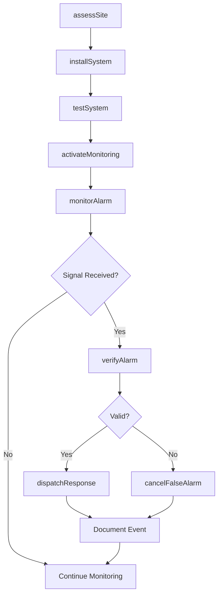
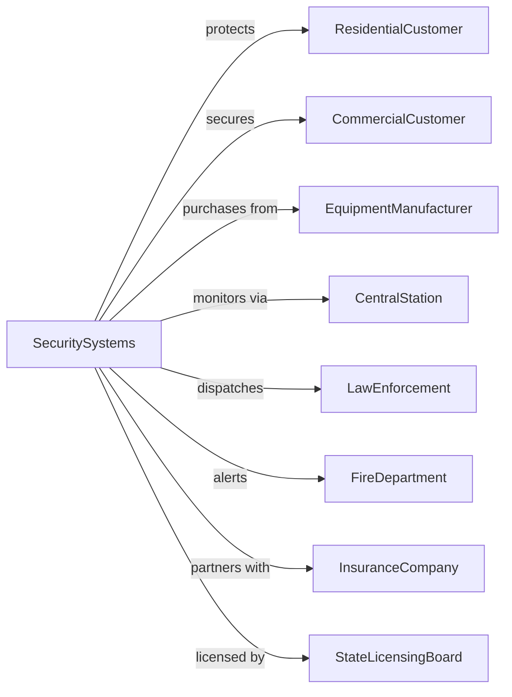

# Security Systems Services (except Locksmiths)

> Business-as-Code definition for electronic security system operations. Models alarm system installation, monitoring, and response services.

## Overview

Security systems services provide electronic alarm systems including burglar alarms, fire detection, video surveillance, and access control. These establishments sell, install, and service security equipment while operating central monitoring stations that receive alarm signals and dispatch appropriate response. Modern systems integrate multiple technologies into comprehensive security platforms.

## Actors

| Actor | Description |
|-------|-------------|
| ResidentialCustomer | Homeowner subscribing to alarm monitoring |
| CommercialCustomer | Business requiring security systems |
| EquipmentManufacturer | Produces alarm panels, sensors, and cameras |
| CentralStation | Monitors alarms and dispatches response |
| LawEnforcement | Responds to verified alarm events |
| FireDepartment | Responds to fire and smoke alarms |
| InsuranceCompany | Offers discounts for monitored security |
| StateLicensingBoard | Regulates alarm company operations |

## Roles

| Role | Description |
|------|-------------|
| SecurityConsultant | Assesses needs and designs system solutions |
| InstallationTechnician | Wires and configures alarm equipment |
| MonitoringOperator | Staffs central station and handles alarms |
| ServiceTechnician | Repairs and maintains installed systems |
| SalesRepresentative | Sells security solutions to customers |
| DispatchCoordinator | Manages alarm response procedures |
| AlarmMonitoringOperator | Watches live alarm feeds at the central station and verifies events before dispatching |

## Entities

| Entity | Description |
|--------|-------------|
| AlarmSystem | Integrated security equipment at customer site |
| MonitoringContract | Agreement for central station services |
| AlarmSignal | Event transmitted from system to monitoring center |
| SensorDevice | Detection equipment (motion, door, glass break) |
| ControlPanel | Central hub managing system components |
| Keypad | User interface for arming and disarming |
| Camera | Video surveillance device |
| AccessCredential | Card, fob, or code for entry control |
| ServiceTicket | Work order for installation or repair |
| AlarmPermit | Municipal registration for alarm system |

## Actions

| Action | Description |
|--------|-------------|
| assessSite | Evaluate security needs and design system |
| installSystem | Wire and configure alarm equipment |
| activateMonitoring | Connect system to central station |
| monitorAlarm | Receive and process alarm signals |
| verifyAlarm | Confirm event before dispatching response |
| dispatchResponse | Contact authorities for verified alarm |
| serviceSystem | Repair or maintain installed equipment |
| upgradeSystem | Add components or replace technology |
| processSignal | Handle alarm transmission at central station |
| testSystem | Verify proper operation of components |
| cancelFalseAlarm | Stop response for non-emergency event |
| renewContract | Extend monitoring agreement |

## Events

| Event | Description |
|-------|-------------|
| siteAssessed | Security evaluation completed |
| systemInstalled | Alarm equipment configured and operational |
| monitoringActivated | Central station connection established |
| alarmReceived | Signal transmitted to monitoring center |
| alarmVerified | Event confirmed as valid emergency |
| responseDispatched | Authorities contacted for verified alarm |
| systemServiced | Repair or maintenance completed |
| systemUpgraded | Components added or replaced |
| signalProcessed | Alarm handled at central station |
| systemTested | Operation verified |
| falseAlarmCancelled | Non-emergency response stopped |
| contractRenewed | Monitoring agreement extended |

## Searches

| Search | Description |
|--------|-------------|
| findCustomers | List accounts by system type or status |
| getAlarms | Retrieve alarm events by site or date |
| searchSystems | Find installations by equipment or zone |
| getServiceHistory | View maintenance records for site |
| findTechnicians | List installers by availability or skill |
| getContracts | Retrieve monitoring agreements by term |
| searchSignals | Find alarm transmissions by type |
| trackResponse | View dispatch status and times |

## Workflow



## Actor Relationships



## Usage

### Calling Actions

```typescript
import { secureSecuritySystems } from '@headlessly/secure-security-systems'

const security = secureSecuritySystems()

// Check customer alarm history and available technicians
const alarms = await security.getAlarms({ customerId: 'homeowner-123', days: 30 })
const techs = await security.findTechnicians({ skill: 'installation', available: '2024-04-05' })

// Assess site and design system
const assessment = await security.assessSite({
  customerId: 'homeowner-123',
  propertyType: 'single-family',
  squareFootage: 2500,
  entryPoints: { doors: 3, windows: 12, garage: 1 },
  concerns: ['burglary', 'fire', 'carbonMonoxide'],
  existingEquipment: 'none',
  preferredFeatures: ['smartphone-control', 'video-doorbell', 'cameras']
})

// Install complete system
const installation = await security.installSystem({
  assessmentId: assessment.id,
  components: [
    { type: 'panel', model: 'SmartHub-Pro', location: 'utility-closet' },
    { type: 'keypad', model: 'TouchScreen-7', location: 'entry-hall' },
    { type: 'doorSensor', model: 'Contact-3', quantity: 3 },
    { type: 'motionSensor', model: 'PIR-360', quantity: 4 },
    { type: 'camera', model: 'Indoor-HD', quantity: 2 },
    { type: 'doorbell', model: 'Video-Pro', quantity: 1 },
    { type: 'smokeCO', model: 'Combo-Detect', quantity: 3 }
  ],
  installDate: '2024-04-05',
  technicianId: 'tech-456'
})

// Activate monitoring
await security.activateMonitoring({
  systemId: installation.id,
  monitoringPlan: 'premium-24x7',
  emergencyContacts: [
    { name: 'John Smith', phone: '555-1234', relationship: 'owner' },
    { name: 'Jane Smith', phone: '555-5678', relationship: 'spouse' }
  ],
  verificationCode: '1234',
  dispatchPreference: 'verify-first'
})
```

### Event-Driven Automation

```typescript
// Auto-dispatch on verified alarm
security.alarmVerified(async ({ systemId, alarmType, zone }) => {
  const customer = await security.getCustomer({ systemId })

  await security.dispatchResponse({
    systemId,
    alarmType,
    zone,
    authority: alarmType === 'fire' ? 'fire-department' : 'police',
    customerAddress: customer.address,
    specialInstructions: customer.dispatchNotes
  })
})

// Auto-schedule service for sensor issues
security.signalProcessed(async ({ systemId, signalType, zone }) => {
  if (signalType === 'low-battery' || signalType === 'supervision') {
    await security.scheduleService({
      systemId,
      issue: signalType,
      zone,
      priority: 'routine',
      notifyCustomer: true
    })
  }
})
```
