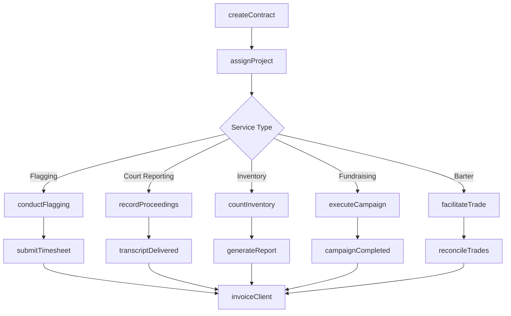
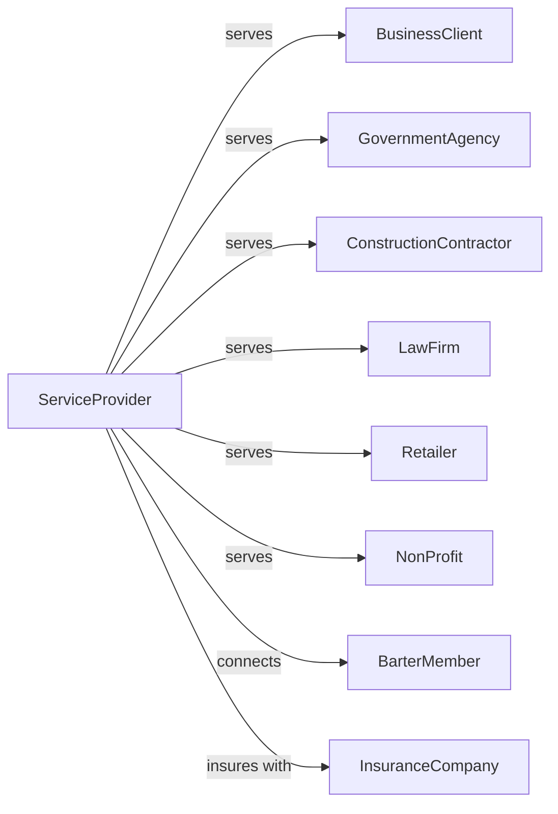

# All Other Support Services

> Business-as-Code definition for miscellaneous business support services. Models diverse operations including flagging, court reporting, inventory services, and bartering exchanges.

## Overview

All other support services encompasses diverse business support activities including traffic flagging, court reporting, inventory taking, bartering services, and fundraising on a contract basis. This definition exposes actions for service delivery, events for workflow automation, and searches for client and project management.

## Actors

| Actor | Description |
|-------|-------------|
| BusinessClient | Company contracting for support services |
| GovernmentAgency | Public entity requiring specialized services |
| ConstructionContractor | Client requiring traffic control flagging |
| LawFirm | Client requiring court reporting services |
| Retailer | Client requiring inventory counting services |
| NonProfit | Organization contracting fundraising services |
| BarterMember | Participant in trade exchange network |
| InsuranceCompany | Processes claims for service-related incidents |

## Roles

| Role | Description |
|------|-------------|
| Owner | Owns the business and manages operations |
| ProjectManager | Coordinates service delivery and staffing |
| CourtReporter | Transcribes legal proceedings |
| Flagger | Directs traffic at construction sites |
| InventoryCounter | Counts and records merchandise stock |
| Fundraiser | Solicits donations on behalf of clients |
| ExchangeCoordinator | Facilitates barter transactions |
| Scheduler | Assigns staff to jobs and manages availability |
| Flagger | Directs traffic safely around construction zones using signaling equipment |

## Entities

| Entity | Description |
|--------|-------------|
| ServiceContract | Agreement defining services and terms |
| Project | Specific job or assignment for a client |
| Transcript | Written record of court proceedings |
| InventoryCount | Stock count report for retail client |
| FundraisingCampaign | Donation solicitation effort |
| BarterTransaction | Trade exchange between members |
| TradeCredit | Currency used in barter network |
| Timesheet | Worker hours for billing purposes |
| Invoice | Bill for services rendered |
| Certificate | Credential or certification for workers |
| SafetyPlan | Protocol for hazardous work environments |
| Report | Documentation of completed work |

## Actions

| Action | Description |
|--------|-------------|
| createContract | Establish service agreement with client |
| assignProject | Allocate staff to specific job |
| conductFlagging | Direct traffic at work zone |
| recordProceedings | Transcribe court or deposition testimony |
| countInventory | Enumerate stock at client location |
| executeCampaign | Run fundraising solicitation effort |
| facilitateTrade | Process barter transaction between members |
| verifyCredentials | Confirm worker certifications |
| submitTimesheet | Record hours worked on project |
| generateReport | Create documentation of completed work |
| invoiceClient | Bill for services rendered |
| reconcileTrades | Balance barter account credits |
| trainWorker | Prepare staff for specialized assignments |
| auditCompliance | Verify adherence to regulations and safety |

## Events

| Event | Description |
|-------|-------------|
| contractSigned | Service agreement executed |
| projectAssigned | Staff allocated to job |
| flaggingCompleted | Traffic control shift finished |
| transcriptDelivered | Court record sent to client |
| inventoryCompleted | Stock count finished and reported |
| campaignCompleted | Fundraising effort concluded |
| tradeExecuted | Barter transaction processed |
| timesheetSubmitted | Hours recorded for billing |
| invoiceSent | Bill sent to client |
| paymentReceived | Client payment processed |
| certificationExpired | Worker credential needs renewal |
| projectCompleted | Project work has been finished and deliverables accepted |
| incidentReported | Safety or service issue documented |

## Searches

| Search | Description |
|--------|-------------|
| findProjects | List projects by client, type, or status |
| getContracts | Retrieve active service agreements |
| findWorkers | List available staff with certifications |
| getTimesheets | Retrieve hours by project or worker |
| getInvoices | List invoices by client or payment status |
| findTranscripts | Search court records by case or date |
| getInventoryReports | Retrieve stock counts by client |
| getBarterBalance | Check trade credit account |

## Workflow



## Actor Relationships



## Usage

### Calling Actions

```typescript
import { provideSpecialtySupport } from '@headlessly/provide-specialty-support'

const support = provideSpecialtySupport()

// Check active projects and available certified workers
const activeProjects = await support.findProjects({ status: 'active', type: 'trafficFlagging' })
const certifiedFlaggers = await support.findWorkers({ certification: 'flagger', available: '2024-04-01' })

// Create a flagging service contract
const contract = await support.createContract({
  clientId: 'contractor-abc',
  serviceType: 'trafficFlagging',
  location: 'Highway 101 Mile Marker 42',
  startDate: '2024-04-01',
  duration: '6 months',
  hoursPerDay: 10
})

// Assign flaggers to project
await support.assignProject({
  contractId: contract.id,
  workers: ['flagger-001', 'flagger-002'],
  shift: 'day',
  startTime: '06:00'
})

// Record inventory count
const inventory = await support.countInventory({
  clientId: 'retailer-xyz',
  locationId: 'store-42',
  countType: 'full',
  categories: ['apparel', 'accessories', 'footwear']
})
```

### Event-Driven Automation

```typescript
// Auto-invoice after project completion
support.projectCompleted(async ({ projectId, contractId }) => {
  const timesheets = await support.getTimesheets({ projectId })
  const totalHours = timesheets.reduce((sum, t) => sum + t.hours, 0)

  await support.invoiceClient({
    contractId,
    projectId,
    hours: totalHours,
    rate: contract.hourlyRate
  })
})

// Alert when certification expires
support.certificationExpired(async ({ workerId, certificationType }) => {
  await sendAlert({
    to: workerId,
    message: `Your ${certificationType} certification has expired`,
    action: 'renewCertification'
  })
})
```

## Related

- [Packaging and Labeling Services](./561910-PackagingAndLabelingServices.mdx)
- [Convention and Trade Show Organizers](./561920-ConventionAndTradeShowOrganizers.mdx)
