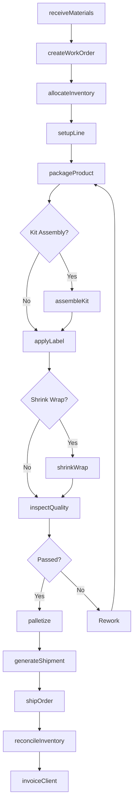
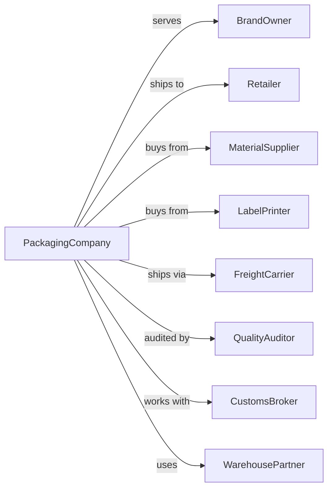

# Packaging and Labeling Services

> Business-as-Code definition for contract packaging and labeling operations. Models the complete fulfillment lifecycle from receiving materials through packaging, labeling, and shipping.

## Overview

Packaging and labeling services provide contract packaging of client-owned products including blister packaging, shrink wrapping, kit assembly, gift wrapping, and product labeling. This definition exposes actions for production operations, events for workflow automation, and searches for inventory and order management.

## Actors

| Actor | Description |
|-------|-------------|
| BrandOwner | Client whose products are being packaged |
| Retailer | Receives packaged products for sale |
| MaterialSupplier | Provides packaging materials and containers |
| LabelPrinter | Produces custom labels and printed materials |
| FreightCarrier | Transports finished goods to destinations |
| QualityAuditor | Inspects packaging for compliance |
| CustomsBroker | Handles import/export documentation |
| WarehousePartner | Provides overflow storage capacity |

## Roles

| Role | Description |
|------|-------------|
| PlantManager | Oversees facility operations and production |
| ProductionSupervisor | Manages packaging lines and crew |
| PackagingOperator | Operates packaging machinery and hand-packs |
| QualityTechnician | Inspects products and packaging for defects |
| InventoryClerk | Tracks materials and finished goods |
| ShippingCoordinator | Arranges outbound logistics |
| AccountManager | Manages client relationships and projects |
| WarehouseWorker | Receives, stores, and retrieves materials |

## Entities

| Entity | Description |
|--------|-------------|
| WorkOrder | Client order specifying packaging requirements |
| Product | Client-owned item to be packaged |
| PackagingMaterial | Boxes, pouches, blister cards, and wrapping |
| Label | Printed identification applied to packages |
| Kit | Assembly of multiple items into single package |
| Batch | Production run of packaged units |
| Pallet | Unit load of finished goods for shipping |
| Inventory | Stock of materials and finished goods |
| Shipment | Outbound delivery of packaged products |
| Specification | Client requirements for packaging and labeling |
| QualityReport | Documentation of inspection results |
| Invoice | Bill for packaging services rendered |

## Actions

| Action | Description |
|--------|-------------|
| receiveMaterials | Accept and inspect incoming products and supplies |
| createWorkOrder | Set up packaging job with specifications |
| allocateInventory | Reserve materials for production run |
| setupLine | Configure packaging equipment for job |
| packageProduct | Place products into packaging containers |
| applyLabel | Attach labels with required information |
| assembleKit | Combine multiple items into kit packages |
| shrinkWrap | Apply heat-shrink film to packages |
| inspectQuality | Verify packaging meets specifications |
| palletize | Stack packages onto pallets for shipping |
| generateShipment | Create shipping documents and labels |
| shipOrder | Release finished goods to carrier |
| reconcileInventory | Update stock counts after production |
| invoiceClient | Bill client for completed services |

## Events

| Event | Description |
|-------|-------------|
| materialsReceived | Products and supplies checked in |
| workOrderCreated | Packaging job entered into system |
| productionStarted | Packaging line began running |
| batchCompleted | Production run finished |
| qualityApproved | Inspection passed |
| qualityRejected | Inspection failed, rework required |
| orderPalletized | Products ready for shipment |
| shipmentDispatched | Carrier picked up order |
| inventoryLow | Material stock below threshold |
| invoiceSent | Bill sent to client |
| paymentReceived | Client payment processed |
| specificationChanged | Client updated requirements |

## Searches

| Search | Description |
|--------|-------------|
| findWorkOrders | List orders by client, status, or date |
| getInventory | Check stock levels for materials or products |
| findBatches | Retrieve production batches by job or date |
| getShipments | List shipments by carrier, destination, or status |
| checkCapacity | View available production line capacity |
| getQualityReports | Retrieve inspection results for batches |
| findClients | List clients with filters for volume or product type |
| getInvoices | Retrieve invoices by client or payment status |

## Workflow



## Actor Relationships



## Usage

### Calling Actions

```typescript
import { packageProduct } from '@headlessly/package-product'

const packaging = packageProduct()

// Check pending work orders and line capacity
const pendingOrders = await packaging.findWorkOrders({ status: 'pending', clientId: 'brand-123' })
const lineCapacity = await packaging.checkCapacity({ date: '2024-04-10', lineNumber: 3 })

// Receive materials from client
const receipt = await packaging.receiveMaterials({
  clientId: 'brand-123',
  items: [
    { sku: 'PROD-001', quantity: 10000, condition: 'good' },
    { sku: 'BOX-SM', quantity: 12000, type: 'material' }
  ],
  purchaseOrder: 'PO-45678'
})

// Create work order for packaging job
const workOrder = await packaging.createWorkOrder({
  clientId: 'brand-123',
  productSku: 'PROD-001',
  quantity: 10000,
  packagingType: 'blisterCard',
  labelRequirements: { upc: true, lotCode: true, expiration: true },
  dueDate: '2024-04-15'
})

// Start production run
await packaging.setupLine({
  workOrderId: workOrder.id,
  lineNumber: 3,
  operators: ['op-101', 'op-102']
})
```

### Event-Driven Automation

```typescript
// Auto-reorder materials when low
packaging.inventoryLow(async ({ materialSku, currentStock, reorderPoint }) => {
  const supplier = await packaging.getPreferredSupplier({ sku: materialSku })
  await createPurchaseOrder({
    supplierId: supplier.id,
    sku: materialSku,
    quantity: supplier.minimumOrder
  })
})

// Notify client when shipment dispatched
packaging.shipmentDispatched(async ({ workOrderId, trackingNumber, carrier }) => {
  const workOrder = await packaging.findWorkOrders({ id: workOrderId })
  await notifyClient({
    clientId: workOrder.clientId,
    message: `Order shipped via ${carrier}`,
    trackingNumber
  })
})
```

## Related

- [Convention and Trade Show Organizers](./561920-ConventionAndTradeShowOrganizers.mdx)
- [All Other Support Services](./561990-AllOtherSupportServices.mdx)
