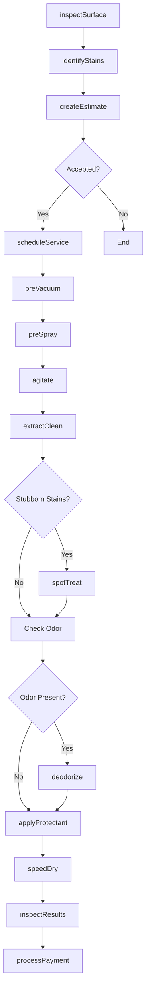
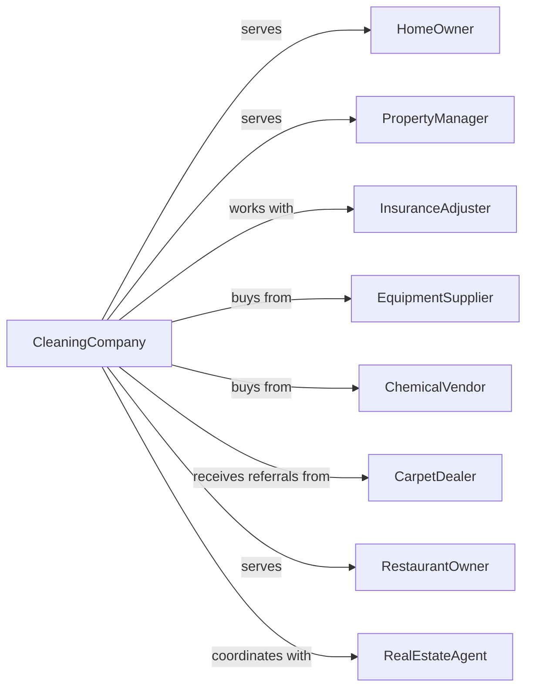

# Carpet and Upholstery Cleaning Services

> Business-as-Code definition for carpet and upholstery cleaning operations. Models the complete service lifecycle from inspection through cleaning and post-treatment care.

## Overview

Carpet and upholstery cleaning services specialize in deep cleaning, stain removal, and restoration of carpets, rugs, and upholstered furniture for residential and commercial clients. This definition exposes actions for service delivery, events for workflow automation, and searches for scheduling and client management.

## Actors

| Actor | Description |
|-------|-------------|
| HomeOwner | Residential client requesting cleaning services |
| PropertyManager | Commercial client managing office or rental properties |
| InsuranceAdjuster | Evaluates damage claims for restoration work |
| EquipmentSupplier | Provides cleaning machines and extraction equipment |
| ChemicalVendor | Supplies cleaning solutions, spotters, and protectants |
| CarpetDealer | Refers customers and provides care recommendations |
| RestaurantOwner | Commercial client with high-traffic upholstery needs |
| RealEstateAgent | Coordinates move-out and pre-sale cleaning |

## Roles

| Role | Description |
|------|-------------|
| Owner | Owns the business and manages operations |
| ServiceManager | Schedules jobs and coordinates technicians |
| LeadTechnician | Performs cleaning and trains junior staff |
| CleaningTechnician | Executes cleaning procedures on-site |
| CustomerServiceRep | Books appointments and handles inquiries |
| Estimator | Assesses jobs and provides quotes |
| QualityInspector | Verifies work quality before sign-off |

## Entities

| Entity | Description |
|--------|-------------|
| ServiceOrder | Work request with customer and job details |
| Carpet | Floor covering to be cleaned or restored |
| Upholstery | Fabric-covered furniture requiring cleaning |
| Stain | Specific spot or discoloration requiring treatment |
| CleaningMethod | Technique used such as steam, dry, or encapsulation |
| Equipment | Truck-mounted or portable extraction machines |
| Chemical | Cleaning solution, pre-spray, or protectant applied |
| Estimate | Price quote for requested services |
| Invoice | Bill for completed services |
| ProtectionPlan | Warranty or maintenance agreement |
| Room | Space unit for pricing and tracking |
| FiberType | Carpet or fabric material affecting cleaning approach |

## Actions

| Action | Description |
|--------|-------------|
| inspectSurface | Evaluate carpet or upholstery condition and fiber type |
| identifyStains | Determine stain types and appropriate treatments |
| createEstimate | Prepare price quote based on inspection |
| scheduleService | Book appointment with customer |
| preVacuum | Remove dry soil before wet cleaning |
| preSpray | Apply cleaning solution to loosen soil |
| agitate | Work solution into fibers mechanically |
| extractClean | Hot water extraction to remove soil and solution |
| spotTreat | Apply specialized treatment to stubborn stains |
| deodorize | Apply odor neutralizer for pet or smoke smells |
| applyProtectant | Coat fibers with stain-resistant treatment |
| speedDry | Use air movers to accelerate drying |
| inspectResults | Verify cleaning quality meets standards |
| processPayment | Collect payment from customer |

## Events

| Event | Description |
|-------|-------------|
| surfaceInspected | Initial evaluation completed |
| stainIdentified | Problem spots documented |
| estimateProvided | Quote sent to customer |
| estimateAccepted | Customer approved the quote |
| serviceScheduled | Appointment confirmed |
| technicianArrived | Technician on-site at customer location |
| cleaningStarted | Service work began |
| cleaningCompleted | All cleaning procedures finished |
| protectantApplied | Fabric protection treatment completed |
| qualityApproved | Work passed inspection |
| paymentReceived | Customer payment processed |
| followUpScheduled | Maintenance appointment booked |

## Searches

| Search | Description |
|--------|-------------|
| findAppointments | List scheduled jobs by date, technician, or area |
| getCustomers | Retrieve customers with filters for type or history |
| getServiceHistory | View past services for a specific customer |
| checkAvailability | Find open time slots for scheduling |
| getEstimates | List pending estimates awaiting approval |
| findStainTypes | Look up treatment protocols for specific stains |
| getEquipmentStatus | Check machine availability and maintenance status |
| getRevenueReport | View income by period, service type, or technician |

## Workflow



## Actor Relationships



## Usage

### Calling Actions

```typescript
import { cleanCarpet } from '@headlessly/clean-carpet'

const cleaning = cleanCarpet()

// Check today's appointments and technician availability
const appointments = await cleaning.findAppointments({ date: '2024-04-01', status: 'confirmed' })
const openSlots = await cleaning.checkAvailability({ date: '2024-04-02', technicianId: 'tech-101' })

// Inspect a carpet before quoting
const inspection = await cleaning.inspectSurface({
  customerId: 'cust-456',
  address: '789 Maple Street',
  surfaces: [
    { type: 'carpet', rooms: ['livingRoom', 'bedroom1', 'bedroom2'] },
    { type: 'upholstery', items: ['sofa', 'loveseat'] }
  ]
})

// Identify stains for treatment
const stains = await cleaning.identifyStains({
  inspectionId: inspection.id,
  stains: [
    { location: 'livingRoom', type: 'wine', severity: 'moderate' },
    { location: 'sofa', type: 'pet', severity: 'heavy' }
  ]
})

// Create estimate based on findings
const estimate = await cleaning.createEstimate({
  inspectionId: inspection.id,
  services: ['deepClean', 'petTreatment', 'fabricProtection'],
  rooms: 3,
  upholsteryPieces: 2
})
```

### Event-Driven Automation

```typescript
// Auto-send follow-up after service
cleaning.cleaningCompleted(async ({ serviceOrderId, customerId }) => {
  await sendEmail({
    to: customerId,
    template: 'post-service-care',
    data: { dryingTime: '4-6 hours', walkOnTime: '24 hours' }
  })
})

// Schedule maintenance reminder
cleaning.protectantApplied(async ({ customerId, protectionPlan }) => {
  if (protectionPlan.includesMaintenance) {
    await cleaning.followUpScheduled({
      customerId,
      scheduledDate: addMonths(new Date(), 12),
      serviceType: 'annualMaintenance'
    })
  }
})
```

## Related

- [Landscaping Services](./561730-LandscapingServices.mdx)
- [Other Services to Buildings and Dwellings](./561790-OtherServicesToBuildingsAndDwellings.mdx)
