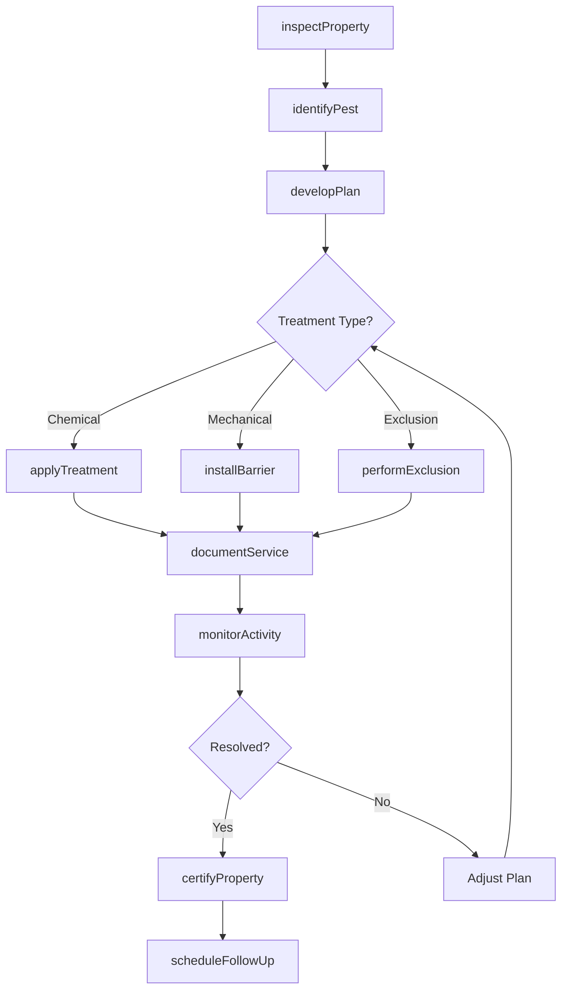
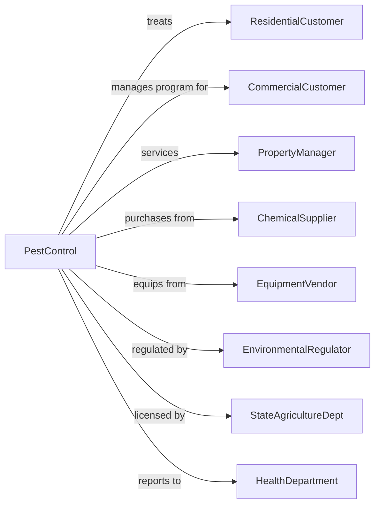

# Exterminating and Pest Control Services

> Business-as-Code definition for pest control and extermination operations. Models the complete service cycle from inspection through treatment and prevention.

## Overview

Exterminating and pest control services eliminate and prevent infestations of insects, rodents, birds, and other pests in residential and commercial properties. Services include inspection, treatment application, exclusion work, and ongoing monitoring programs. Integrated Pest Management approaches combine chemical treatments with environmental modifications for sustainable control.

## Actors

| Actor | Description |
|-------|-------------|
| ResidentialCustomer | Homeowner requiring pest treatment |
| CommercialCustomer | Business needing pest management program |
| PropertyManager | Oversees pest control for multiple units |
| ChemicalSupplier | Provides pesticides and treatment products |
| EquipmentVendor | Supplies application equipment and traps |
| EnvironmentalRegulator | Enforces pesticide use regulations |
| StateAgricultureDept | Issues pest control operator licenses |
| HealthDepartment | Enforces sanitation and pest standards |

## Roles

| Role | Description |
|------|-------------|
| PestControlTechnician | Applies treatments and monitors results |
| Inspector | Evaluates properties and identifies pest issues |
| TermiteSpecialist | Handles wood-destroying organism work |
| WildlifeController | Manages bird and animal exclusion |
| ServiceManager | Oversees treatment programs and schedules |
| LicensedApplicator | Certified to apply restricted pesticides |
| Exterminator | Goes into infested properties to apply treatments and eliminate pest populations |

## Entities

| Entity | Description |
|--------|-------------|
| Inspection | Evaluation of property for pest activity |
| TreatmentPlan | Prescribed approach for pest elimination |
| ServiceContract | Agreement for ongoing pest management |
| Pesticide | Chemical product applied for control |
| BaitStation | Device containing attractant and toxicant |
| TrapDevice | Mechanical pest capture device |
| TermiteReport | Wood-destroying organism inspection document |
| ExclusionWork | Physical barrier installation |
| ServiceTicket | Individual treatment visit record |
| ActivityLog | Record of pest sightings and treatments |

## Actions

| Action | Description |
|--------|-------------|
| inspectProperty | Evaluate for pest activity and entry points |
| identifyPest | Determine species and infestation severity |
| developPlan | Create treatment strategy for situation |
| applyTreatment | Execute pest control application |
| installBarrier | Place bait stations or traps |
| performExclusion | Seal entry points and install barriers |
| monitorActivity | Check traps and bait stations |
| documentService | Record treatment details and observations |
| scheduleFollowUp | Plan return visit for ongoing program |
| certifyProperty | Issue termite or pest-free documentation |
| trainCustomer | Educate on prevention practices |
| renewContract | Extend service agreement |

## Events

| Event | Description |
|-------|-------------|
| propertyInspected | Evaluation completed with findings |
| pestIdentified | Species and severity determined |
| planDeveloped | Treatment strategy created |
| treatmentApplied | Pest control application completed |
| barrierInstalled | Bait stations or traps placed |
| exclusionPerformed | Entry points sealed |
| activityMonitored | Traps and stations checked |
| serviceDocumented | Treatment record completed |
| followUpScheduled | Return visit planned |
| propertyCertified | Pest-free documentation issued |
| customerTrained | Prevention education completed |
| contractRenewed | Service agreement extended |

## Searches

| Search | Description |
|--------|-------------|
| findCustomers | List accounts by service type or location |
| getInspections | Retrieve evaluations by date or findings |
| searchTreatments | Find service records by pest type |
| getContracts | List service agreements by status |
| findTechnicians | View staff by availability or certification |
| getProducts | Check pesticide inventory and usage |
| searchCertifications | Find termite reports by property |
| trackActivity | View pest sighting trends |

## Workflow



## Actor Relationships



## Usage

### Calling Actions

```typescript
import { exterminatePests } from '@headlessly/exterminate-pests'

const pestControl = exterminatePests()

// Check upcoming contracts and technician schedules
const contracts = await pestControl.getContracts({ status: 'active', renewalWithin: 30 })
const techs = await pestControl.findTechnicians({ certification: 'licensed-applicator', available: '2024-04-01' })

// Inspect property
const inspection = await pestControl.inspectProperty({
  customerId: 'homeowner-123',
  propertyType: 'single-family',
  concerns: ['ants-in-kitchen', 'mice-in-garage'],
  accessAreas: ['interior', 'exterior', 'attic', 'crawlspace']
})

// Develop treatment plan
const plan = await pestControl.developPlan({
  inspectionId: inspection.id,
  findings: [
    { pest: 'odorous-house-ant', location: 'kitchen', severity: 'moderate' },
    { pest: 'house-mouse', location: 'garage', severity: 'light' }
  ],
  approach: 'integrated-pest-management',
  treatments: [
    { pest: 'ants', method: 'bait-gel', products: ['Advion-Ant'] },
    { pest: 'mice', method: 'snap-traps', quantity: 6 },
    { pest: 'mice', method: 'exclusion', locations: ['garage-door-seal'] }
  ]
})

// Apply treatment
await pestControl.applyTreatment({
  planId: plan.id,
  technician: 'tech-456',
  applications: [
    { product: 'Advion-Ant', amount: '30g', locations: ['kitchen-cracks', 'behind-appliances'] }
  ],
  trapsPlaced: [
    { type: 'snap-trap', location: 'garage-wall-1' },
    { type: 'snap-trap', location: 'garage-wall-2' }
  ],
  recommendations: ['store-pet-food-sealed', 'clean-under-stove']
})
```

### Event-Driven Automation

```typescript
// Auto-schedule follow-up after treatment
pestControl.treatmentApplied(async ({ serviceId, planId, pestTypes }) => {
  const followUpDays = pestTypes.includes('termites') ? 30 : 14

  await pestControl.scheduleFollowUp({
    serviceId,
    daysAfter: followUpDays,
    purpose: 'monitor-effectiveness',
    checkAreas: await pestControl.getTreatmentAreas({ planId })
  })
})

// Auto-alert on recurring issues
pestControl.activityMonitored(async ({ customerId, findings }) => {
  const history = await pestControl.getActivityHistory({ customerId, months: 6 })
  const recurringPest = findRecurring(findings, history)

  if (recurringPest) {
    await pestControl.escalateToSpecialist({
      customerId,
      pest: recurringPest,
      reason: 'recurring-infestation',
      recommendedAction: 'comprehensive-inspection'
    })
  }
})
```
