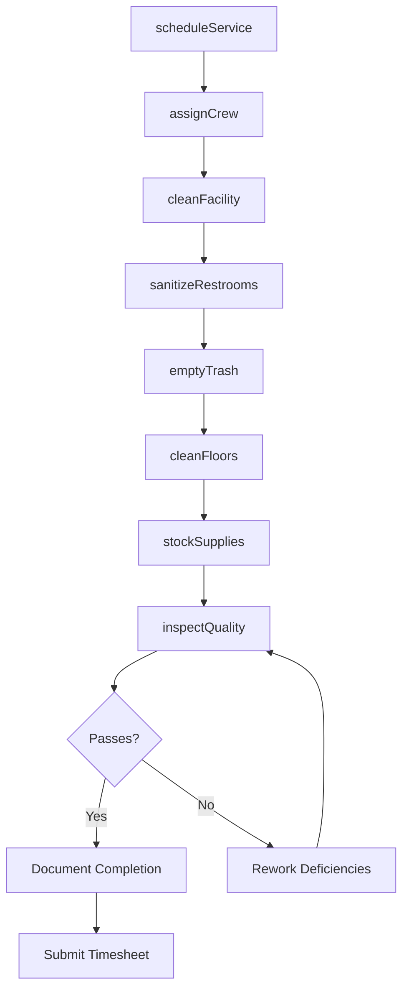
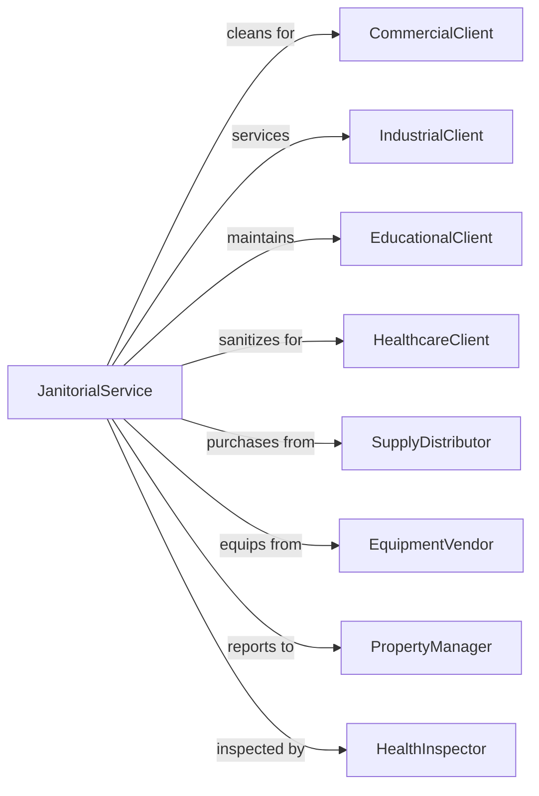

# Janitorial Services

> Business-as-Code definition for commercial cleaning and janitorial operations. Models cleaning service delivery from scheduling through quality inspection.

## Overview

Janitorial services provide interior cleaning for commercial buildings, offices, schools, and transportation equipment. Services include floor care, restroom sanitation, trash removal, window washing, and specialized cleaning. These establishments deploy cleaning crews on scheduled or on-demand basis, maintaining clean and sanitary environments for client facilities.

## Actors

| Actor | Description |
|-------|-------------|
| CommercialClient | Office building or business facility |
| IndustrialClient | Manufacturing or warehouse operation |
| EducationalClient | School, university, or training facility |
| HealthcareClient | Medical office or clinic requiring sanitation |
| SupplyDistributor | Provides cleaning chemicals and consumables |
| EquipmentVendor | Supplies floor machines and cleaning equipment |
| PropertyManager | Oversees cleaning for multiple properties |
| HealthInspector | Enforces sanitation standards |

## Roles

| Role | Description |
|------|-------------|
| Custodian | Performs routine cleaning tasks |
| FloorCareTechnician | Operates floor cleaning and finishing equipment |
| ShiftSupervisor | Oversees cleaning crew and quality |
| AccountManager | Manages client relationships and contracts |
| QualityInspector | Audits cleaning standards compliance |
| ProjectManager | Coordinates special cleaning projects |
| Janitor | Performs nightly cleaning duties including vacuuming, mopping, and trash removal |

## Entities

| Entity | Description |
|--------|-------------|
| CleaningContract | Agreement defining service scope and frequency |
| WorkOrder | Specific cleaning task assignment |
| CleaningSchedule | Recurring service calendar |
| SupplyInventory | Stock of cleaning products and consumables |
| InspectionReport | Quality audit findings |
| TaskChecklist | List of cleaning duties for area |
| TimeRecord | Staff hours worked at client site |
| EquipmentLog | Maintenance records for cleaning machines |
| ChemicalSDS | Safety data sheets for cleaning products |
| ClientPortal | Online access for service requests |

## Actions

| Action | Description |
|--------|-------------|
| cleanFacility | Perform routine cleaning tasks |
| sanitizeRestrooms | Clean and disinfect bathroom areas |
| emptyTrash | Collect and dispose of waste |
| cleanFloors | Vacuum, mop, or scrub floor surfaces |
| stripAndWax | Remove old finish and apply new coating |
| washWindows | Clean interior glass surfaces |
| deepClean | Perform thorough periodic cleaning |
| stockSupplies | Replenish paper products and soap |
| inspectQuality | Audit cleaning against standards |
| scheduleService | Plan and assign cleaning visits |
| trainStaff | Educate crew on procedures and safety |
| respondEmergency | Address urgent cleaning needs |

## Events

| Event | Description |
|-------|-------------|
| facilityCleaned | Routine cleaning completed |
| restroomsSanitized | Bathroom cleaning finished |
| trashEmptied | Waste collection completed |
| floorsCleaned | Floor care tasks finished |
| floorRefinished | Strip and wax completed |
| windowsWashed | Glass cleaning finished |
| deepCleanCompleted | Thorough cleaning finished |
| suppliesStocked | Consumables replenished |
| qualityInspected | Audit completed with findings |
| serviceScheduled | Cleaning visit planned |
| staffTrained | Crew completed training |
| emergencyResponded | Urgent cleaning addressed |

## Searches

| Search | Description |
|--------|-------------|
| findClients | List accounts by size, type, or status |
| getSchedule | View cleaning assignments by date or site |
| searchWorkOrders | Find tasks by status or priority |
| getInspections | Retrieve quality audits by score |
| findStaff | List crew by availability or certification |
| getSupplyLevels | Check inventory by product or location |
| searchContracts | Find agreements by term or value |
| trackHours | View time records by employee or site |

## Workflow



## Actor Relationships



## Usage

### Calling Actions

```typescript
import { cleanJanitorial } from '@headlessly/clean-janitorial'

const janitorial = cleanJanitorial()

// Check tonight's schedule and supply levels
const schedule = await janitorial.getSchedule({ date: '2024-04-01', siteId: 'office-tower-123' })
const supplies = await janitorial.getSupplyLevels({ siteId: 'office-tower-123', belowPar: true })

// Schedule routine cleaning
const schedule = await janitorial.scheduleService({
  clientId: 'office-tower-123',
  frequency: 'nightly',
  scope: {
    areas: ['lobbies', 'offices', 'restrooms', 'breakrooms'],
    squareFootage: 50000,
    floors: 5
  },
  tasks: [
    { task: 'vacuum-carpet', frequency: 'nightly' },
    { task: 'sanitize-restrooms', frequency: 'nightly' },
    { task: 'empty-trash', frequency: 'nightly' },
    { task: 'mop-hard-floors', frequency: 'nightly' },
    { task: 'dust-surfaces', frequency: 'weekly' },
    { task: 'clean-windows-interior', frequency: 'monthly' }
  ],
  crew: { size: 4, supervisor: true },
  timeWindow: { start: '18:00', end: '22:00' }
})

// Perform deep cleaning project
await janitorial.deepClean({
  clientId: 'office-tower-123',
  projectType: 'post-construction',
  areas: ['floor-6-new-tenant'],
  tasks: [
    'dust-all-surfaces',
    'clean-windows',
    'vacuum-and-extract-carpet',
    'scrub-hard-floors',
    'sanitize-restrooms',
    'clean-light-fixtures'
  ],
  scheduledDate: '2024-04-06',
  estimatedHours: 16
})

// Inspect quality
await janitorial.inspectQuality({
  clientId: 'office-tower-123',
  inspectorId: 'qa-789',
  areas: ['lobby', 'floor-3-offices', 'restrooms'],
  criteria: [
    { item: 'floor-cleanliness', weight: 20 },
    { item: 'restroom-sanitation', weight: 25 },
    { item: 'trash-removal', weight: 15 },
    { item: 'surface-dusting', weight: 15 },
    { item: 'supply-stocking', weight: 10 },
    { item: 'overall-appearance', weight: 15 }
  ]
})
```

### Event-Driven Automation

```typescript
// Auto-reorder supplies when low
janitorial.suppliesStocked(async ({ siteId, item, remainingStock }) => {
  const parLevel = await janitorial.getParLevel({ siteId, item })

  if (remainingStock < parLevel * 0.3) {
    await janitorial.orderSupplies({
      siteId,
      item,
      quantity: parLevel * 2,
      priority: remainingStock < parLevel * 0.1 ? 'rush' : 'standard'
    })
  }
})

// Auto-escalate quality issues
janitorial.qualityInspected(async ({ inspectionId, score, deficiencies }) => {
  if (score < 80) {
    await janitorial.escalateQualityIssue({
      inspectionId,
      score,
      deficiencies,
      notifyAccountManager: true,
      scheduleReinspection: true,
      documentCorrective: true
    })
  }
})
```
