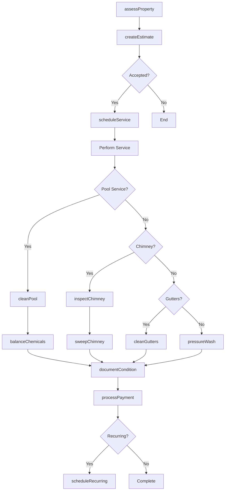
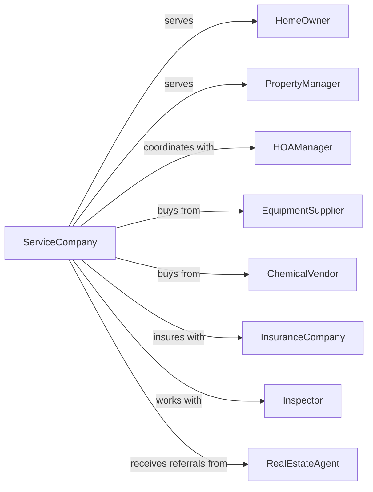

# Other Services to Buildings and Dwellings

> Business-as-Code definition for specialized building services. Models service operations including pool maintenance, chimney cleaning, gutter cleaning, and pressure washing.

## Overview

Other services to buildings and dwellings includes specialized maintenance such as swimming pool cleaning, chimney sweeping, gutter cleaning, pressure washing, and ventilation duct cleaning. This definition exposes actions for service delivery, events for workflow automation, and searches for scheduling and customer management.

## Actors

| Actor | Description |
|-------|-------------|
| HomeOwner | Residential client requesting building services |
| PropertyManager | Manages multiple properties requiring maintenance |
| HOAManager | Coordinates services for community common areas |
| EquipmentSupplier | Provides specialized cleaning and maintenance equipment |
| ChemicalVendor | Supplies pool chemicals, cleaning agents, and sealants |
| InsuranceCompany | Provides liability coverage and processes claims |
| Inspector | Certifies work meets code requirements |
| RealEstateAgent | Coordinates pre-sale inspections and cleaning |

## Roles

| Role | Description |
|------|-------------|
| Owner | Owns the business and sets strategic direction |
| OperationsManager | Oversees daily scheduling and crew assignments |
| ServiceTechnician | Performs specialized maintenance and cleaning |
| PoolTechnician | Maintains swimming pools and spas |
| ChimneyTechnician | Inspects and cleans chimneys and flues |
| Scheduler | Books appointments and manages customer communications |
| QualityInspector | Verifies completed work meets standards |
| PoolTechnician | Tests water chemistry and services swimming pool filtration and heating systems |

## Entities

| Entity | Description |
|--------|-------------|
| Property | Building or dwelling receiving services |
| ServiceOrder | Work request with job specifications |
| SwimmingPool | Pool or spa requiring maintenance |
| Chimney | Flue system requiring cleaning or inspection |
| Gutter | Rain gutter and downspout system |
| HVAC | Heating, ventilation, and air conditioning system |
| Equipment | Pressure washers, vacuums, and specialized tools |
| Chemical | Cleaning agents, pool chemicals, and treatments |
| Estimate | Price quote for requested services |
| Invoice | Bill for completed services |
| MaintenancePlan | Recurring service agreement |
| SafetyReport | Documentation of inspections and certifications |

## Actions

| Action | Description |
|--------|-------------|
| assessProperty | Evaluate service needs and site conditions |
| createEstimate | Prepare price quote for requested work |
| scheduleService | Book appointment with customer |
| cleanPool | Vacuum, skim, and chemically treat swimming pool |
| balanceChemicals | Test and adjust pool water chemistry |
| inspectChimney | Examine flue for creosote buildup and damage |
| sweepChimney | Remove soot and creosote from chimney |
| cleanGutters | Remove debris from gutters and downspouts |
| pressureWash | Clean exterior surfaces with high-pressure water |
| cleanDucts | Remove dust and debris from HVAC ductwork |
| sealSurfaces | Apply protective sealant to cleaned surfaces |
| documentCondition | Record before and after conditions |
| processPayment | Collect payment from customer |
| scheduleRecurring | Set up ongoing maintenance visits |

## Events

| Event | Description |
|-------|-------------|
| propertyAssessed | Initial evaluation completed |
| estimateProvided | Quote sent to customer |
| estimateAccepted | Customer approved the quote |
| serviceScheduled | Appointment confirmed |
| technicianArrived | Technician on-site at property |
| serviceStarted | Work began on property |
| serviceCompleted | All work finished |
| issueDiscovered | Problem found requiring additional work |
| paymentReceived | Customer payment processed |
| recurringScheduled | Maintenance plan established |
| inspectionPassed | Work certified by inspector |
| warrantyIssued | Service warranty provided to customer |

## Searches

| Search | Description |
|--------|-------------|
| findAppointments | List scheduled jobs by date or technician |
| getCustomers | Retrieve customers with service history |
| getProperties | List properties with filters for service type |
| checkAvailability | Find open time slots for scheduling |
| getEstimates | List pending estimates awaiting approval |
| getMaintenancePlans | View active recurring service agreements |
| getEquipmentStatus | Check equipment availability and maintenance |
| findOverdueServices | List properties due for scheduled maintenance |

## Workflow



## Actor Relationships



## Usage

### Calling Actions

```typescript
import { serviceBuilding } from '@headlessly/service-building'

const service = serviceBuilding()

// Assess a property for pool service
const assessment = await service.assessProperty({
  propertyId: 'prop-789',
  address: '123 Sunset Drive',
  serviceTypes: ['poolMaintenance', 'gutterCleaning'],
  features: { poolSize: 'large', stories: 2 }
})

// Create estimate for services
const estimate = await service.createEstimate({
  propertyId: 'prop-789',
  services: [
    { type: 'poolMaintenance', frequency: 'weekly' },
    { type: 'gutterCleaning', frequency: 'quarterly' }
  ]
})

// Schedule recurring pool maintenance
await service.scheduleRecurring({
  propertyId: 'prop-789',
  serviceType: 'poolMaintenance',
  frequency: 'weekly',
  preferredDay: 'wednesday',
  startDate: '2024-04-01'
})
```

### Event-Driven Automation

```typescript
// Auto-alert for discovered issues
service.issueDiscovered(async ({ serviceOrderId, propertyId, issue }) => {
  await sendAlert({
    to: propertyId,
    message: `During service, we found: ${issue.description}`,
    recommendedAction: issue.recommendation,
    urgency: issue.severity
  })
})

// Auto-schedule next service after completion
service.serviceCompleted(async ({ serviceOrderId, maintenancePlanId }) => {
  if (maintenancePlanId) {
    const plan = await service.getMaintenancePlans({ id: maintenancePlanId })
    await service.scheduleService({
      propertyId: plan.propertyId,
      nextDate: calculateNextDate(plan.frequency)
    })
  }
})
```

## Related

- [Landscaping Services](./561730-LandscapingServices.mdx)
- [Carpet and Upholstery Cleaning Services](./561740-CarpetAndUpholsteryCleaningServices.mdx)
