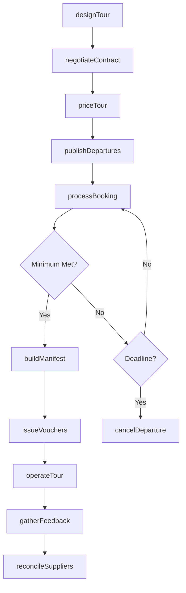
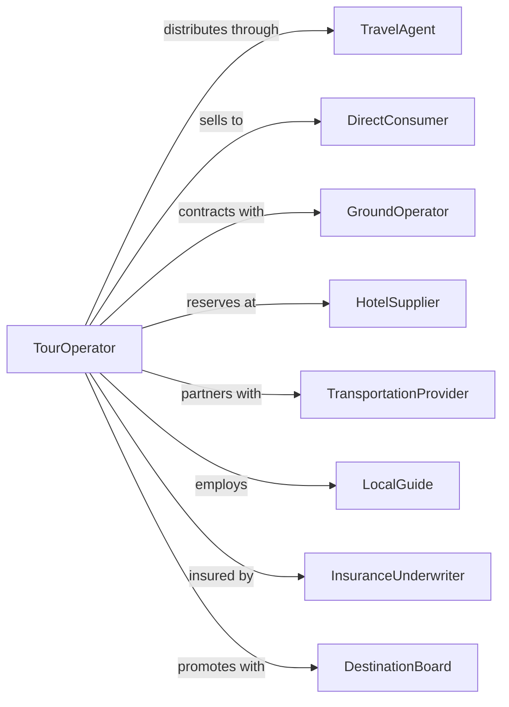

# Tour Operators

> Business-as-Code definition for tour operator operations. Models the creation, packaging, and distribution of assembled travel experiences.

## Overview

Tour operators design, assemble, and wholesale travel packages combining transportation, accommodations, activities, and guide services into complete vacation experiences. These establishments negotiate bulk rates with suppliers, create tour itineraries, and distribute packages through travel agencies or direct-to-consumer channels. Operations range from escorted group tours to independent travel packages.

## Actors

| Actor | Description |
|-------|-------------|
| TravelAgent | Retail seller distributing tour packages |
| DirectConsumer | Traveler booking directly with operator |
| GroundOperator | Local partner providing destination services |
| HotelSupplier | Property providing contracted room inventory |
| TransportationProvider | Airline, coach, or rail partner |
| LocalGuide | In-destination tour leader and expert |
| InsuranceUnderwriter | Provides tour operator liability coverage |
| DestinationBoard | Tourism authority promoting region |

## Roles

| Role | Description |
|------|-------------|
| ProductManager | Designs tour itineraries and experiences |
| ContractNegotiator | Secures supplier rates and allotments |
| OperationsCoordinator | Manages tour logistics and execution |
| GroupLeader | Accompanies tours and manages participants |
| ReservationsAgent | Processes bookings and passenger manifests |
| QualityController | Monitors tour delivery and guest satisfaction |
| TourGuide | Accompanies guests on-site and provides expert narration at destinations |

## Entities

| Entity | Description |
|--------|-------------|
| TourPackage | Assembled travel product with all components |
| Itinerary | Day-by-day schedule of tour activities |
| Departure | Specific tour date with available capacity |
| Manifest | List of confirmed passengers for departure |
| SupplierContract | Agreement securing rates and inventory |
| Allotment | Reserved supplier capacity for tour use |
| Brochure | Marketing material describing tours |
| Voucher | Document entitling guest to services |
| TourCost | Component costs determining package price |
| GuestFeedback | Post-tour satisfaction evaluation |

## Actions

| Action | Description |
|--------|-------------|
| designTour | Create new tour itinerary and experience |
| negotiateContract | Secure supplier rates and allotments |
| priceTour | Calculate package pricing and margins |
| publishDepartures | Release tour dates for booking |
| processBooking | Confirm passenger reservation on departure |
| buildManifest | Compile passenger list for tour operation |
| issueVouchers | Generate service entitlement documents |
| operateTour | Execute tour with guests and guide |
| gatherFeedback | Collect post-tour guest evaluations |
| reconcileSuppliers | Settle payments with service providers |
| adjustInventory | Modify available capacity based on demand |
| cancelDeparture | Remove tour date due to low enrollment |

## Events

| Event | Description |
|-------|-------------|
| tourDesigned | New itinerary completed and approved |
| contractNegotiated | Supplier agreement executed |
| tourPriced | Package rates established |
| departuresPublished | Tour dates released for sale |
| bookingProcessed | Passenger confirmed on departure |
| manifestBuilt | Passenger list finalized |
| vouchersIssued | Service documents delivered to guests |
| tourOperated | Tour completed with guests |
| feedbackGathered | Guest evaluations collected |
| suppliersReconciled | Payments settled with providers |
| inventoryAdjusted | Capacity modified |
| departureCancelled | Tour date removed |

## Searches

| Search | Description |
|--------|-------------|
| findTours | Search packages by destination, theme, or date |
| getDepartures | List available tour dates with capacity |
| searchBookings | Find reservations by guest or departure |
| getManifest | Retrieve passenger list for departure |
| findSuppliers | List contracted service providers |
| getContracts | Retrieve supplier agreements by term |
| searchFeedback | Find guest evaluations by tour or rating |
| getInventory | Check available capacity by departure |

## Workflow



## Actor Relationships



## Usage

### Calling Actions

```typescript
import { bookTourOperators } from '@headlessly/book-tour-operators'

const tourOp = bookTourOperators()

// Design new tour package
const tour = await tourOp.designTour({
  name: 'Tuscan Wine & Cuisine',
  destination: 'Italy',
  duration: 8,
  style: 'escorted',
  itinerary: [
    { day: 1, location: 'Florence', activities: ['arrival', 'welcome-dinner'] },
    { day: 2, location: 'Florence', activities: ['uffizi-tour', 'cooking-class'] },
    { day: 3, location: 'Chianti', activities: ['vineyard-tour', 'wine-tasting'] }
    // ... additional days
  ],
  inclusions: ['hotels', 'breakfast-daily', 'guided-tours', 'wine-tastings'],
  groupSize: { min: 10, max: 24 }
})

// Publish departures for booking
await tourOp.publishDepartures({
  tourId: tour.id,
  departures: [
    { date: '2024-09-15', price: 3299, capacity: 24 },
    { date: '2024-10-06', price: 3199, capacity: 24 },
    { date: '2024-10-27', price: 2999, capacity: 24 }
  ],
  earlyBirdDiscount: { amount: 200, deadline: '2024-06-01' }
})

// Process guest booking
await tourOp.processBooking({
  departureId: 'tuscan-2024-09-15',
  guests: [
    { name: 'John Smith', roomType: 'single', dietary: 'none' },
    { name: 'Mary Smith', roomType: 'single', dietary: 'vegetarian' }
  ],
  payment: { method: 'deposit', amount: 500 },
  addOns: ['travel-insurance', 'airport-transfer']
})
```

### Event-Driven Automation

```typescript
// Auto-cancel departures below minimum
tourOp.bookingProcessed(async ({ departureId }) => {
  const departure = await tourOp.getDeparture({ departureId })
  const daysUntil = daysBetween(new Date(), departure.date)

  if (daysUntil <= 45 && departure.booked < departure.minimum) {
    await tourOp.cancelDeparture({
      departureId,
      reason: 'minimum-not-met',
      offerAlternatives: true,
      refundPolicy: 'full'
    })
  }
})

// Auto-send vouchers before departure
tourOp.manifestBuilt(async ({ departureId, guestCount }) => {
  await tourOp.issueVouchers({
    departureId,
    deliveryMethod: 'email',
    includeDocuments: ['itinerary', 'hotel-confirmations', 'emergency-contacts'],
    daysBeforeDeparture: 14
  })
})
```
