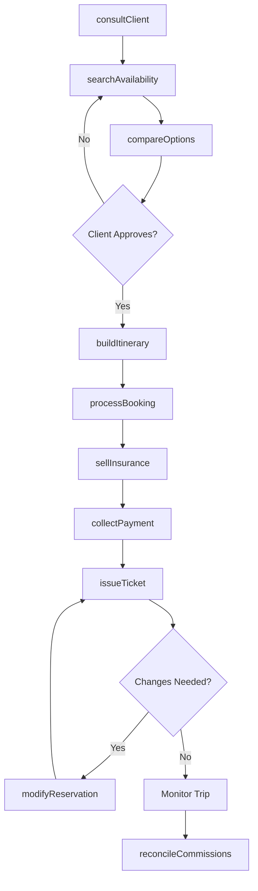
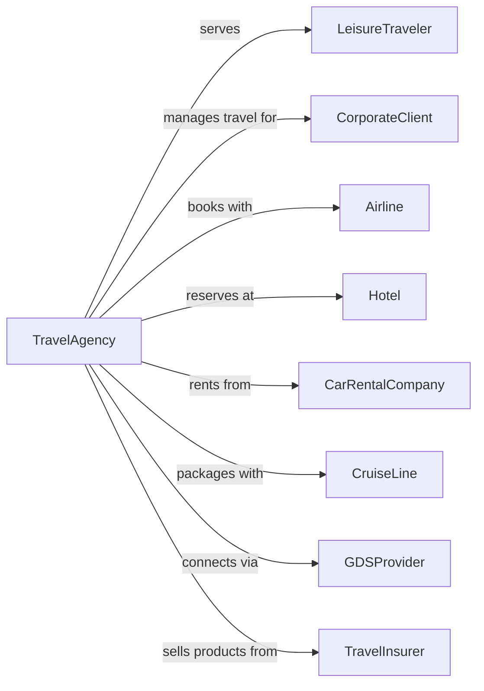

# Travel Agencies

> Business-as-Code definition for travel agency operations. Models the complete travel booking cycle from consultation through trip fulfillment.

## Overview

Travel agencies act as intermediaries selling travel, tour, and accommodation services to leisure and business travelers. These establishments earn commissions from suppliers or service fees from clients, providing expertise in itinerary planning, fare comparison, and travel logistics. Modern agencies handle both traditional bookings and complex multi-destination corporate travel programs.

## Actors

| Actor | Description |
|-------|-------------|
| LeisureTraveler | Individual or family booking vacation travel |
| CorporateClient | Business contracting for managed travel services |
| Airline | Carrier providing flight inventory and ticketing |
| Hotel | Property providing accommodation inventory |
| CarRentalCompany | Provides vehicle rental reservations |
| CruiseLine | Offers cruise vacation packages |
| GDSProvider | Global distribution system aggregating travel inventory |
| TravelInsurer | Provides trip protection products |

## Roles

| Role | Description |
|------|-------------|
| TravelAdvisor | Consults with clients and books travel arrangements |
| CorporateAccountManager | Manages business client relationships and policies |
| TicketingAgent | Processes reservations and issues tickets |
| GroupCoordinator | Handles multi-passenger bookings and tours |
| AfterHoursAgent | Provides emergency travel support |
| QualitySpecialist | Monitors booking accuracy and client satisfaction |
| TravelAdvisor | Consults with clients on destinations, builds custom itineraries, and books travel |

## Entities

| Entity | Description |
|--------|-------------|
| Reservation | Booking for flight, hotel, car, or other service |
| Itinerary | Complete trip plan with all segments |
| Quote | Price estimate for proposed travel |
| Ticket | Issued travel document |
| TravelPolicy | Corporate rules governing employee bookings |
| Commission | Payment earned from supplier on booking |
| ServiceFee | Charge collected from client for services |
| Waiver | Travel protection document |
| ClientProfile | Traveler preferences and loyalty program data |
| Invoice | Bill for travel services and bookings |

## Actions

| Action | Description |
|--------|-------------|
| consultClient | Understand travel needs and preferences |
| searchAvailability | Query GDS for flights, hotels, and cars |
| compareOptions | Present alternatives with pricing and features |
| buildItinerary | Assemble complete trip with all components |
| processBooking | Confirm reservations with suppliers |
| issueTicket | Generate travel documents |
| collectPayment | Process client payment for services |
| sellInsurance | Offer and bind travel protection |
| modifyReservation | Change existing booking per client request |
| cancelBooking | Process cancellation and refunds |
| handleEmergency | Address urgent travel disruptions |
| reconcileCommissions | Track and collect supplier payments |

## Events

| Event | Description |
|-------|-------------|
| clientConsulted | Initial travel discussion completed |
| availabilitySearched | Inventory query returned results |
| optionsPresented | Travel alternatives shown to client |
| itineraryBuilt | Complete trip plan assembled |
| bookingConfirmed | Reservations confirmed with suppliers |
| ticketIssued | Travel documents generated |
| paymentCollected | Client payment processed |
| insuranceSold | Travel protection purchased |
| reservationModified | Booking changes processed |
| bookingCancelled | Cancellation completed with refund |
| emergencyHandled | Travel disruption resolved |
| commissionReconciled | Supplier payment received |

## Searches

| Search | Description |
|--------|-------------|
| findFlights | Search available air segments by route and date |
| getHotels | List accommodations by destination and criteria |
| searchCars | Find rental vehicles at specified location |
| getClientHistory | Retrieve past bookings and preferences |
| findReservations | List bookings by client, date, or status |
| getCommissions | Track earnings by supplier or period |
| searchPolicies | Find corporate travel rules by client |
| getFares | Compare pricing across suppliers |

## Workflow



## Actor Relationships



## Usage

### Calling Actions

```typescript
import { bookTravelItineraries } from '@headlessly/book-travel-itineraries'

const agency = bookTravelItineraries()

// Check client preferences and past bookings
const clientHistory = await agency.getClientHistory({ clientId: 'client-123' })
const fares = await agency.getFares({ origin: 'LAX', destination: 'CDG', class: 'business' })

// Search for flights
const flights = await agency.searchAvailability({
  type: 'air',
  origin: 'LAX',
  destination: 'CDG',
  departDate: '2024-06-15',
  returnDate: '2024-06-25',
  passengers: 2,
  class: 'business'
})

// Build complete itinerary
const itinerary = await agency.buildItinerary({
  clientId: 'client-123',
  components: [
    { type: 'flight', selection: flights.options[0].id },
    { type: 'hotel', propertyId: 'paris-marriott', nights: 10 },
    { type: 'car', vendor: 'hertz', pickupDate: '2024-06-15' }
  ],
  travelers: [
    { name: 'John Doe', loyaltyPrograms: ['AA-Gold', 'Marriott-Platinum'] },
    { name: 'Jane Doe', loyaltyPrograms: ['AA-Gold'] }
  ]
})

// Process booking and issue tickets
await agency.processBooking({ itineraryId: itinerary.id })
await agency.issueTicket({ itineraryId: itinerary.id, delivery: 'email' })
```

### Event-Driven Automation

```typescript
// Auto-offer insurance after booking confirmation
agency.bookingConfirmed(async ({ itineraryId, clientId, tripValue }) => {
  const client = await agency.getClientProfile({ clientId })

  if (!client.hasInsurance) {
    await agency.sellInsurance({
      itineraryId,
      products: ['cancellation', 'medical', 'baggage'],
      tripCost: tripValue,
      travelers: client.travelers
    })
  }
})

// Auto-reaccommodate on schedule changes
agency.emergencyHandled(async ({ reservationId, disruptionType }) => {
  if (disruptionType === 'flight-cancellation') {
    const alternatives = await agency.searchAvailability({
      reservationId,
      searchType: 'reaccommodation'
    })

    await agency.notifyClient({
      reservationId,
      message: 'Your flight has been cancelled. Here are rebooking options.',
      options: alternatives.slice(0, 3)
    })
  }
})
```
